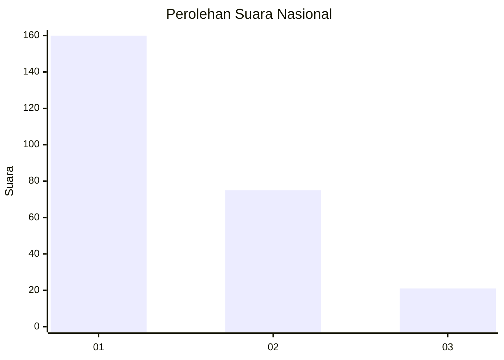
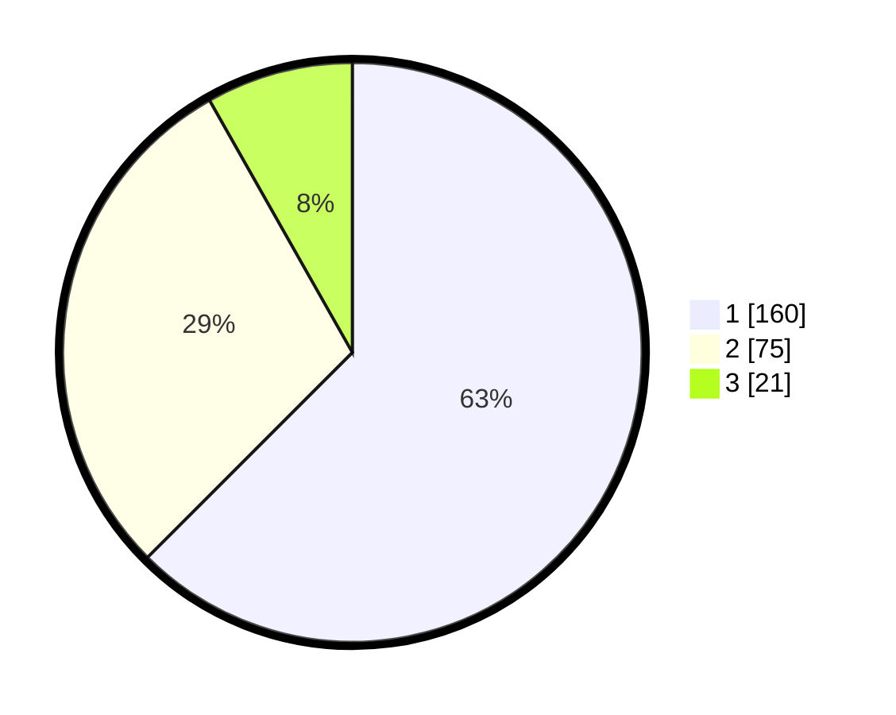

# Hasil

## Grafik

## Tabel

| No.    | Nama Paslon    | Suara | Suara (raw) | Persentase |
|:------ |:-------------- | -----:| -----------:| ----------:|
| 100025 | ANIES MUHAIMIN | 160   | [160][p-1]  | 62,50      |
| 100026 | PRABOWO GIBRAN | 75    | [75][p-2]   | 29,30      |
| 100027 | GANJAR MAHFUD  | 21    | [21][p-3]   | 8,20       |

[p-1]: https://github.com/gigit-pemilu/pemilu-2024/blob/main/pilpres/hitung-suara/sub/31-dki-jakarta/sub/73-jakarta-barat/sub/05-kebon-jeruk/sub/1003-sukabumi-selatan/sub/054-tps/sub/paslon-1.txt
[p-2]: https://github.com/gigit-pemilu/pemilu-2024/blob/main/pilpres/hitung-suara/sub/31-dki-jakarta/sub/73-jakarta-barat/sub/05-kebon-jeruk/sub/1003-sukabumi-selatan/sub/054-tps/sub/paslon-2.txt
[p-3]: https://github.com/gigit-pemilu/pemilu-2024/blob/main/pilpres/hitung-suara/sub/31-dki-jakarta/sub/73-jakarta-barat/sub/05-kebon-jeruk/sub/1003-sukabumi-selatan/sub/054-tps/sub/paslon-3.txt

## Foto C Plano

https://sirekap-obj-formc.kpu.go.id/2d37/pemilu/ppwp/31/73/05/10/03/3173051003054-20240215-005209--8dee543d-1db2-43c5-b015-067d68c79420.jpg

https://sirekap-obj-formc.kpu.go.id/2d37/pemilu/ppwp/31/73/05/10/03/3173051003054-20240215-005541--a6485ea7-974d-44f2-8fd2-faace267047b.jpg

https://sirekap-obj-formc.kpu.go.id/2d37/pemilu/ppwp/31/73/05/10/03/3173051003054-20240215-005711--d07f0c72-11da-4c27-86a8-29cdddec9dd7.jpg

## Metadata

| Key        | Value               |
| ---------- | ------------------- |
| Time Stamp | 2024-02-19 13:00:00 |

