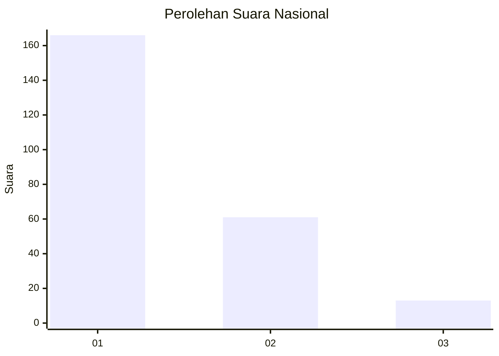
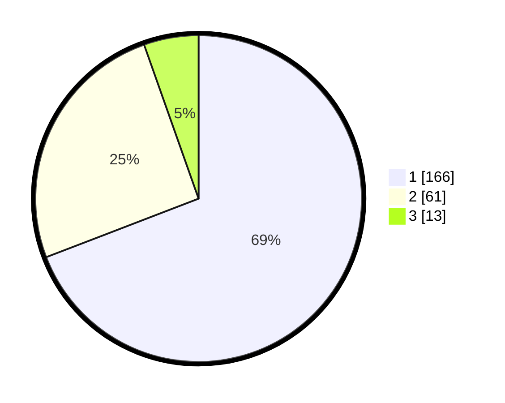

# Hasil

## Grafik

## Tabel

| No.    | Nama Paslon    | Suara | Suara (raw) | Persentase |
|:------ |:-------------- | -----:| -----------:| ----------:|
| 100025 | ANIES MUHAIMIN | 166   | [166][p-1]  | 69,17      |
| 100026 | PRABOWO GIBRAN | 61    | [61][p-2]   | 25,42      |
| 100027 | GANJAR MAHFUD  | 13    | [13][p-3]   | 5,42       |

[p-1]: https://github.com/gigit-pemilu/pemilu-2024/blob/main/pilpres/hitung-suara/sub/31-dki-jakarta/sub/73-jakarta-barat/sub/05-kebon-jeruk/sub/1003-sukabumi-selatan/sub/058-tps/sub/paslon-1.txt
[p-2]: https://github.com/gigit-pemilu/pemilu-2024/blob/main/pilpres/hitung-suara/sub/31-dki-jakarta/sub/73-jakarta-barat/sub/05-kebon-jeruk/sub/1003-sukabumi-selatan/sub/058-tps/sub/paslon-2.txt
[p-3]: https://github.com/gigit-pemilu/pemilu-2024/blob/main/pilpres/hitung-suara/sub/31-dki-jakarta/sub/73-jakarta-barat/sub/05-kebon-jeruk/sub/1003-sukabumi-selatan/sub/058-tps/sub/paslon-3.txt

## Foto C Plano

https://sirekap-obj-formc.kpu.go.id/e016/pemilu/ppwp/31/73/05/10/03/3173051003058-20240214-214105--f5db021a-2202-4167-abf1-6cb956d76767.jpg

https://sirekap-obj-formc.kpu.go.id/e016/pemilu/ppwp/31/73/05/10/03/3173051003058-20240214-214151--2856de7b-1622-43e2-a313-1b070c69911a.jpg

https://sirekap-obj-formc.kpu.go.id/e016/pemilu/ppwp/31/73/05/10/03/3173051003058-20240214-214216--c1ec2af5-6770-4cb8-bb3f-9a5051339326.jpg

## Metadata

| Key        | Value               |
| ---------- | ------------------- |
| Time Stamp | 2024-02-19 13:00:00 |

