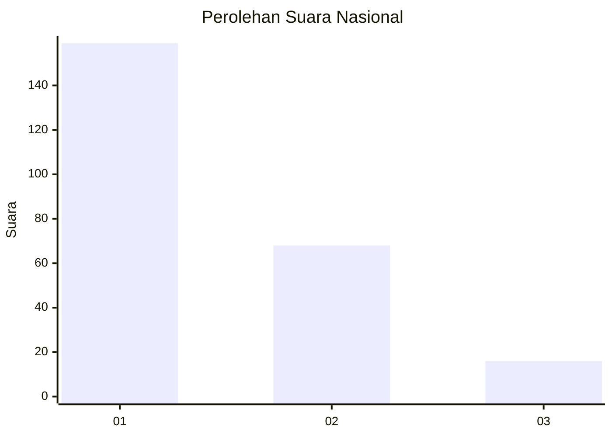
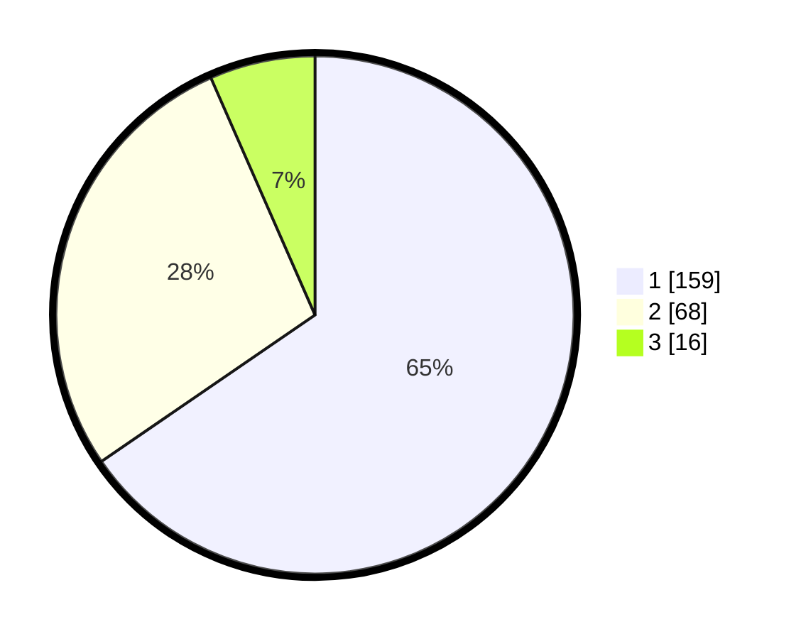

# Hasil

## Grafik

## Tabel

| No.    | Nama Paslon    | Suara | Suara (raw) | Persentase |
|:------ |:-------------- | -----:| -----------:| ----------:|
| 100025 | ANIES MUHAIMIN | 159   | [159][p-1]  | 65,43      |
| 100026 | PRABOWO GIBRAN | 68    | [68][p-2]   | 27,98      |
| 100027 | GANJAR MAHFUD  | 16    | [16][p-3]   | 6,58       |

[p-1]: https://github.com/gigit-pemilu/pemilu-2024/blob/main/pilpres/hitung-suara/sub/31-dki-jakarta/sub/73-jakarta-barat/sub/05-kebon-jeruk/sub/1003-sukabumi-selatan/sub/060-tps/sub/paslon-1.txt
[p-2]: https://github.com/gigit-pemilu/pemilu-2024/blob/main/pilpres/hitung-suara/sub/31-dki-jakarta/sub/73-jakarta-barat/sub/05-kebon-jeruk/sub/1003-sukabumi-selatan/sub/060-tps/sub/paslon-2.txt
[p-3]: https://github.com/gigit-pemilu/pemilu-2024/blob/main/pilpres/hitung-suara/sub/31-dki-jakarta/sub/73-jakarta-barat/sub/05-kebon-jeruk/sub/1003-sukabumi-selatan/sub/060-tps/sub/paslon-3.txt

## Foto C Plano

https://sirekap-obj-formc.kpu.go.id/8e44/pemilu/ppwp/31/73/05/10/03/3173051003060-20240214-230141--5ecf9445-f020-4ac8-8fae-de29b04c50b9.jpg

https://sirekap-obj-formc.kpu.go.id/8e44/pemilu/ppwp/31/73/05/10/03/3173051003060-20240214-230301--e14625a5-1d67-4c79-b407-ad2ab558f0d9.jpg

https://sirekap-obj-formc.kpu.go.id/8e44/pemilu/ppwp/31/73/05/10/03/3173051003060-20240214-230415--2c6aeda1-7425-4547-ac89-eab94e4d2bb1.jpg

## Metadata

| Key        | Value               |
| ---------- | ------------------- |
| Time Stamp | 2024-02-16 21:01:00 |

