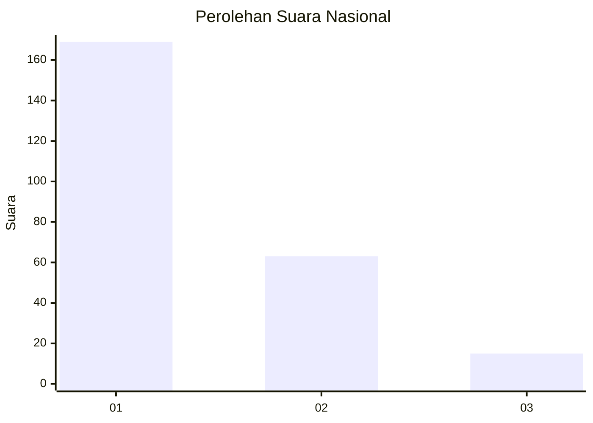
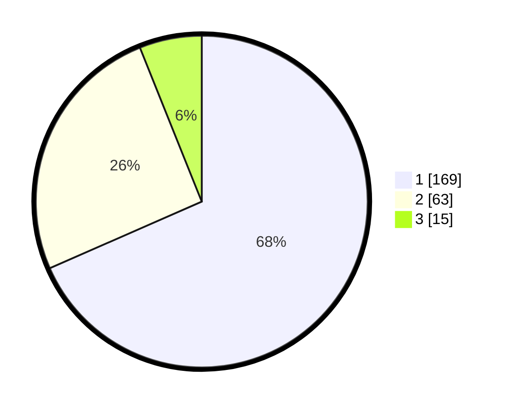

# Hasil

## Grafik

## Tabel

| No. | Nama Paslon    | Suara | Suara (raw) | Persentase |
|:--- |:-------------- | -----:| -----------:| ----------:|
| 1   | ANIES MUHAIMIN | 169   | [169][p-1]  | 68,42      |
| 2   | PRABOWO GIBRAN | 63    | [63][p-2]   | 25,51      |
| 3   | GANJAR MAHFUD  | 15    | [15][p-3]   | 6,07       |

[p-1]: https://github.com/gigit-pemilu/pemilu-2024/blob/main/pilpres/hitung-suara/sub/31-dki-jakarta/sub/73-jakarta-barat/sub/05-kebon-jeruk/sub/1003-sukabumi-selatan/sub/061-tps/sub/paslon-1.txt
[p-2]: https://github.com/gigit-pemilu/pemilu-2024/blob/main/pilpres/hitung-suara/sub/31-dki-jakarta/sub/73-jakarta-barat/sub/05-kebon-jeruk/sub/1003-sukabumi-selatan/sub/061-tps/sub/paslon-2.txt
[p-3]: https://github.com/gigit-pemilu/pemilu-2024/blob/main/pilpres/hitung-suara/sub/31-dki-jakarta/sub/73-jakarta-barat/sub/05-kebon-jeruk/sub/1003-sukabumi-selatan/sub/061-tps/sub/paslon-3.txt

## Foto C Plano

https://sirekap-obj-formc.kpu.go.id/4696/pemilu/ppwp/31/73/05/10/03/3173051003061-20240214-235807--dfb0f707-f1ac-4e05-8ada-66c42809d6fc.jpg

https://sirekap-obj-formc.kpu.go.id/4696/pemilu/ppwp/31/73/05/10/03/3173051003061-20240214-232642--6290b330-bf5f-49a5-9618-224be0fa35d1.jpg

https://sirekap-obj-formc.kpu.go.id/4696/pemilu/ppwp/31/73/05/10/03/3173051003061-20240214-233001--5c237012-14d2-4f91-aa53-4c35a2cd784c.jpg

## Metadata

| Key        | Value               |
| ---------- | ------------------- |
| Time Stamp | 2024-02-16 17:00:00 |

