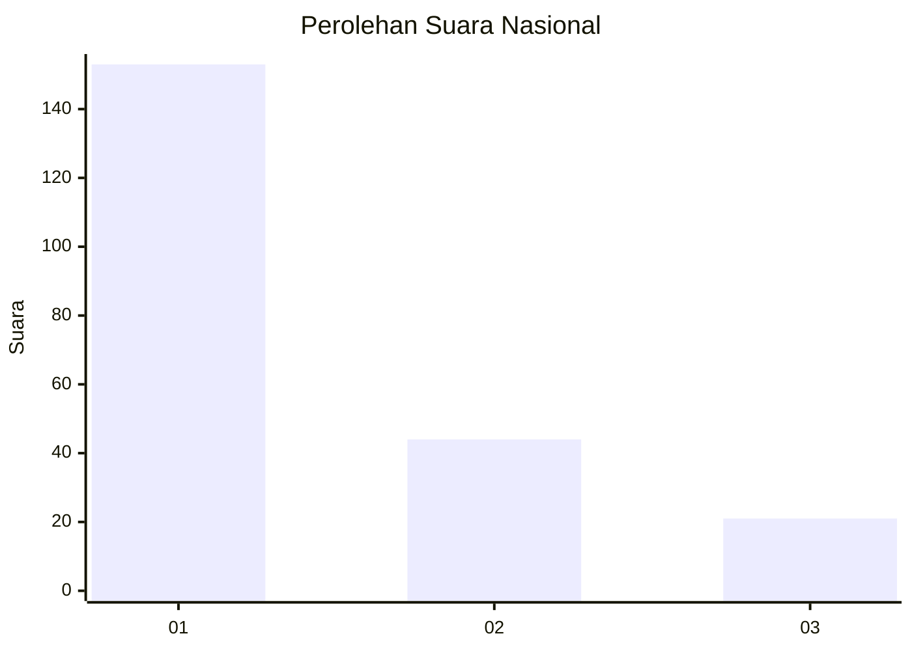
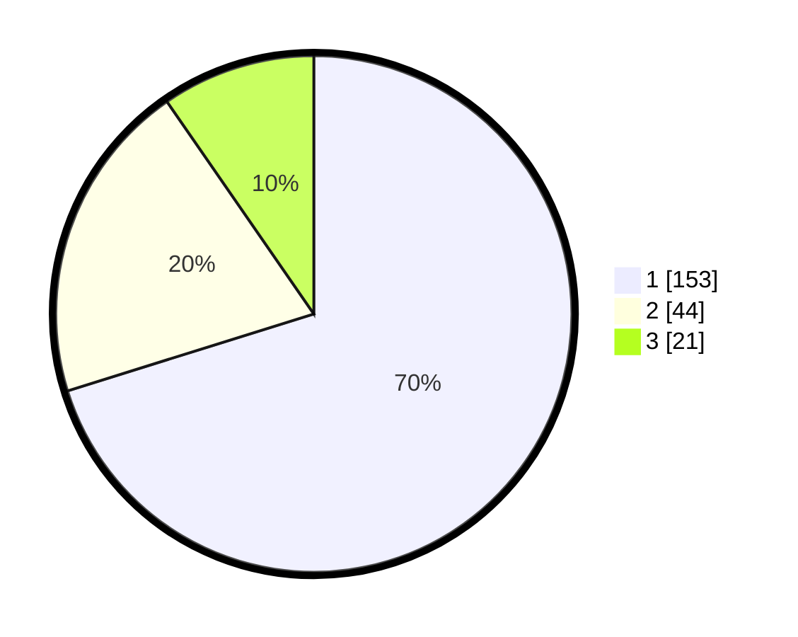

# Hasil

## Grafik

## Tabel

| No.    | Nama Paslon    | Suara | Suara (raw) | Persentase |
|:------ |:-------------- | -----:| -----------:| ----------:|
| 100025 | ANIES MUHAIMIN | 153   | [153][p-1]  | 70,18      |
| 100026 | PRABOWO GIBRAN | 44    | [44][p-2]   | 20,18      |
| 100027 | GANJAR MAHFUD  | 21    | [21][p-3]   | 9,63       |

[p-1]: https://github.com/gigit-pemilu/pemilu-2024/blob/main/pilpres/hitung-suara/sub/31-dki-jakarta/sub/73-jakarta-barat/sub/05-kebon-jeruk/sub/1003-sukabumi-selatan/sub/063-tps/sub/paslon-1.txt
[p-2]: https://github.com/gigit-pemilu/pemilu-2024/blob/main/pilpres/hitung-suara/sub/31-dki-jakarta/sub/73-jakarta-barat/sub/05-kebon-jeruk/sub/1003-sukabumi-selatan/sub/063-tps/sub/paslon-2.txt
[p-3]: https://github.com/gigit-pemilu/pemilu-2024/blob/main/pilpres/hitung-suara/sub/31-dki-jakarta/sub/73-jakarta-barat/sub/05-kebon-jeruk/sub/1003-sukabumi-selatan/sub/063-tps/sub/paslon-3.txt

## Foto C Plano

https://sirekap-obj-formc.kpu.go.id/3ea5/pemilu/ppwp/31/73/05/10/03/3173051003063-20240215-012351--1e211126-b906-4d75-9d28-077cae753d1e.jpg

https://sirekap-obj-formc.kpu.go.id/3ea5/pemilu/ppwp/31/73/05/10/03/3173051003063-20240215-012846--01648d1b-ae51-46ea-ad88-64193a535108.jpg

https://sirekap-obj-formc.kpu.go.id/3ea5/pemilu/ppwp/31/73/05/10/03/3173051003063-20240215-013025--8d140028-e7bf-439c-b64d-66401b39af3f.jpg

## Metadata

| Key        | Value               |
| ---------- | ------------------- |
| Time Stamp | 2024-02-15 15:00:29 |

