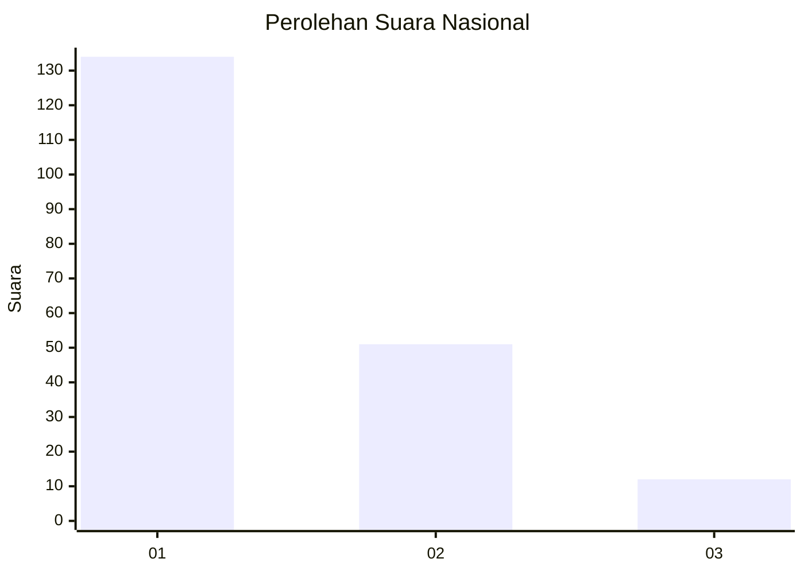
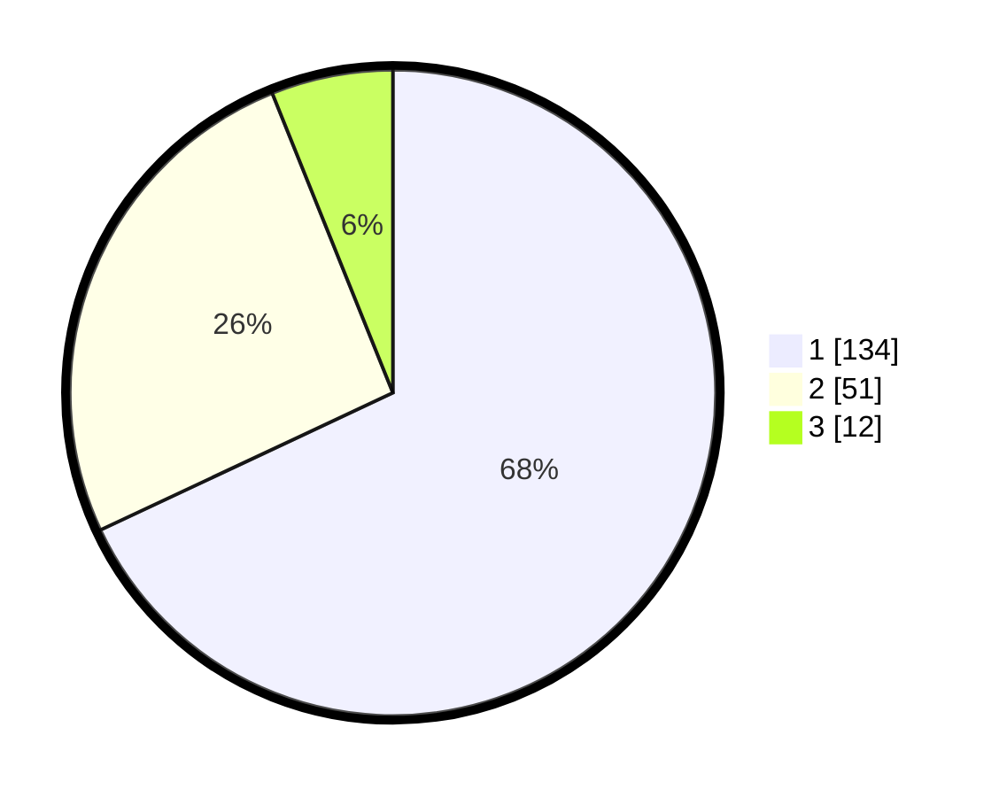

# Hasil

## Grafik

## Tabel

| No.    | Nama Paslon    | Suara | Suara (raw) | Persentase |
|:------ |:-------------- | -----:| -----------:| ----------:|
| 100025 | ANIES MUHAIMIN | 134   | [134][p-1]  | 68,02      |
| 100026 | PRABOWO GIBRAN | 51    | [51][p-2]   | 25,89      |
| 100027 | GANJAR MAHFUD  | 12    | [12][p-3]   | 6,09       |

[p-1]: https://github.com/gigit-pemilu/pemilu-2024/blob/main/pilpres/hitung-suara/sub/31-dki-jakarta/sub/73-jakarta-barat/sub/05-kebon-jeruk/sub/1003-sukabumi-selatan/sub/064-tps/sub/paslon-1.txt
[p-2]: https://github.com/gigit-pemilu/pemilu-2024/blob/main/pilpres/hitung-suara/sub/31-dki-jakarta/sub/73-jakarta-barat/sub/05-kebon-jeruk/sub/1003-sukabumi-selatan/sub/064-tps/sub/paslon-2.txt
[p-3]: https://github.com/gigit-pemilu/pemilu-2024/blob/main/pilpres/hitung-suara/sub/31-dki-jakarta/sub/73-jakarta-barat/sub/05-kebon-jeruk/sub/1003-sukabumi-selatan/sub/064-tps/sub/paslon-3.txt

## Foto C Plano

https://sirekap-obj-formc.kpu.go.id/565f/pemilu/ppwp/31/73/05/10/03/3173051003064-20240214-232719--9868466a-874c-4141-9ea7-729cd39c2a12.jpg

https://sirekap-obj-formc.kpu.go.id/565f/pemilu/ppwp/31/73/05/10/03/3173051003064-20240214-232812--5db94d37-ba48-47e6-b200-6dbde8d748b5.jpg

https://sirekap-obj-formc.kpu.go.id/565f/pemilu/ppwp/31/73/05/10/03/3173051003064-20240214-232901--6d0bfdc2-22ae-4752-9021-a9e31436515c.jpg

## Metadata

| Key        | Value               |
| ---------- | ------------------- |
| Time Stamp | 2024-02-15 15:00:29 |

