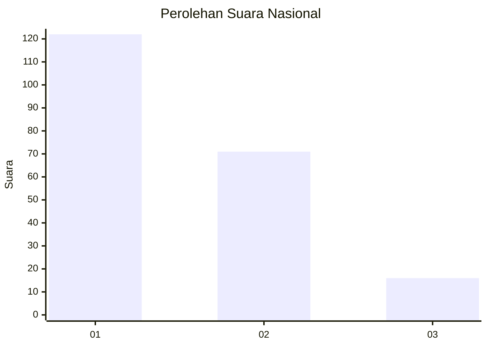
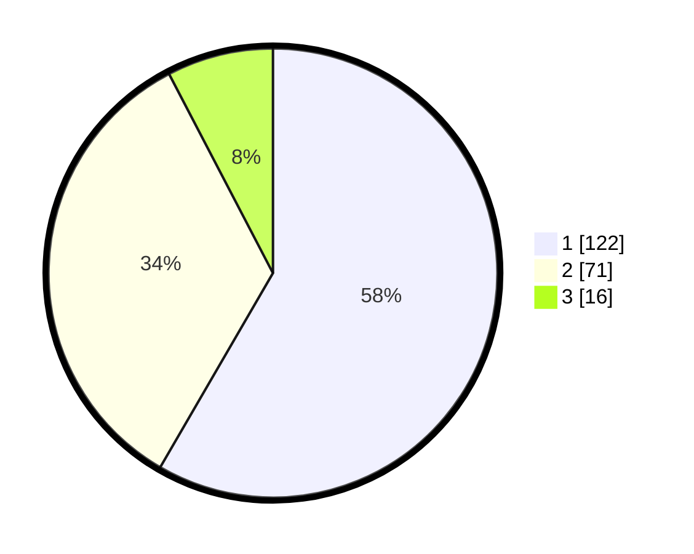

# Hasil

## Grafik

## Tabel

| No.    | Nama Paslon    | Suara | Suara (raw) | Persentase |
|:------ |:-------------- | -----:| -----------:| ----------:|
| 100025 | ANIES MUHAIMIN | 122   | [122][p-1]  | 58,37      |
| 100026 | PRABOWO GIBRAN | 71    | [71][p-2]   | 33,97      |
| 100027 | GANJAR MAHFUD  | 16    | [16][p-3]   | 7,66       |

[p-1]: https://github.com/gigit-pemilu/pemilu-2024/blob/main/pilpres/hitung-suara/sub/31-dki-jakarta/sub/73-jakarta-barat/sub/05-kebon-jeruk/sub/1003-sukabumi-selatan/sub/072-tps/sub/paslon-1.txt
[p-2]: https://github.com/gigit-pemilu/pemilu-2024/blob/main/pilpres/hitung-suara/sub/31-dki-jakarta/sub/73-jakarta-barat/sub/05-kebon-jeruk/sub/1003-sukabumi-selatan/sub/072-tps/sub/paslon-2.txt
[p-3]: https://github.com/gigit-pemilu/pemilu-2024/blob/main/pilpres/hitung-suara/sub/31-dki-jakarta/sub/73-jakarta-barat/sub/05-kebon-jeruk/sub/1003-sukabumi-selatan/sub/072-tps/sub/paslon-3.txt

## Foto C Plano

https://sirekap-obj-formc.kpu.go.id/617e/pemilu/ppwp/31/73/05/10/03/3173051003072-20240215-010343--56275103-236a-468f-8c47-ab8a7ae88cf9.jpg

https://sirekap-obj-formc.kpu.go.id/617e/pemilu/ppwp/31/73/05/10/03/3173051003072-20240215-010547--45c7136e-d2cc-4cf3-8586-39a010fabe63.jpg

https://sirekap-obj-formc.kpu.go.id/617e/pemilu/ppwp/31/73/05/10/03/3173051003072-20240215-010826--00a6378c-26d1-4dca-917f-2cf5cfab95a4.jpg

## Metadata

| Key        | Value               |
| ---------- | ------------------- |
| Time Stamp | 2024-02-16 21:01:00 |

