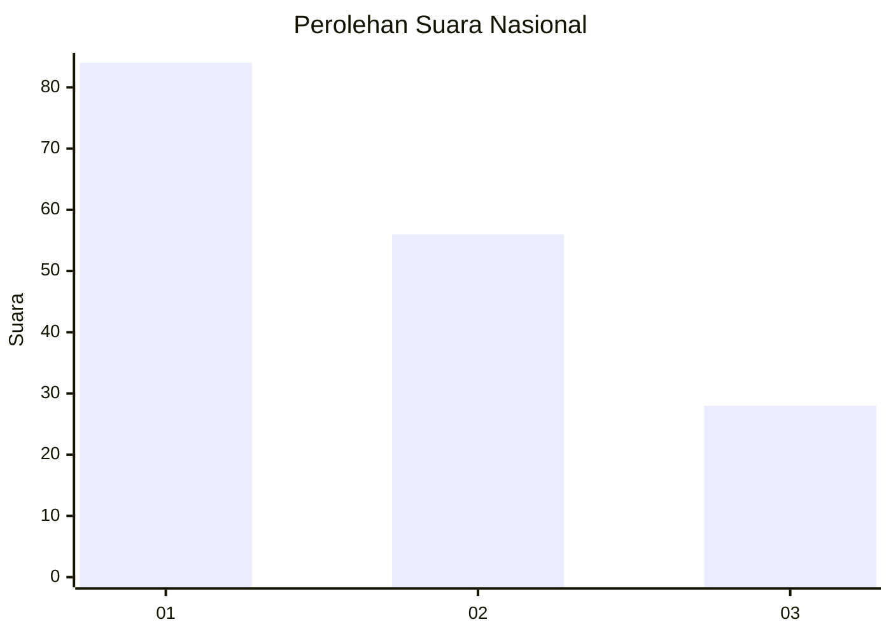
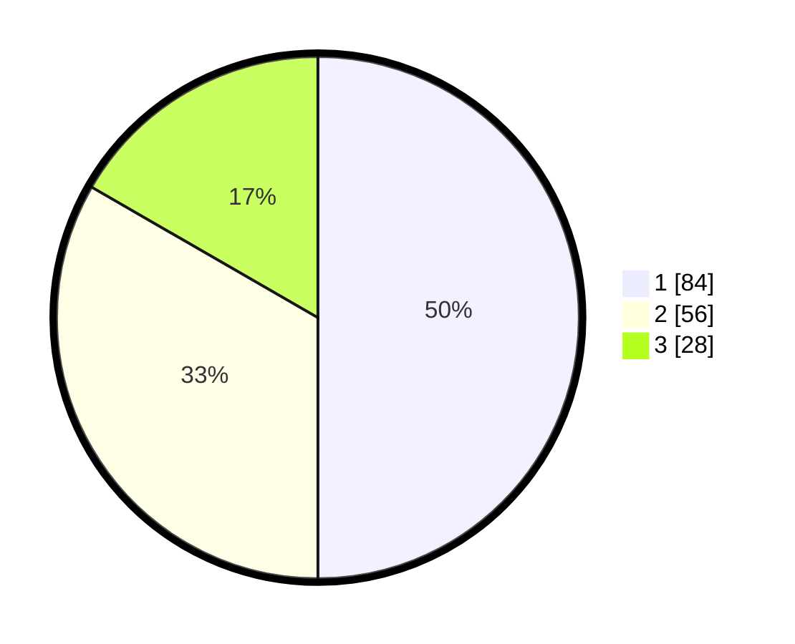

# Hasil

## Grafik

## Tabel

| No.    | Nama Paslon    | Suara | Suara (raw) | Persentase |
|:------ |:-------------- | -----:| -----------:| ----------:|
| 100025 | ANIES MUHAIMIN | 84    | [84][p-1]   | 50,00      |
| 100026 | PRABOWO GIBRAN | 56    | [56][p-2]   | 33,33      |
| 100027 | GANJAR MAHFUD  | 28    | [28][p-3]   | 16,67      |

[p-1]: https://github.com/gigit-pemilu/pemilu-2024/blob/main/pilpres/hitung-suara/sub/31-dki-jakarta/sub/73-jakarta-barat/sub/05-kebon-jeruk/sub/1003-sukabumi-selatan/sub/075-tps/sub/paslon-1.txt
[p-2]: https://github.com/gigit-pemilu/pemilu-2024/blob/main/pilpres/hitung-suara/sub/31-dki-jakarta/sub/73-jakarta-barat/sub/05-kebon-jeruk/sub/1003-sukabumi-selatan/sub/075-tps/sub/paslon-2.txt
[p-3]: https://github.com/gigit-pemilu/pemilu-2024/blob/main/pilpres/hitung-suara/sub/31-dki-jakarta/sub/73-jakarta-barat/sub/05-kebon-jeruk/sub/1003-sukabumi-selatan/sub/075-tps/sub/paslon-3.txt

## Foto C Plano

https://sirekap-obj-formc.kpu.go.id/095b/pemilu/ppwp/31/73/05/10/03/3173051003075-20240215-001400--ff1fecaa-0a09-499c-80e2-600d03f2b0b8.jpg

https://sirekap-obj-formc.kpu.go.id/095b/pemilu/ppwp/31/73/05/10/03/3173051003075-20240215-001609--256d3e12-0a66-4882-a470-7ce15cfba454.jpg

https://sirekap-obj-formc.kpu.go.id/095b/pemilu/ppwp/31/73/05/10/03/3173051003075-20240215-001716--21970371-bd3c-4dfe-abb2-bf08f082c9f3.jpg

## Metadata

| Key        | Value               |
| ---------- | ------------------- |
| Time Stamp | 2024-02-15 16:30:25 |

