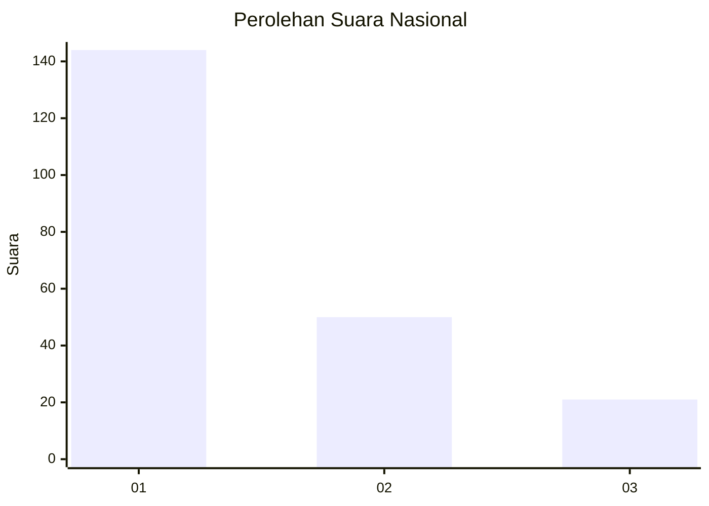
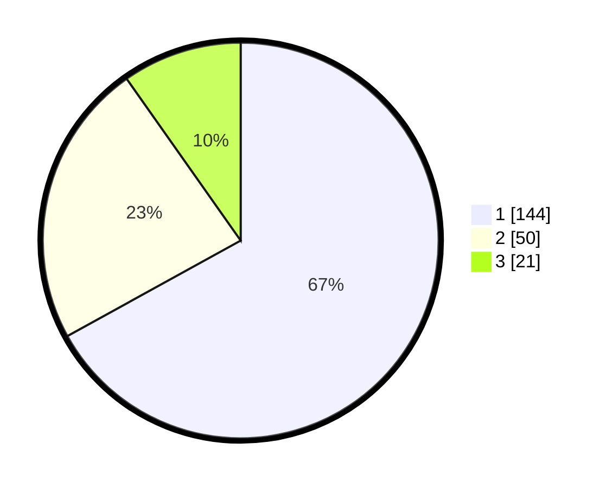

# Hasil

## Grafik

## Tabel

| No.    | Nama Paslon    | Suara | Suara (raw) | Persentase |
|:------ |:-------------- | -----:| -----------:| ----------:|
| 100025 | ANIES MUHAIMIN | 144   | [144][p-1]  | 66,98      |
| 100026 | PRABOWO GIBRAN | 50    | [50][p-2]   | 23,26      |
| 100027 | GANJAR MAHFUD  | 21    | [21][p-3]   | 9,77       |

[p-1]: https://github.com/gigit-pemilu/pemilu-2024/blob/main/pilpres/hitung-suara/sub/31-dki-jakarta/sub/73-jakarta-barat/sub/05-kebon-jeruk/sub/1003-sukabumi-selatan/sub/080-tps/sub/paslon-1.txt
[p-2]: https://github.com/gigit-pemilu/pemilu-2024/blob/main/pilpres/hitung-suara/sub/31-dki-jakarta/sub/73-jakarta-barat/sub/05-kebon-jeruk/sub/1003-sukabumi-selatan/sub/080-tps/sub/paslon-2.txt
[p-3]: https://github.com/gigit-pemilu/pemilu-2024/blob/main/pilpres/hitung-suara/sub/31-dki-jakarta/sub/73-jakarta-barat/sub/05-kebon-jeruk/sub/1003-sukabumi-selatan/sub/080-tps/sub/paslon-3.txt

## Foto C Plano

https://sirekap-obj-formc.kpu.go.id/a4c7/pemilu/ppwp/31/73/05/10/03/3173051003080-20240215-020949--0c61445a-d5e9-4d7a-bbae-ce136aeac6cf.jpg

https://sirekap-obj-formc.kpu.go.id/a4c7/pemilu/ppwp/31/73/05/10/03/3173051003080-20240215-021208--66151193-12a1-4f29-9257-4963a89d5cbe.jpg

https://sirekap-obj-formc.kpu.go.id/a4c7/pemilu/ppwp/31/73/05/10/03/3173051003080-20240215-021348--4b140d0c-2f51-4bed-a455-8352500180d3.jpg

## Metadata

| Key        | Value               |
| ---------- | ------------------- |
| Time Stamp | 2024-02-19 13:00:00 |

