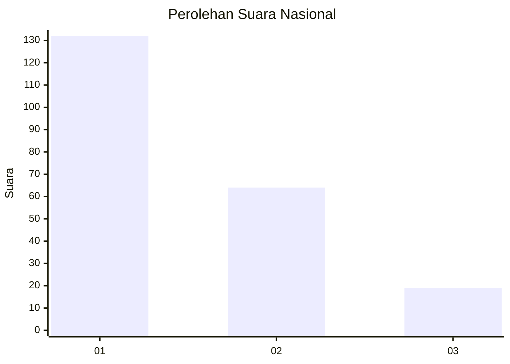
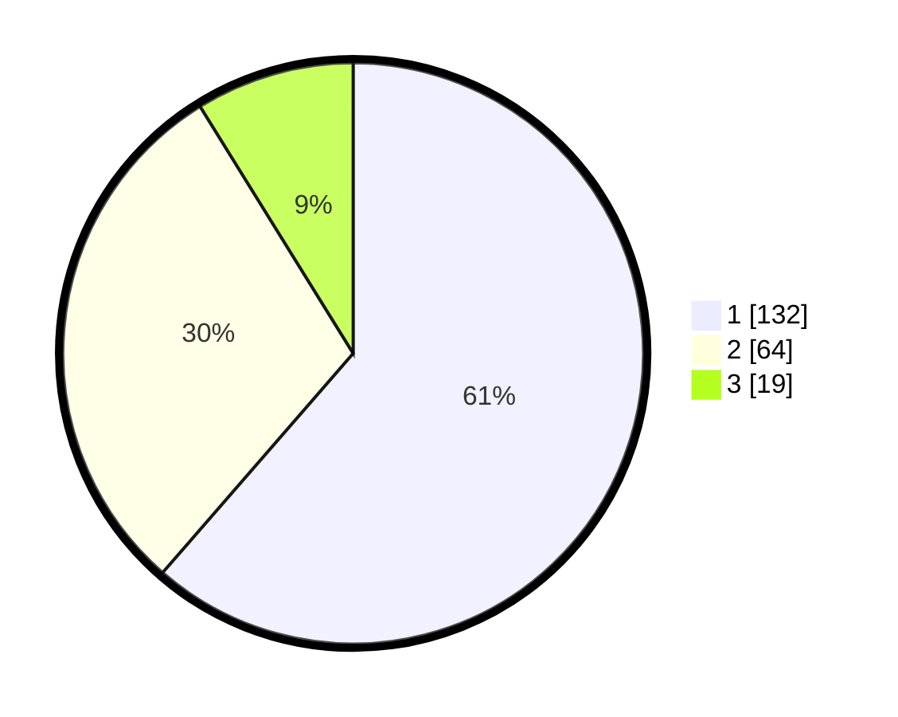

# Hasil

## Grafik

## Tabel

| No.    | Nama Paslon    | Suara | Suara (raw) | Persentase |
|:------ |:-------------- | -----:| -----------:| ----------:|
| 100025 | ANIES MUHAIMIN | 132   | [132][p-1]  | 61,40      |
| 100026 | PRABOWO GIBRAN | 64    | [64][p-2]   | 29,77      |
| 100027 | GANJAR MAHFUD  | 19    | [19][p-3]   | 8,84       |

[p-1]: https://github.com/gigit-pemilu/pemilu-2024/blob/main/pilpres/hitung-suara/sub/31-dki-jakarta/sub/73-jakarta-barat/sub/05-kebon-jeruk/sub/1003-sukabumi-selatan/sub/083-tps/sub/paslon-1.txt
[p-2]: https://github.com/gigit-pemilu/pemilu-2024/blob/main/pilpres/hitung-suara/sub/31-dki-jakarta/sub/73-jakarta-barat/sub/05-kebon-jeruk/sub/1003-sukabumi-selatan/sub/083-tps/sub/paslon-2.txt
[p-3]: https://github.com/gigit-pemilu/pemilu-2024/blob/main/pilpres/hitung-suara/sub/31-dki-jakarta/sub/73-jakarta-barat/sub/05-kebon-jeruk/sub/1003-sukabumi-selatan/sub/083-tps/sub/paslon-3.txt

## Foto C Plano

https://sirekap-obj-formc.kpu.go.id/f705/pemilu/ppwp/31/73/05/10/03/3173051003083-20240215-021601--07e7c605-b6cd-4ebe-8c19-cb2f08904415.jpg

https://sirekap-obj-formc.kpu.go.id/f705/pemilu/ppwp/31/73/05/10/03/3173051003083-20240215-021832--c58129da-f77f-4d47-9241-098add9a4a8a.jpg

https://sirekap-obj-formc.kpu.go.id/f705/pemilu/ppwp/31/73/05/10/03/3173051003083-20240215-021334--b3d20d42-b231-454c-aa0c-fc3ed6ed0336.jpg

## Metadata

| Key        | Value               |
| ---------- | ------------------- |
| Time Stamp | 2024-02-21 17:00:00 |

