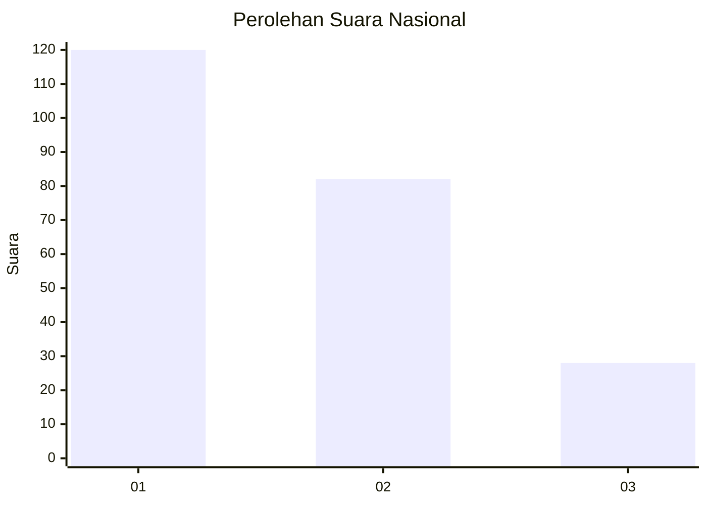
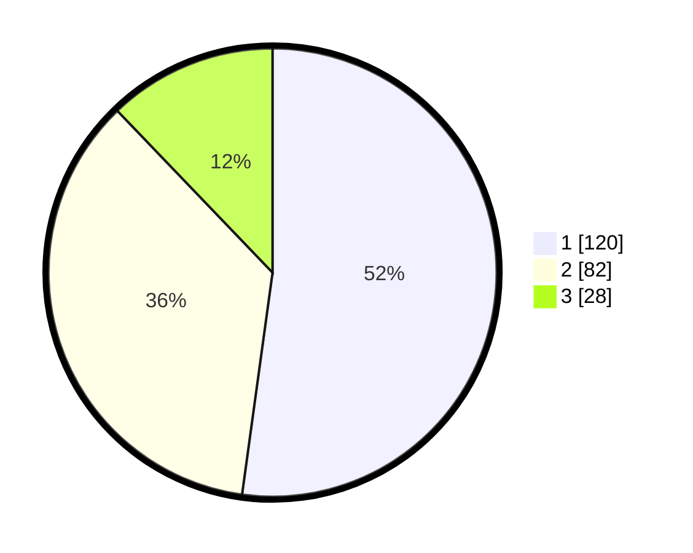

# Hasil

## Grafik

## Tabel

| No.    | Nama Paslon    | Suara | Suara (raw) | Persentase |
|:------ |:-------------- | -----:| -----------:| ----------:|
| 100025 | ANIES MUHAIMIN | 120   | [120][p-1]  | 52,17      |
| 100026 | PRABOWO GIBRAN | 82    | [82][p-2]   | 35,65      |
| 100027 | GANJAR MAHFUD  | 28    | [28][p-3]   | 12,17      |

[p-1]: https://github.com/gigit-pemilu/pemilu-2024/blob/main/pilpres/hitung-suara/sub/31-dki-jakarta/sub/73-jakarta-barat/sub/05-kebon-jeruk/sub/1003-sukabumi-selatan/sub/086-tps/sub/paslon-1.txt
[p-2]: https://github.com/gigit-pemilu/pemilu-2024/blob/main/pilpres/hitung-suara/sub/31-dki-jakarta/sub/73-jakarta-barat/sub/05-kebon-jeruk/sub/1003-sukabumi-selatan/sub/086-tps/sub/paslon-2.txt
[p-3]: https://github.com/gigit-pemilu/pemilu-2024/blob/main/pilpres/hitung-suara/sub/31-dki-jakarta/sub/73-jakarta-barat/sub/05-kebon-jeruk/sub/1003-sukabumi-selatan/sub/086-tps/sub/paslon-3.txt

## Foto C Plano

https://sirekap-obj-formc.kpu.go.id/195b/pemilu/ppwp/31/73/05/10/03/3173051003086-20240214-214209--1f997495-d648-4ca0-b30a-77bb335a0096.jpg

https://sirekap-obj-formc.kpu.go.id/195b/pemilu/ppwp/31/73/05/10/03/3173051003086-20240214-204604--e7e6784c-bedb-405e-bdab-3384922cb2f0.jpg

https://sirekap-obj-formc.kpu.go.id/195b/pemilu/ppwp/31/73/05/10/03/3173051003086-20240214-214820--b1710d9d-1ad4-4471-9502-0d9aa76ba429.jpg

## Metadata

| Key        | Value               |
| ---------- | ------------------- |
| Time Stamp | 2024-02-15 00:41:44 |

