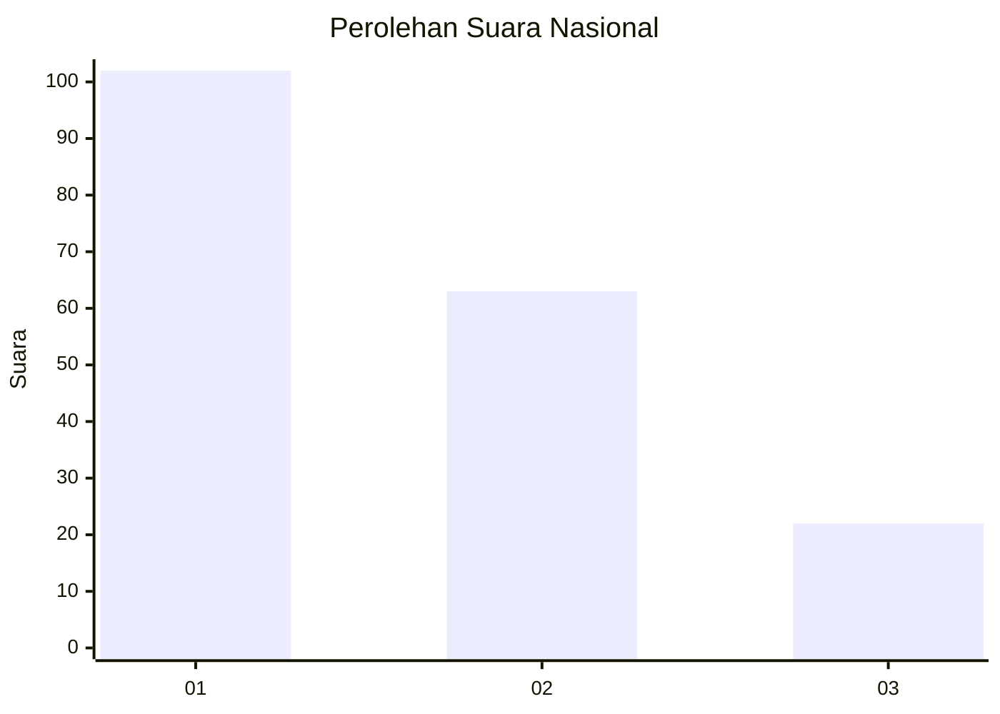
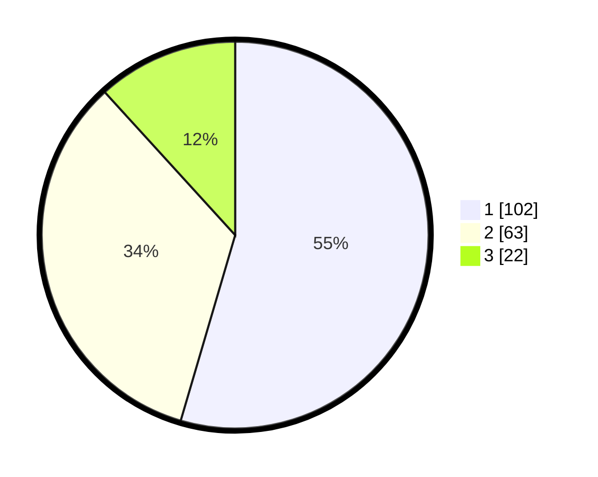

# Hasil

## Grafik

## Tabel

| No.    | Nama Paslon    | Suara | Suara (raw) | Persentase |
|:------ |:-------------- | -----:| -----------:| ----------:|
| 100025 | ANIES MUHAIMIN | 102   | [102][p-1]  | 54,55      |
| 100026 | PRABOWO GIBRAN | 63    | [63][p-2]   | 33,69      |
| 100027 | GANJAR MAHFUD  | 22    | [22][p-3]   | 11,76      |

[p-1]: https://github.com/gigit-pemilu/pemilu-2024/blob/main/pilpres/hitung-suara/sub/31-dki-jakarta/sub/73-jakarta-barat/sub/05-kebon-jeruk/sub/1003-sukabumi-selatan/sub/109-tps/sub/paslon-1.txt
[p-2]: https://github.com/gigit-pemilu/pemilu-2024/blob/main/pilpres/hitung-suara/sub/31-dki-jakarta/sub/73-jakarta-barat/sub/05-kebon-jeruk/sub/1003-sukabumi-selatan/sub/109-tps/sub/paslon-2.txt
[p-3]: https://github.com/gigit-pemilu/pemilu-2024/blob/main/pilpres/hitung-suara/sub/31-dki-jakarta/sub/73-jakarta-barat/sub/05-kebon-jeruk/sub/1003-sukabumi-selatan/sub/109-tps/sub/paslon-3.txt

## Foto C Plano

https://sirekap-obj-formc.kpu.go.id/0d9a/pemilu/ppwp/31/73/05/10/03/3173051003109-20240214-225732--a1ba8faa-c7dc-4e3a-b070-413354cba1c8.jpg

https://sirekap-obj-formc.kpu.go.id/0d9a/pemilu/ppwp/31/73/05/10/03/3173051003109-20240214-230102--183ee2c3-fb69-4c79-9692-b17ca5336e1c.jpg

https://sirekap-obj-formc.kpu.go.id/0d9a/pemilu/ppwp/31/73/05/10/03/3173051003109-20240214-230234--1fd7548f-1536-479d-8bf6-e4ea0c5f6123.jpg

## Metadata

| Key        | Value               |
| ---------- | ------------------- |
| Time Stamp | 2024-02-19 14:00:00 |

