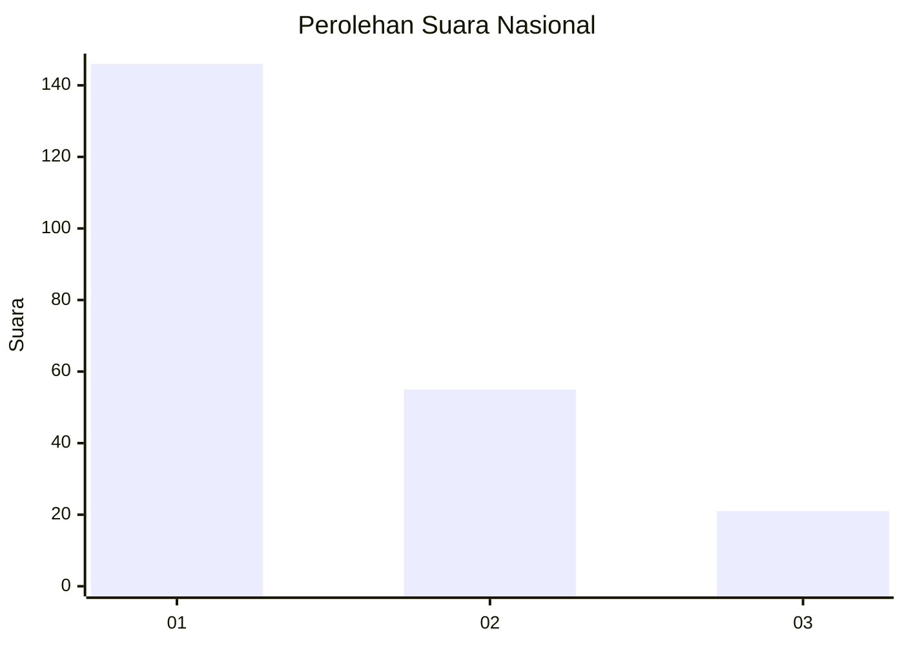
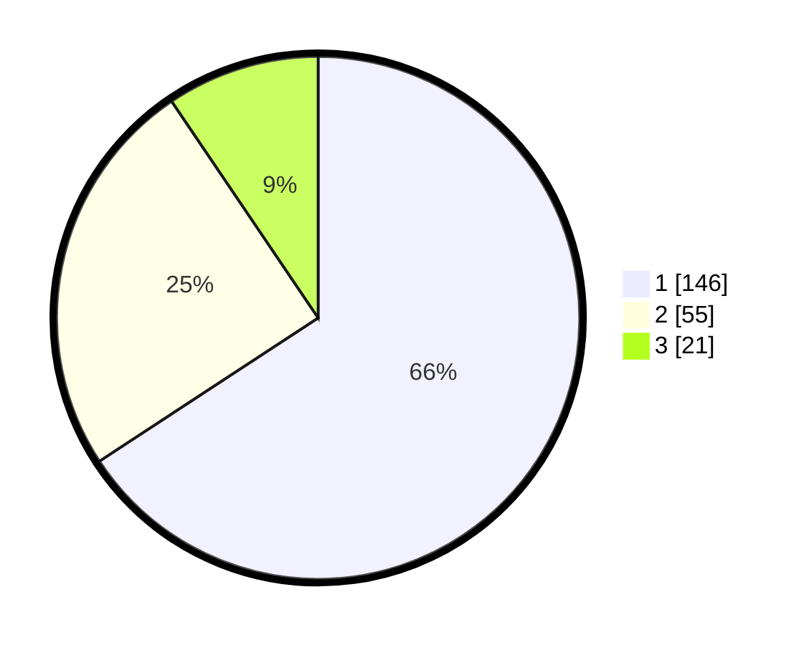

# Hasil

## Grafik

## Tabel

| No.    | Nama Paslon    | Suara | Suara (raw) | Persentase |
|:------ |:-------------- | -----:| -----------:| ----------:|
| 100025 | ANIES MUHAIMIN | 146   | [146][p-1]  | 65,77      |
| 100026 | PRABOWO GIBRAN | 55    | [55][p-2]   | 24,77      |
| 100027 | GANJAR MAHFUD  | 21    | [21][p-3]   | 9,46       |

[p-1]: https://github.com/gigit-pemilu/pemilu-2024/blob/main/pilpres/hitung-suara/sub/31-dki-jakarta/sub/73-jakarta-barat/sub/05-kebon-jeruk/sub/1003-sukabumi-selatan/sub/112-tps/sub/paslon-1.txt
[p-2]: https://github.com/gigit-pemilu/pemilu-2024/blob/main/pilpres/hitung-suara/sub/31-dki-jakarta/sub/73-jakarta-barat/sub/05-kebon-jeruk/sub/1003-sukabumi-selatan/sub/112-tps/sub/paslon-2.txt
[p-3]: https://github.com/gigit-pemilu/pemilu-2024/blob/main/pilpres/hitung-suara/sub/31-dki-jakarta/sub/73-jakarta-barat/sub/05-kebon-jeruk/sub/1003-sukabumi-selatan/sub/112-tps/sub/paslon-3.txt

## Foto C Plano

https://sirekap-obj-formc.kpu.go.id/3fac/pemilu/ppwp/31/73/05/10/03/3173051003112-20240215-010701--60e3d2c0-ee62-4060-a373-42abb3165784.jpg

https://sirekap-obj-formc.kpu.go.id/3fac/pemilu/ppwp/31/73/05/10/03/3173051003112-20240215-010808--e02382f6-63f9-487b-a408-4f28fba4d738.jpg

https://sirekap-obj-formc.kpu.go.id/3fac/pemilu/ppwp/31/73/05/10/03/3173051003112-20240215-010855--833b39b8-5f33-4bf9-b54a-ff6957379eb2.jpg

## Metadata

| Key        | Value               |
| ---------- | ------------------- |
| Time Stamp | 2024-02-19 14:00:00 |

