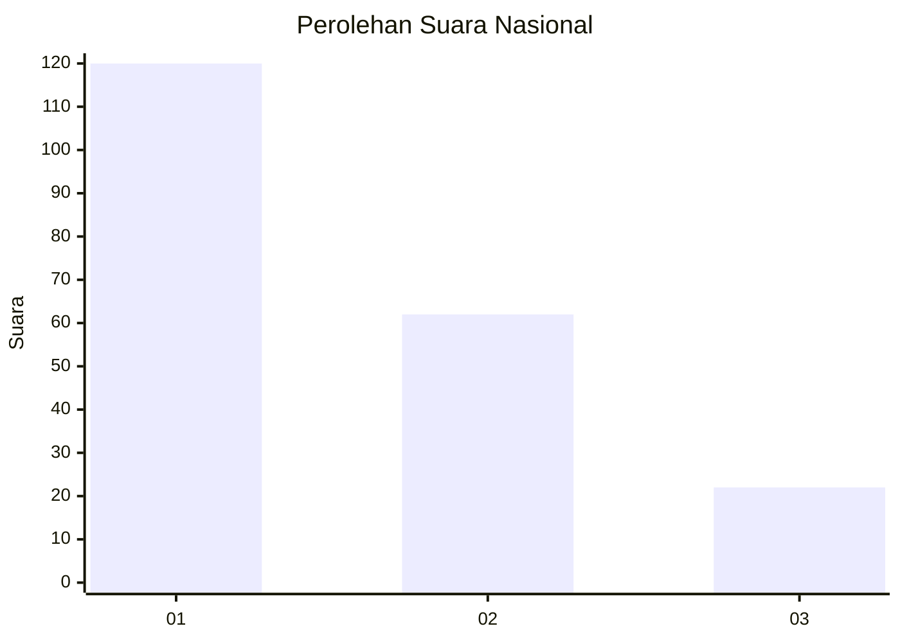
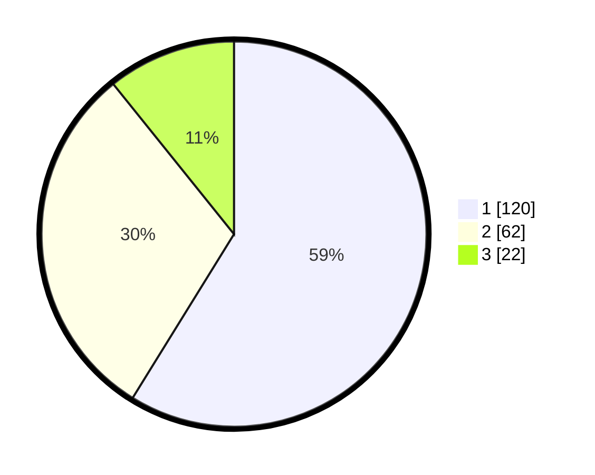

# Hasil

## Grafik

## Tabel

| No.    | Nama Paslon    | Suara | Suara (raw) | Persentase |
|:------ |:-------------- | -----:| -----------:| ----------:|
| 100025 | ANIES MUHAIMIN | 120   | [120][p-1]  | 58,82      |
| 100026 | PRABOWO GIBRAN | 62    | [62][p-2]   | 30,39      |
| 100027 | GANJAR MAHFUD  | 22    | [22][p-3]   | 10,78      |

[p-1]: https://github.com/gigit-pemilu/pemilu-2024/blob/main/pilpres/hitung-suara/sub/31-dki-jakarta/sub/73-jakarta-barat/sub/05-kebon-jeruk/sub/1003-sukabumi-selatan/sub/115-tps/sub/paslon-1.txt
[p-2]: https://github.com/gigit-pemilu/pemilu-2024/blob/main/pilpres/hitung-suara/sub/31-dki-jakarta/sub/73-jakarta-barat/sub/05-kebon-jeruk/sub/1003-sukabumi-selatan/sub/115-tps/sub/paslon-2.txt
[p-3]: https://github.com/gigit-pemilu/pemilu-2024/blob/main/pilpres/hitung-suara/sub/31-dki-jakarta/sub/73-jakarta-barat/sub/05-kebon-jeruk/sub/1003-sukabumi-selatan/sub/115-tps/sub/paslon-3.txt

## Foto C Plano

https://sirekap-obj-formc.kpu.go.id/7a2c/pemilu/ppwp/31/73/05/10/03/3173051003115-20240215-013423--7f24770c-6745-42b7-afcc-41e4d1fecf7b.jpg

https://sirekap-obj-formc.kpu.go.id/7a2c/pemilu/ppwp/31/73/05/10/03/3173051003115-20240215-013611--063b2277-0c1d-4a12-a157-288411d818ad.jpg

https://sirekap-obj-formc.kpu.go.id/7a2c/pemilu/ppwp/31/73/05/10/03/3173051003115-20240215-013836--7e1751f7-62f2-4498-827e-e88f74198618.jpg

## Metadata

| Key        | Value               |
| ---------- | ------------------- |
| Time Stamp | 2024-02-19 14:00:00 |

