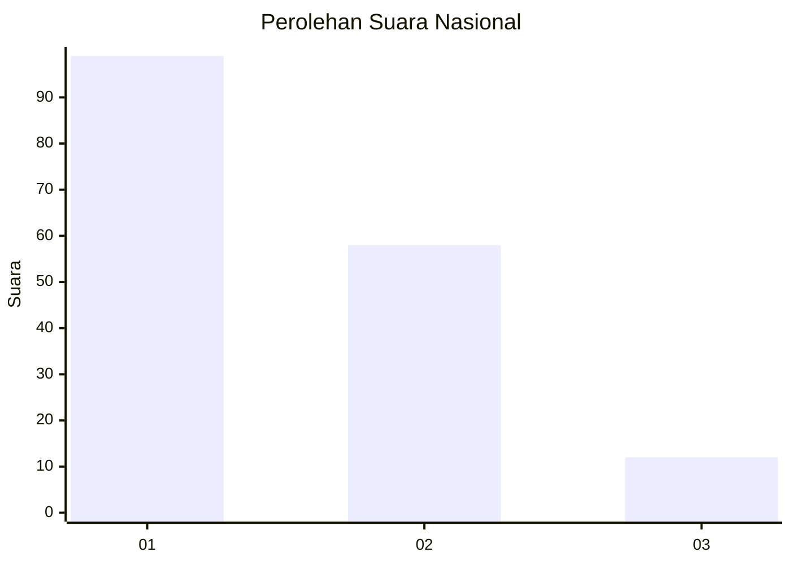
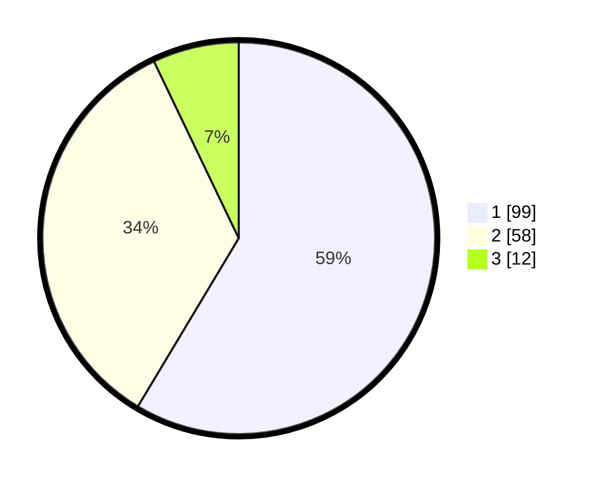

# Hasil

## Grafik

## Tabel

| No.    | Nama Paslon    | Suara | Suara (raw) | Persentase |
|:------ |:-------------- | -----:| -----------:| ----------:|
| 100025 | ANIES MUHAIMIN | 99    | [99][p-1]   | 58,58      |
| 100026 | PRABOWO GIBRAN | 58    | [58][p-2]   | 34,32      |
| 100027 | GANJAR MAHFUD  | 12    | [12][p-3]   | 7,10       |

[p-1]: https://github.com/gigit-pemilu/pemilu-2024/blob/main/pilpres/hitung-suara/sub/31-dki-jakarta/sub/73-jakarta-barat/sub/05-kebon-jeruk/sub/1003-sukabumi-selatan/sub/116-tps/sub/paslon-1.txt
[p-2]: https://github.com/gigit-pemilu/pemilu-2024/blob/main/pilpres/hitung-suara/sub/31-dki-jakarta/sub/73-jakarta-barat/sub/05-kebon-jeruk/sub/1003-sukabumi-selatan/sub/116-tps/sub/paslon-2.txt
[p-3]: https://github.com/gigit-pemilu/pemilu-2024/blob/main/pilpres/hitung-suara/sub/31-dki-jakarta/sub/73-jakarta-barat/sub/05-kebon-jeruk/sub/1003-sukabumi-selatan/sub/116-tps/sub/paslon-3.txt

## Foto C Plano

https://sirekap-obj-formc.kpu.go.id/bc22/pemilu/ppwp/31/73/05/10/03/3173051003116-20240215-004000--baa19a1c-fc55-4af8-bebb-020296c7b7c7.jpg

https://sirekap-obj-formc.kpu.go.id/bc22/pemilu/ppwp/31/73/05/10/03/3173051003116-20240215-004049--6d2accbc-13b4-46fe-9b31-93f6eab04697.jpg

https://sirekap-obj-formc.kpu.go.id/bc22/pemilu/ppwp/31/73/05/10/03/3173051003116-20240215-004144--c1f0179b-fe92-4f3b-93a8-763b5dd1ce33.jpg

## Metadata

| Key        | Value               |
| ---------- | ------------------- |
| Time Stamp | 2024-02-16 21:01:00 |

