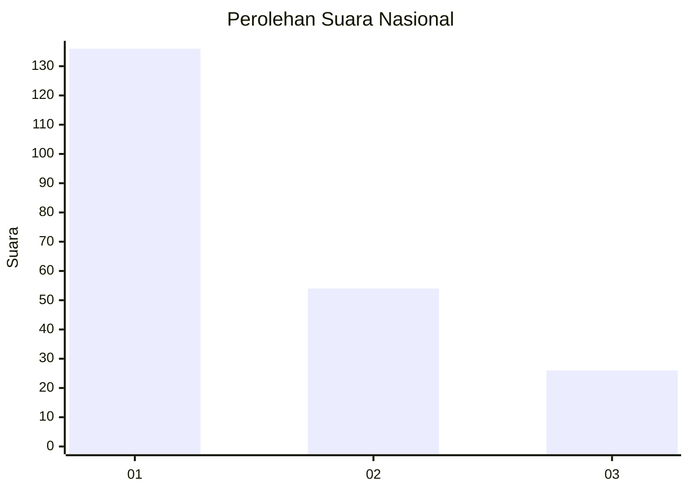
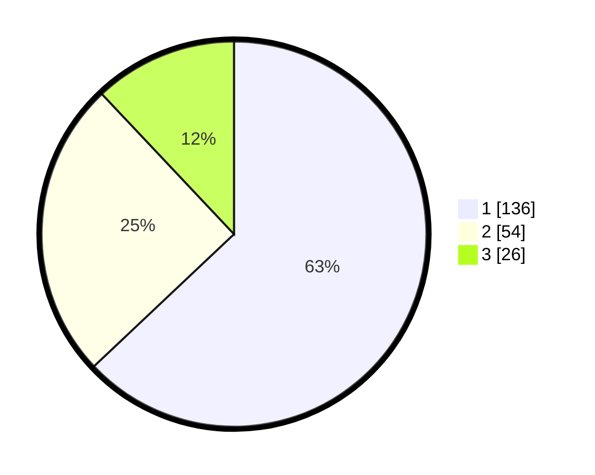

# Hasil

## Grafik

## Tabel

| No.    | Nama Paslon    | Suara | Suara (raw) | Persentase |
|:------ |:-------------- | -----:| -----------:| ----------:|
| 100025 | ANIES MUHAIMIN | 136   | [136][p-1]  | 62,96      |
| 100026 | PRABOWO GIBRAN | 54    | [54][p-2]   | 25,00      |
| 100027 | GANJAR MAHFUD  | 26    | [26][p-3]   | 12,04      |

[p-1]: https://github.com/gigit-pemilu/pemilu-2024/blob/main/pilpres/hitung-suara/sub/31-dki-jakarta/sub/73-jakarta-barat/sub/05-kebon-jeruk/sub/1004-kelapa-dua/sub/001-tps/sub/paslon-1.txt
[p-2]: https://github.com/gigit-pemilu/pemilu-2024/blob/main/pilpres/hitung-suara/sub/31-dki-jakarta/sub/73-jakarta-barat/sub/05-kebon-jeruk/sub/1004-kelapa-dua/sub/001-tps/sub/paslon-2.txt
[p-3]: https://github.com/gigit-pemilu/pemilu-2024/blob/main/pilpres/hitung-suara/sub/31-dki-jakarta/sub/73-jakarta-barat/sub/05-kebon-jeruk/sub/1004-kelapa-dua/sub/001-tps/sub/paslon-3.txt

## Foto C Plano

https://sirekap-obj-formc.kpu.go.id/6277/pemilu/ppwp/31/73/05/10/04/3173051004001-20240215-001708--87f2b9c3-9fd3-4649-83ea-9e8741ff8af0.jpg

https://sirekap-obj-formc.kpu.go.id/6277/pemilu/ppwp/31/73/05/10/04/3173051004001-20240215-001652--32da720f-96da-4873-9dfa-11bc3abc320c.jpg

https://sirekap-obj-formc.kpu.go.id/6277/pemilu/ppwp/31/73/05/10/04/3173051004001-20240215-001454--9941c655-3de4-4725-bf43-d0000ee5805d.jpg

## Metadata

| Key        | Value               |
| ---------- | ------------------- |
| Time Stamp | 2024-02-16 21:01:00 |

