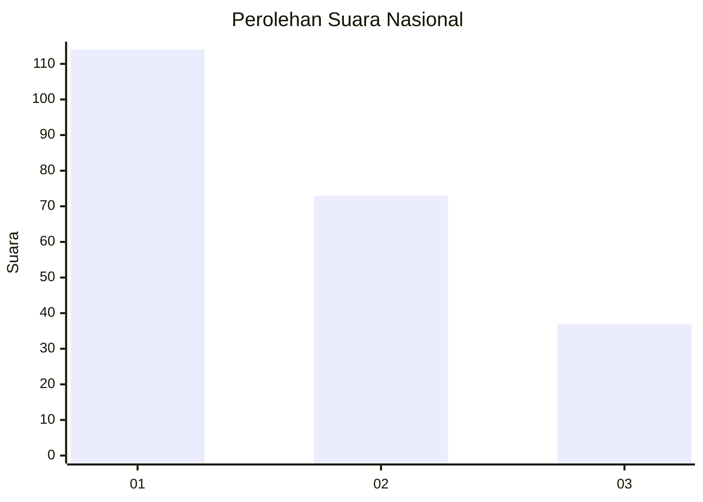
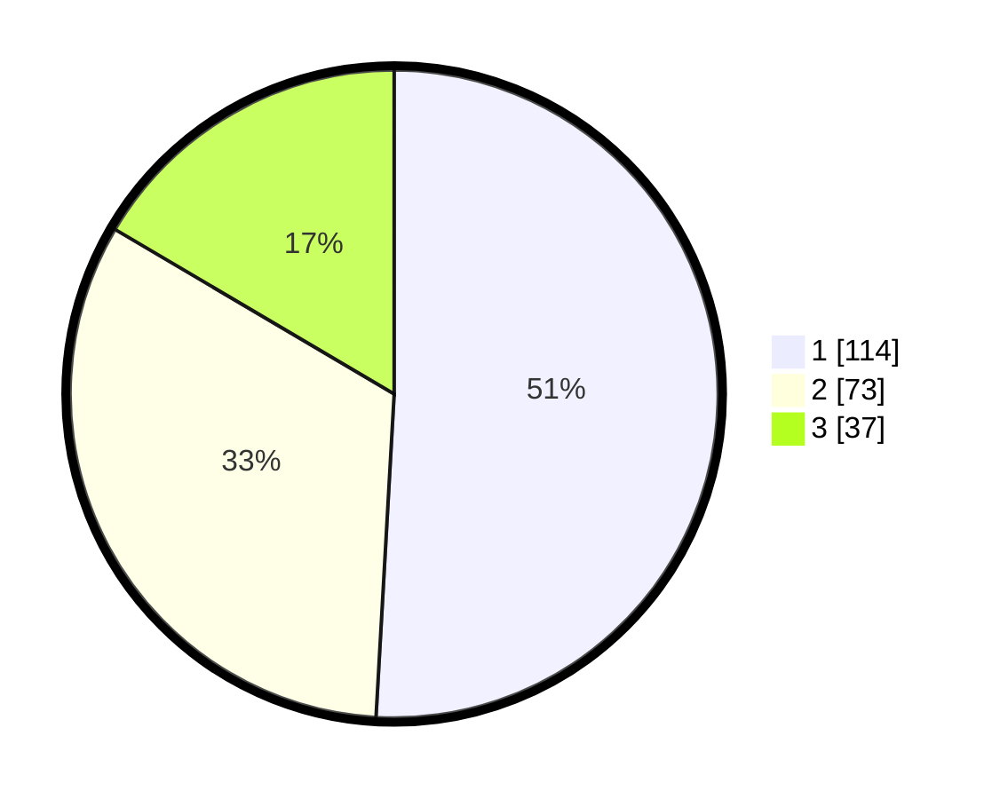

# Hasil

## Grafik

## Tabel

| No.    | Nama Paslon    | Suara | Suara (raw) | Persentase |
|:------ |:-------------- | -----:| -----------:| ----------:|
| 100025 | ANIES MUHAIMIN | 114   | [114][p-1]  | 50,89      |
| 100026 | PRABOWO GIBRAN | 73    | [73][p-2]   | 32,59      |
| 100027 | GANJAR MAHFUD  | 37    | [37][p-3]   | 16,52      |

[p-1]: https://github.com/gigit-pemilu/pemilu-2024/blob/main/pilpres/hitung-suara/sub/31-dki-jakarta/sub/73-jakarta-barat/sub/05-kebon-jeruk/sub/1004-kelapa-dua/sub/006-tps/sub/paslon-1.txt
[p-2]: https://github.com/gigit-pemilu/pemilu-2024/blob/main/pilpres/hitung-suara/sub/31-dki-jakarta/sub/73-jakarta-barat/sub/05-kebon-jeruk/sub/1004-kelapa-dua/sub/006-tps/sub/paslon-2.txt
[p-3]: https://github.com/gigit-pemilu/pemilu-2024/blob/main/pilpres/hitung-suara/sub/31-dki-jakarta/sub/73-jakarta-barat/sub/05-kebon-jeruk/sub/1004-kelapa-dua/sub/006-tps/sub/paslon-3.txt

## Foto C Plano

https://sirekap-obj-formc.kpu.go.id/8564/pemilu/ppwp/31/73/05/10/04/3173051004006-20240215-015247--bfbe1528-5e07-4d53-8235-5d4e37cc3d02.jpg

https://sirekap-obj-formc.kpu.go.id/8564/pemilu/ppwp/31/73/05/10/04/3173051004006-20240215-024611--d9825ed6-2c0e-4152-ba0c-40a7d388e1ab.jpg

https://sirekap-obj-formc.kpu.go.id/8564/pemilu/ppwp/31/73/05/10/04/3173051004006-20240215-024655--67b08514-4bcb-4e56-96cd-4c1d1f562cbc.jpg

## Metadata

| Key        | Value               |
| ---------- | ------------------- |
| Time Stamp | 2024-02-19 14:00:00 |

