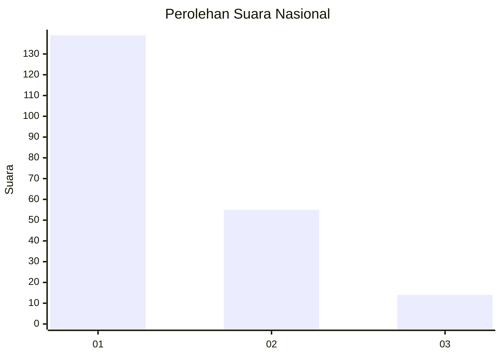
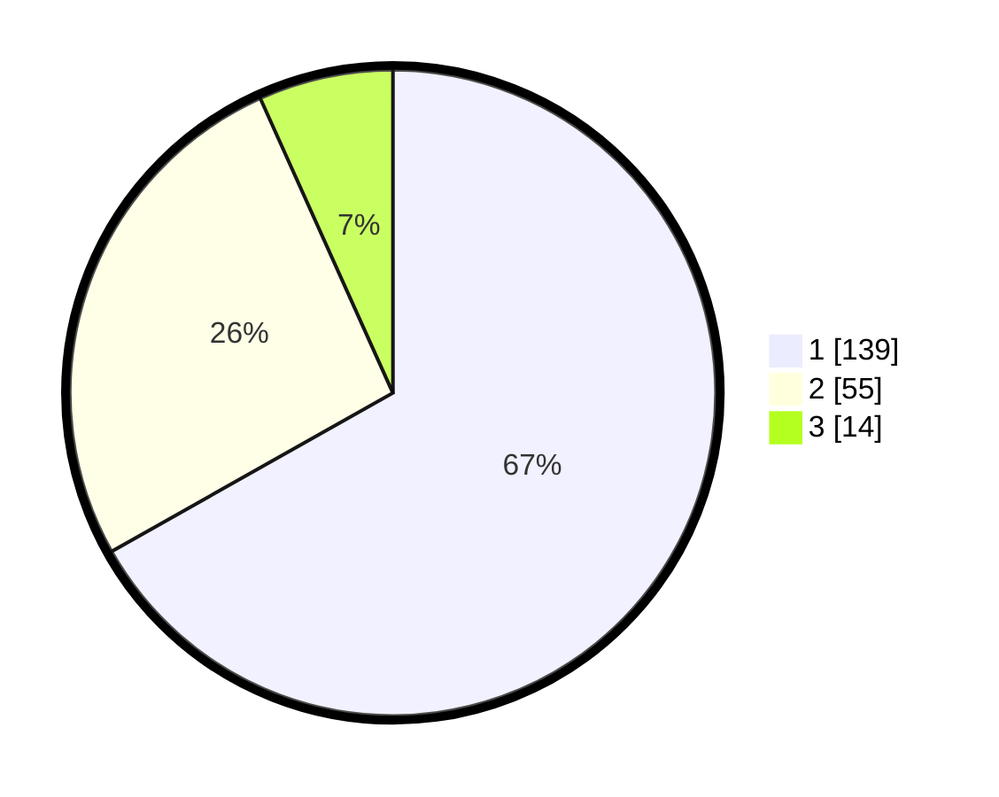

# Hasil

## Grafik

## Tabel

| No.    | Nama Paslon    | Suara | Suara (raw) | Persentase |
|:------ |:-------------- | -----:| -----------:| ----------:|
| 100025 | ANIES MUHAIMIN | 139   | [139][p-1]  | 66,83      |
| 100026 | PRABOWO GIBRAN | 55    | [55][p-2]   | 26,44      |
| 100027 | GANJAR MAHFUD  | 14    | [14][p-3]   | 6,73       |

[p-1]: https://github.com/gigit-pemilu/pemilu-2024/blob/main/pilpres/hitung-suara/sub/31-dki-jakarta/sub/73-jakarta-barat/sub/05-kebon-jeruk/sub/1004-kelapa-dua/sub/008-tps/sub/paslon-1.txt
[p-2]: https://github.com/gigit-pemilu/pemilu-2024/blob/main/pilpres/hitung-suara/sub/31-dki-jakarta/sub/73-jakarta-barat/sub/05-kebon-jeruk/sub/1004-kelapa-dua/sub/008-tps/sub/paslon-2.txt
[p-3]: https://github.com/gigit-pemilu/pemilu-2024/blob/main/pilpres/hitung-suara/sub/31-dki-jakarta/sub/73-jakarta-barat/sub/05-kebon-jeruk/sub/1004-kelapa-dua/sub/008-tps/sub/paslon-3.txt

## Foto C Plano

https://sirekap-obj-formc.kpu.go.id/8845/pemilu/ppwp/31/73/05/10/04/3173051004008-20240214-234944--8111ab4b-bbab-40a7-9268-f0ef5c155d80.jpg

https://sirekap-obj-formc.kpu.go.id/8845/pemilu/ppwp/31/73/05/10/04/3173051004008-20240214-220518--4543a773-a2aa-4c66-869e-cab34ba945df.jpg

https://sirekap-obj-formc.kpu.go.id/8845/pemilu/ppwp/31/73/05/10/04/3173051004008-20240214-220635--3c84cd35-bfc5-4429-83c0-b1072fc38545.jpg

## Metadata

| Key        | Value               |
| ---------- | ------------------- |
| Time Stamp | 2024-02-16 21:01:00 |

