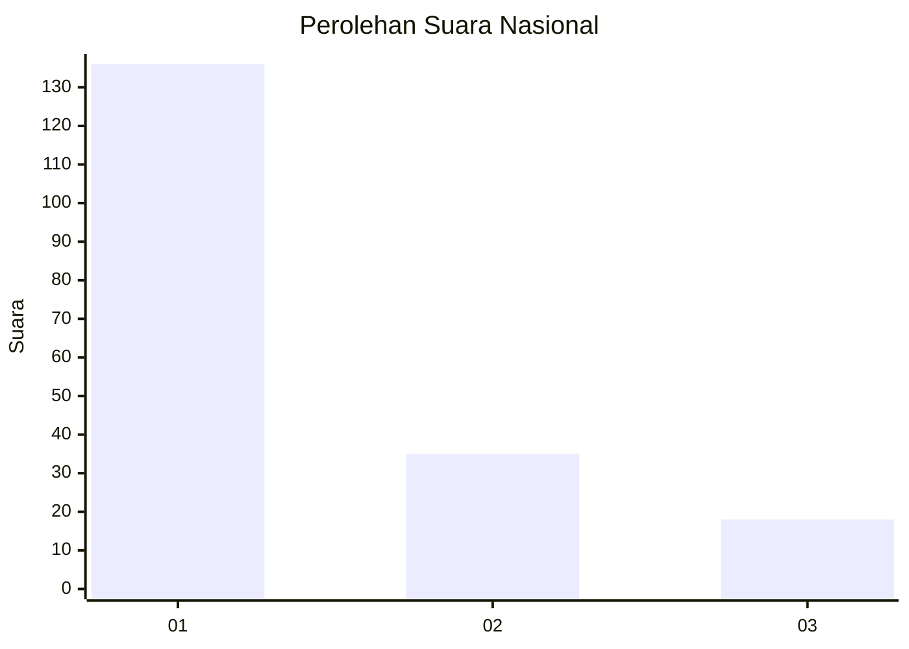
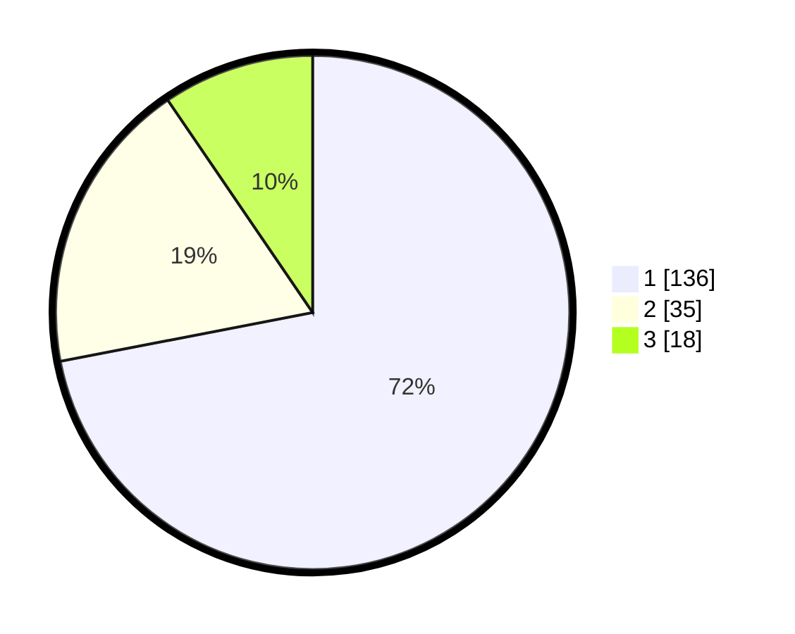

# Hasil

## Grafik

## Tabel

| No.    | Nama Paslon    | Suara | Suara (raw) | Persentase |
|:------ |:-------------- | -----:| -----------:| ----------:|
| 100025 | ANIES MUHAIMIN | 136   | [136][p-1]  | 71,96      |
| 100026 | PRABOWO GIBRAN | 35    | [35][p-2]   | 18,52      |
| 100027 | GANJAR MAHFUD  | 18    | [18][p-3]   | 9,52       |

[p-1]: https://github.com/gigit-pemilu/pemilu-2024/blob/main/pilpres/hitung-suara/sub/31-dki-jakarta/sub/73-jakarta-barat/sub/05-kebon-jeruk/sub/1004-kelapa-dua/sub/009-tps/sub/paslon-1.txt
[p-2]: https://github.com/gigit-pemilu/pemilu-2024/blob/main/pilpres/hitung-suara/sub/31-dki-jakarta/sub/73-jakarta-barat/sub/05-kebon-jeruk/sub/1004-kelapa-dua/sub/009-tps/sub/paslon-2.txt
[p-3]: https://github.com/gigit-pemilu/pemilu-2024/blob/main/pilpres/hitung-suara/sub/31-dki-jakarta/sub/73-jakarta-barat/sub/05-kebon-jeruk/sub/1004-kelapa-dua/sub/009-tps/sub/paslon-3.txt

## Foto C Plano

https://sirekap-obj-formc.kpu.go.id/daf8/pemilu/ppwp/31/73/05/10/04/3173051004009-20240214-213645--ad4a0af4-311b-4ffc-84f1-0de338e330e5.jpg

https://sirekap-obj-formc.kpu.go.id/daf8/pemilu/ppwp/31/73/05/10/04/3173051004009-20240214-213651--15a7d049-6ff5-4ba6-8dfd-9aa0cf047a53.jpg

https://sirekap-obj-formc.kpu.go.id/daf8/pemilu/ppwp/31/73/05/10/04/3173051004009-20240214-213656--57b869c6-b80b-4d85-9612-b67d7af72c87.jpg

## Metadata

| Key        | Value               |
| ---------- | ------------------- |
| Time Stamp | 2024-02-19 14:00:00 |

