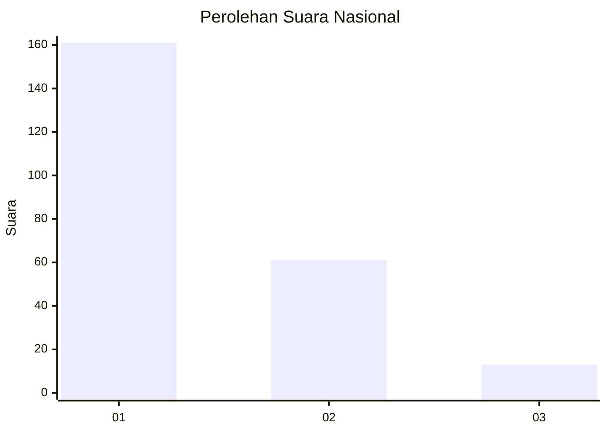
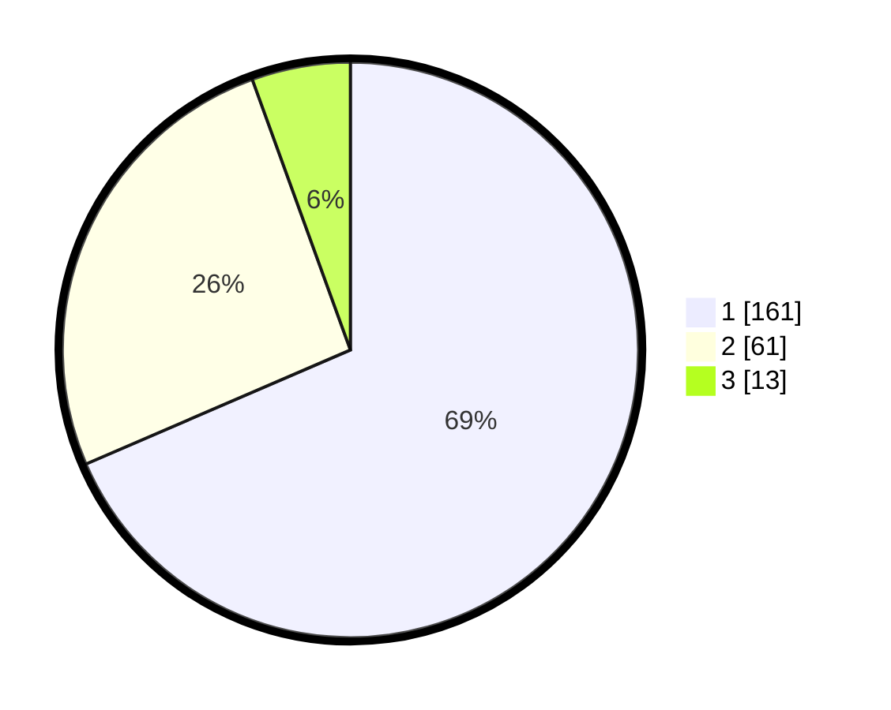

# Hasil

## Grafik

## Tabel

| No. | Nama Paslon    | Suara | Suara (raw) | Persentase |
|:--- |:-------------- | -----:| -----------:| ----------:|
| 1   | ANIES MUHAIMIN | 161   | [161][p-1]  | 68,51      |
| 2   | PRABOWO GIBRAN | 61    | [61][p-2]   | 25,96      |
| 3   | GANJAR MAHFUD  | 13    | [13][p-3]   | 5,53       |

[p-1]: https://github.com/gigit-pemilu/pemilu-2024/blob/main/pilpres/hitung-suara/sub/31-dki-jakarta/sub/73-jakarta-barat/sub/05-kebon-jeruk/sub/1004-kelapa-dua/sub/012-tps/sub/paslon-1.txt
[p-2]: https://github.com/gigit-pemilu/pemilu-2024/blob/main/pilpres/hitung-suara/sub/31-dki-jakarta/sub/73-jakarta-barat/sub/05-kebon-jeruk/sub/1004-kelapa-dua/sub/012-tps/sub/paslon-2.txt
[p-3]: https://github.com/gigit-pemilu/pemilu-2024/blob/main/pilpres/hitung-suara/sub/31-dki-jakarta/sub/73-jakarta-barat/sub/05-kebon-jeruk/sub/1004-kelapa-dua/sub/012-tps/sub/paslon-3.txt

## Foto C Plano

https://sirekap-obj-formc.kpu.go.id/dca3/pemilu/ppwp/31/73/05/10/04/3173051004012-20240214-201831--e901df7a-cb5d-41fd-ada0-107b1c0ed457.jpg

https://sirekap-obj-formc.kpu.go.id/dca3/pemilu/ppwp/31/73/05/10/04/3173051004012-20240214-202152--c538ef25-28e9-4c2d-8dc9-71c837a3b8b4.jpg

https://sirekap-obj-formc.kpu.go.id/dca3/pemilu/ppwp/31/73/05/10/04/3173051004012-20240214-202347--06d6aabc-f4e3-4533-b311-b44d47e46e84.jpg

## Metadata

| Key        | Value               |
| ---------- | ------------------- |
| Time Stamp | 2024-02-21 17:00:00 |

