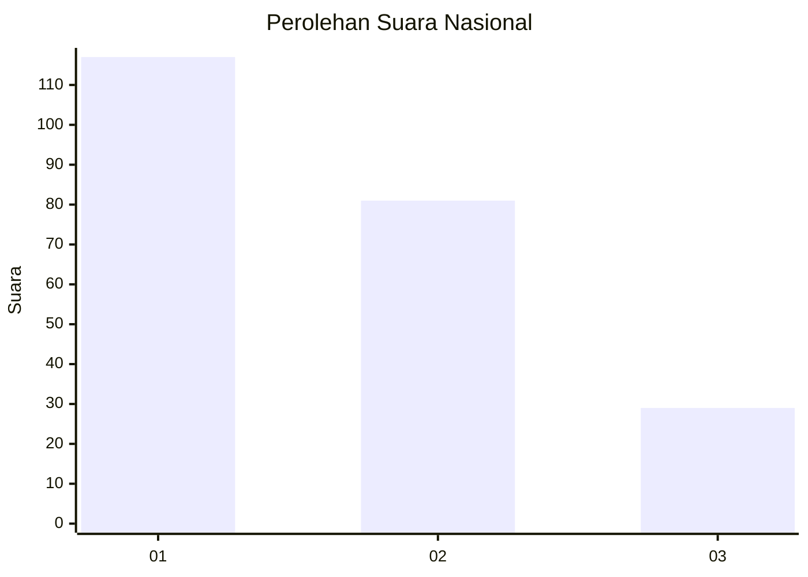
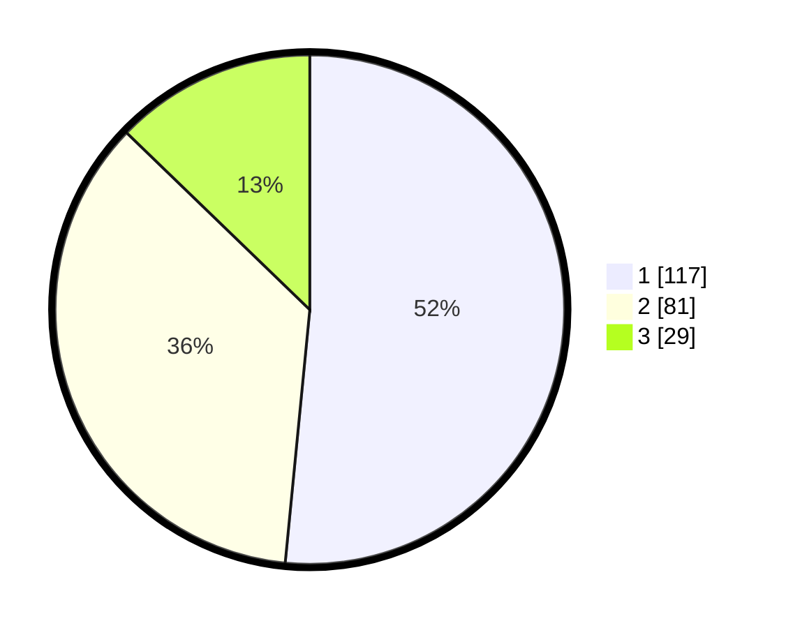

# Hasil

## Grafik

## Tabel

| No.    | Nama Paslon    | Suara | Suara (raw) | Persentase |
|:------ |:-------------- | -----:| -----------:| ----------:|
| 100025 | ANIES MUHAIMIN | 117   | [117][p-1]  | 51,54      |
| 100026 | PRABOWO GIBRAN | 81    | [81][p-2]   | 35,68      |
| 100027 | GANJAR MAHFUD  | 29    | [29][p-3]   | 12,78      |

[p-1]: https://github.com/gigit-pemilu/pemilu-2024/blob/main/pilpres/hitung-suara/sub/31-dki-jakarta/sub/73-jakarta-barat/sub/05-kebon-jeruk/sub/1004-kelapa-dua/sub/029-tps/sub/paslon-1.txt
[p-2]: https://github.com/gigit-pemilu/pemilu-2024/blob/main/pilpres/hitung-suara/sub/31-dki-jakarta/sub/73-jakarta-barat/sub/05-kebon-jeruk/sub/1004-kelapa-dua/sub/029-tps/sub/paslon-2.txt
[p-3]: https://github.com/gigit-pemilu/pemilu-2024/blob/main/pilpres/hitung-suara/sub/31-dki-jakarta/sub/73-jakarta-barat/sub/05-kebon-jeruk/sub/1004-kelapa-dua/sub/029-tps/sub/paslon-3.txt

## Foto C Plano

https://sirekap-obj-formc.kpu.go.id/611f/pemilu/ppwp/31/73/05/10/04/3173051004029-20240215-064239--ef5e66d7-1661-4a39-9c66-328452a54a5b.jpg

https://sirekap-obj-formc.kpu.go.id/611f/pemilu/ppwp/31/73/05/10/04/3173051004029-20240215-064242--dfe93d3b-d085-4dda-a0c5-4205adac530c.jpg

https://sirekap-obj-formc.kpu.go.id/611f/pemilu/ppwp/31/73/05/10/04/3173051004029-20240215-035853--1c42cc3f-2e89-4637-b4de-6eaf390f2149.jpg

## Metadata

| Key        | Value               |
| ---------- | ------------------- |
| Time Stamp | 2024-02-21 17:00:00 |

