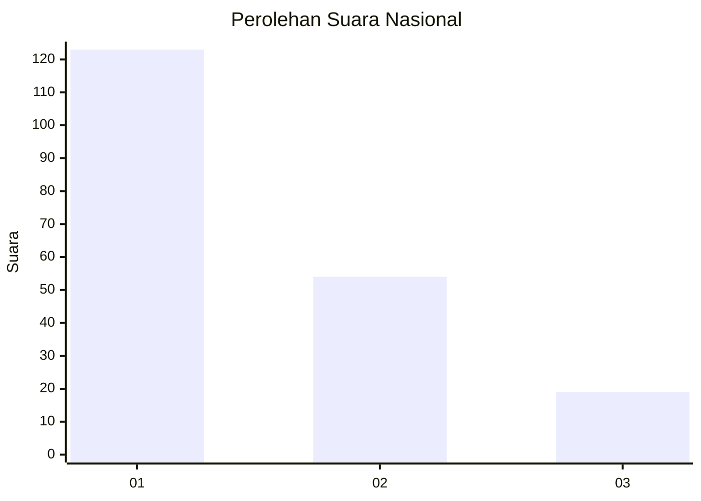
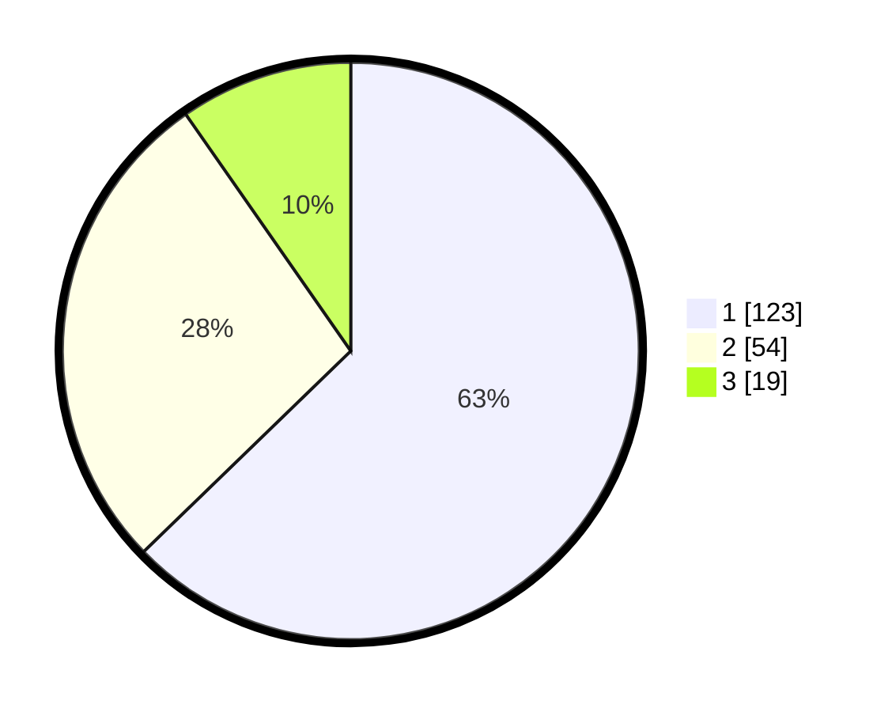

# Hasil

## Grafik

## Tabel

| No.    | Nama Paslon    | Suara | Suara (raw) | Persentase |
|:------ |:-------------- | -----:| -----------:| ----------:|
| 100025 | ANIES MUHAIMIN | 123   | [123][p-1]  | 62,76      |
| 100026 | PRABOWO GIBRAN | 54    | [54][p-2]   | 27,55      |
| 100027 | GANJAR MAHFUD  | 19    | [19][p-3]   | 9,69       |

[p-1]: https://github.com/gigit-pemilu/pemilu-2024/blob/main/pilpres/hitung-suara/sub/31-dki-jakarta/sub/73-jakarta-barat/sub/05-kebon-jeruk/sub/1004-kelapa-dua/sub/032-tps/sub/paslon-1.txt
[p-2]: https://github.com/gigit-pemilu/pemilu-2024/blob/main/pilpres/hitung-suara/sub/31-dki-jakarta/sub/73-jakarta-barat/sub/05-kebon-jeruk/sub/1004-kelapa-dua/sub/032-tps/sub/paslon-2.txt
[p-3]: https://github.com/gigit-pemilu/pemilu-2024/blob/main/pilpres/hitung-suara/sub/31-dki-jakarta/sub/73-jakarta-barat/sub/05-kebon-jeruk/sub/1004-kelapa-dua/sub/032-tps/sub/paslon-3.txt

## Foto C Plano

https://sirekap-obj-formc.kpu.go.id/e217/pemilu/ppwp/31/73/05/10/04/3173051004032-20240214-195122--0eb1371b-0f96-4c93-8846-1bb7c8181609.jpg

https://sirekap-obj-formc.kpu.go.id/e217/pemilu/ppwp/31/73/05/10/04/3173051004032-20240214-195202--2e42ec56-8e5c-4556-8ca8-fef4147c92be.jpg

https://sirekap-obj-formc.kpu.go.id/e217/pemilu/ppwp/31/73/05/10/04/3173051004032-20240214-195305--0878a08a-aa2e-4475-8068-82123c313b6e.jpg

## Metadata

| Key        | Value               |
| ---------- | ------------------- |
| Time Stamp | 2024-02-16 21:01:00 |

