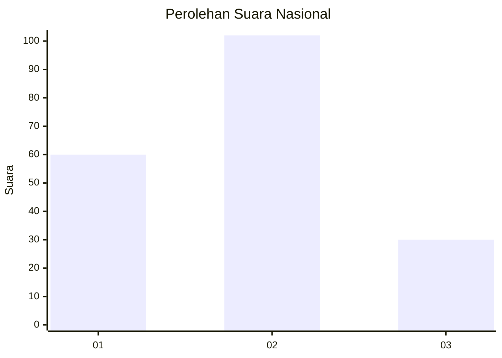
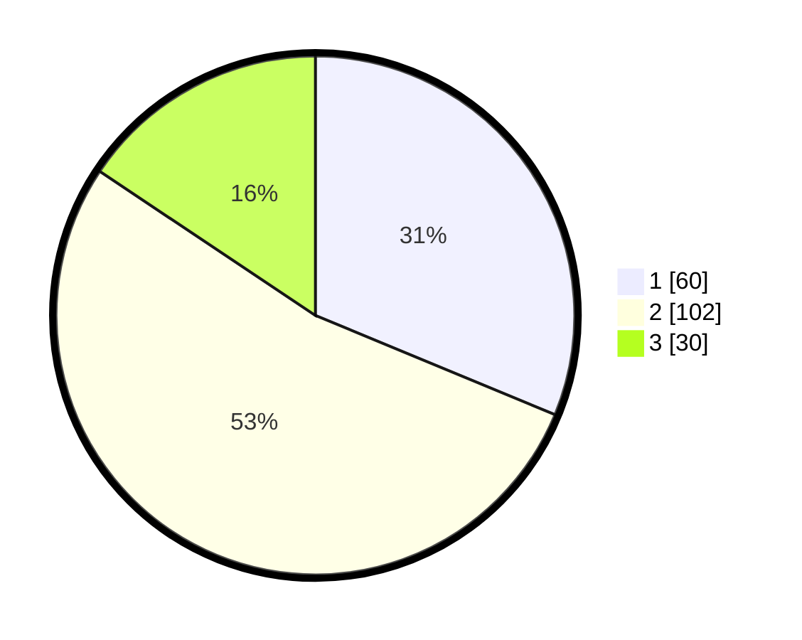

# Hasil

## Grafik

## Tabel

| No.    | Nama Paslon    | Suara | Suara (raw) | Persentase |
|:------ |:-------------- | -----:| -----------:| ----------:|
| 100025 | ANIES MUHAIMIN | 60    | [60][p-1]   | 31,25      |
| 100026 | PRABOWO GIBRAN | 102   | [102][p-2]  | 53,13      |
| 100027 | GANJAR MAHFUD  | 30    | [30][p-3]   | 15,63      |

[p-1]: https://github.com/gigit-pemilu/pemilu-2024/blob/main/pilpres/hitung-suara/sub/31-dki-jakarta/sub/73-jakarta-barat/sub/05-kebon-jeruk/sub/1004-kelapa-dua/sub/042-tps/sub/paslon-1.txt
[p-2]: https://github.com/gigit-pemilu/pemilu-2024/blob/main/pilpres/hitung-suara/sub/31-dki-jakarta/sub/73-jakarta-barat/sub/05-kebon-jeruk/sub/1004-kelapa-dua/sub/042-tps/sub/paslon-2.txt
[p-3]: https://github.com/gigit-pemilu/pemilu-2024/blob/main/pilpres/hitung-suara/sub/31-dki-jakarta/sub/73-jakarta-barat/sub/05-kebon-jeruk/sub/1004-kelapa-dua/sub/042-tps/sub/paslon-3.txt

## Foto C Plano

https://sirekap-obj-formc.kpu.go.id/9ca7/pemilu/ppwp/31/73/05/10/04/3173051004042-20240215-012947--e7de6c81-9045-4ad0-afa9-adb03827f7ea.jpg

https://sirekap-obj-formc.kpu.go.id/9ca7/pemilu/ppwp/31/73/05/10/04/3173051004042-20240215-013038--759dfba1-2b58-427f-8a3d-1f9c25decc6b.jpg

https://sirekap-obj-formc.kpu.go.id/9ca7/pemilu/ppwp/31/73/05/10/04/3173051004042-20240215-013134--b70a29d7-76c7-4bc5-a692-9da8900d09fb.jpg

## Metadata

| Key        | Value               |
| ---------- | ------------------- |
| Time Stamp | 2024-02-16 21:01:00 |

