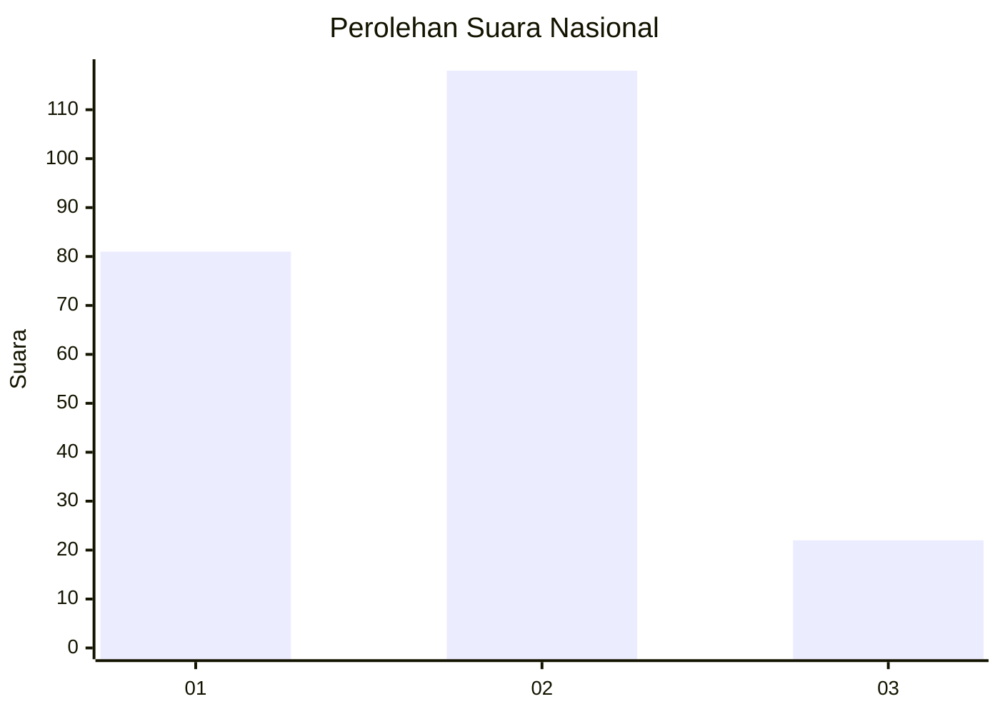

# Hasil

## Grafik

## Tabel

| No.    | Nama Paslon    | Suara | Suara (raw) | Persentase |
|:------ |:-------------- | -----:| -----------:| ----------:|
| 100025 | ANIES MUHAIMIN | 81    | [81][p-1]   | 36,65      |
| 100026 | PRABOWO GIBRAN | 118   | [118][p-2]  | 53,39      |
| 100027 | GANJAR MAHFUD  | 22    | [22][p-3]   | 9,95       |

[p-1]: https://github.com/gigit-pemilu/pemilu-2024/blob/main/pilpres/hitung-suara/sub/31-dki-jakarta/sub/73-jakarta-barat/sub/05-kebon-jeruk/sub/1004-kelapa-dua/sub/044-tps/sub/paslon-1.txt
[p-2]: https://github.com/gigit-pemilu/pemilu-2024/blob/main/pilpres/hitung-suara/sub/31-dki-jakarta/sub/73-jakarta-barat/sub/05-kebon-jeruk/sub/1004-kelapa-dua/sub/044-tps/sub/paslon-2.txt
[p-3]: https://github.com/gigit-pemilu/pemilu-2024/blob/main/pilpres/hitung-suara/sub/31-dki-jakarta/sub/73-jakarta-barat/sub/05-kebon-jeruk/sub/1004-kelapa-dua/sub/044-tps/sub/paslon-3.txt

## Foto C Plano

https://sirekap-obj-formc.kpu.go.id/b997/pemilu/ppwp/31/73/05/10/04/3173051004044-20240214-205441--9b573dc2-cc28-47bc-bb1c-a3d0930211e5.jpg

https://sirekap-obj-formc.kpu.go.id/b997/pemilu/ppwp/31/73/05/10/04/3173051004044-20240214-205709--101ee32f-29e0-4722-9052-2f9e620f3115.jpg

https://sirekap-obj-formc.kpu.go.id/b997/pemilu/ppwp/31/73/05/10/04/3173051004044-20240214-205831--9ea82dec-7ab3-4134-94cf-e92e1a943e83.jpg

## Metadata

| Key        | Value               |
| ---------- | ------------------- |
| Time Stamp | 2024-02-19 14:00:00 |

