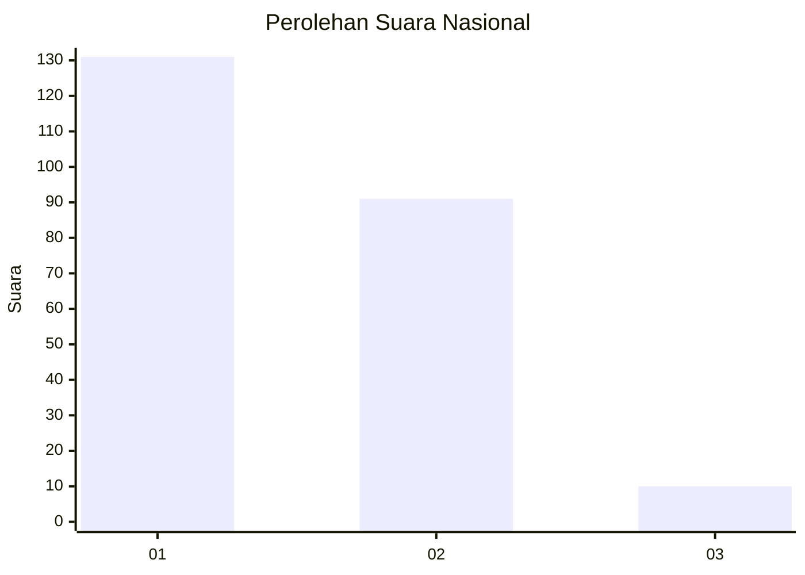
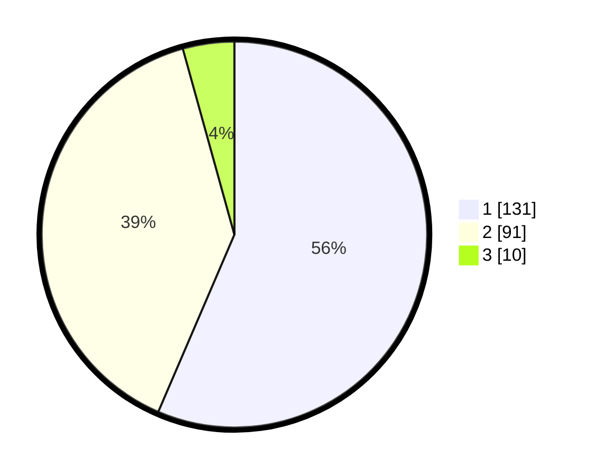

# Hasil

## Grafik

## Tabel

| No.    | Nama Paslon    | Suara | Suara (raw) | Persentase |
|:------ |:-------------- | -----:| -----------:| ----------:|
| 100025 | ANIES MUHAIMIN | 131   | [131][p-1]  | 56,47      |
| 100026 | PRABOWO GIBRAN | 91    | [91][p-2]   | 39,22      |
| 100027 | GANJAR MAHFUD  | 10    | [10][p-3]   | 4,31       |

[p-1]: https://github.com/gigit-pemilu/pemilu-2024/blob/main/pilpres/hitung-suara/sub/31-dki-jakarta/sub/73-jakarta-barat/sub/05-kebon-jeruk/sub/1004-kelapa-dua/sub/055-tps/sub/paslon-1.txt
[p-2]: https://github.com/gigit-pemilu/pemilu-2024/blob/main/pilpres/hitung-suara/sub/31-dki-jakarta/sub/73-jakarta-barat/sub/05-kebon-jeruk/sub/1004-kelapa-dua/sub/055-tps/sub/paslon-2.txt
[p-3]: https://github.com/gigit-pemilu/pemilu-2024/blob/main/pilpres/hitung-suara/sub/31-dki-jakarta/sub/73-jakarta-barat/sub/05-kebon-jeruk/sub/1004-kelapa-dua/sub/055-tps/sub/paslon-3.txt

## Foto C Plano

https://sirekap-obj-formc.kpu.go.id/d743/pemilu/ppwp/31/73/05/10/04/3173051004055-20240215-001324--f7f4394d-bb3e-415e-bb00-91142ef4bd4f.jpg

https://sirekap-obj-formc.kpu.go.id/d743/pemilu/ppwp/31/73/05/10/04/3173051004055-20240215-001350--0e79b361-1a23-4e5f-b6bd-585fc51872c0.jpg

https://sirekap-obj-formc.kpu.go.id/d743/pemilu/ppwp/31/73/05/10/04/3173051004055-20240215-001409--6487bb1f-d2cf-4989-b685-2435278d2ff0.jpg

## Metadata

| Key        | Value               |
| ---------- | ------------------- |
| Time Stamp | 2024-02-19 14:00:00 |

