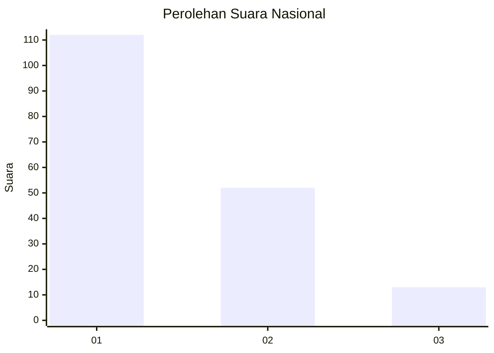
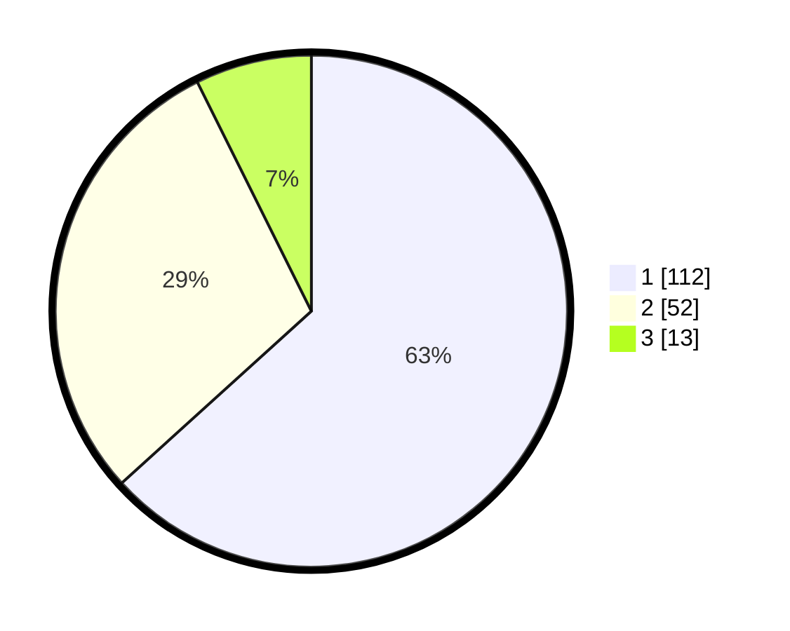

# Hasil

## Grafik

## Tabel

| No.    | Nama Paslon    | Suara | Suara (raw) | Persentase |
|:------ |:-------------- | -----:| -----------:| ----------:|
| 100025 | ANIES MUHAIMIN | 112   | [112][p-1]  | 63,28      |
| 100026 | PRABOWO GIBRAN | 52    | [52][p-2]   | 29,38      |
| 100027 | GANJAR MAHFUD  | 13    | [13][p-3]   | 7,34       |

[p-1]: https://github.com/gigit-pemilu/pemilu-2024/blob/main/pilpres/hitung-suara/sub/31-dki-jakarta/sub/73-jakarta-barat/sub/05-kebon-jeruk/sub/1004-kelapa-dua/sub/067-tps/sub/paslon-1.txt
[p-2]: https://github.com/gigit-pemilu/pemilu-2024/blob/main/pilpres/hitung-suara/sub/31-dki-jakarta/sub/73-jakarta-barat/sub/05-kebon-jeruk/sub/1004-kelapa-dua/sub/067-tps/sub/paslon-2.txt
[p-3]: https://github.com/gigit-pemilu/pemilu-2024/blob/main/pilpres/hitung-suara/sub/31-dki-jakarta/sub/73-jakarta-barat/sub/05-kebon-jeruk/sub/1004-kelapa-dua/sub/067-tps/sub/paslon-3.txt

## Foto C Plano

https://sirekap-obj-formc.kpu.go.id/03d1/pemilu/ppwp/31/73/05/10/04/3173051004067-20240215-011304--ffe09379-475f-4155-b5ef-7d141b58c547.jpg

https://sirekap-obj-formc.kpu.go.id/03d1/pemilu/ppwp/31/73/05/10/04/3173051004067-20240215-010851--a311a3e9-0a6f-4759-bd8b-cee793cf9378.jpg

https://sirekap-obj-formc.kpu.go.id/03d1/pemilu/ppwp/31/73/05/10/04/3173051004067-20240215-011103--8d19abd1-91b9-446d-b665-0541c5041c5a.jpg

## Metadata

| Key        | Value               |
| ---------- | ------------------- |
| Time Stamp | 2024-02-16 21:01:00 |

