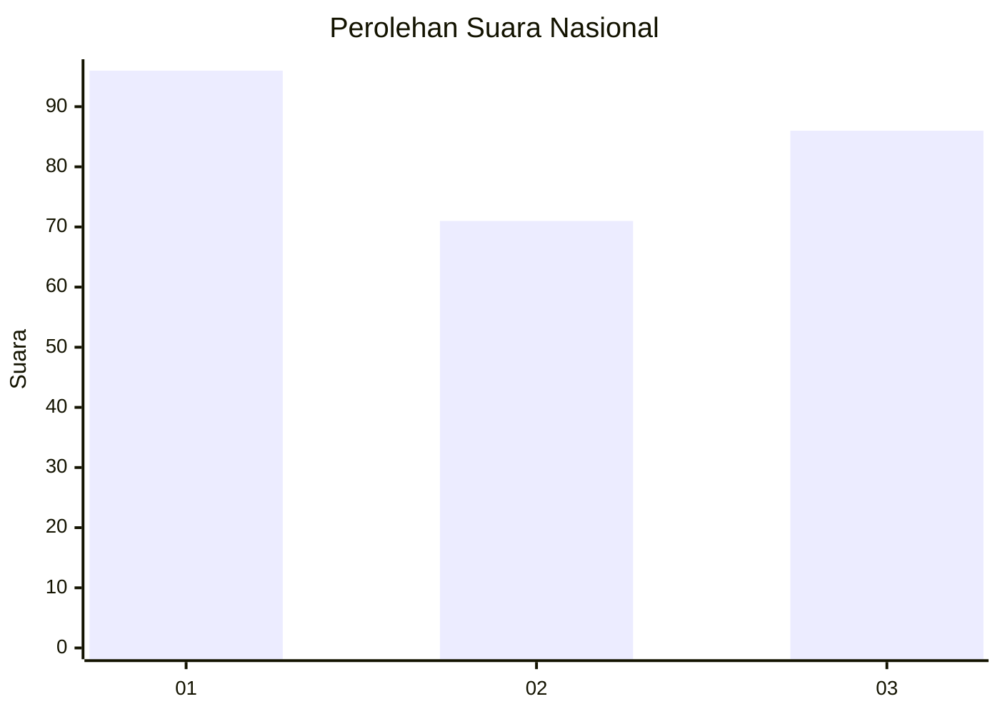
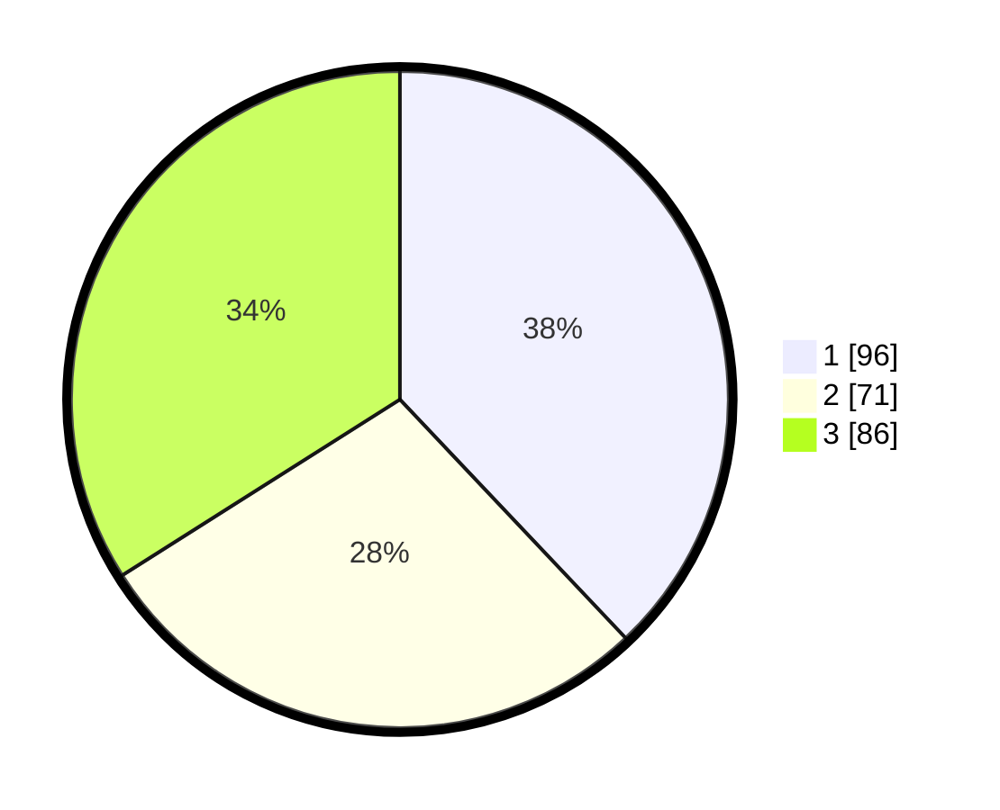

# Hasil

## Grafik

## Tabel

| No.    | Nama Paslon    | Suara | Suara (raw) | Persentase |
|:------ |:-------------- | -----:| -----------:| ----------:|
| 100025 | ANIES MUHAIMIN | 96    | [96][p-1]   | 37,94      |
| 100026 | PRABOWO GIBRAN | 71    | [71][p-2]   | 28,06      |
| 100027 | GANJAR MAHFUD  | 86    | [86][p-3]   | 33,99      |

[p-1]: https://github.com/gigit-pemilu/pemilu-2024/blob/main/pilpres/hitung-suara/sub/31-dki-jakarta/sub/73-jakarta-barat/sub/05-kebon-jeruk/sub/1004-kelapa-dua/sub/070-tps/sub/paslon-1.txt
[p-2]: https://github.com/gigit-pemilu/pemilu-2024/blob/main/pilpres/hitung-suara/sub/31-dki-jakarta/sub/73-jakarta-barat/sub/05-kebon-jeruk/sub/1004-kelapa-dua/sub/070-tps/sub/paslon-2.txt
[p-3]: https://github.com/gigit-pemilu/pemilu-2024/blob/main/pilpres/hitung-suara/sub/31-dki-jakarta/sub/73-jakarta-barat/sub/05-kebon-jeruk/sub/1004-kelapa-dua/sub/070-tps/sub/paslon-3.txt

## Foto C Plano

https://sirekap-obj-formc.kpu.go.id/6fb3/pemilu/ppwp/31/73/05/10/04/3173051004070-20240214-200823--53203571-21c7-411b-a41e-799016298f3c.jpg

https://sirekap-obj-formc.kpu.go.id/6fb3/pemilu/ppwp/31/73/05/10/04/3173051004070-20240214-201033--1722e0f4-4b9a-4d9d-a682-c95f701ccf30.jpg

https://sirekap-obj-formc.kpu.go.id/6fb3/pemilu/ppwp/31/73/05/10/04/3173051004070-20240214-201313--67173bf0-b880-42fe-8311-ef8ea8093470.jpg

## Metadata

| Key        | Value               |
| ---------- | ------------------- |
| Time Stamp | 2024-02-19 14:00:00 |

