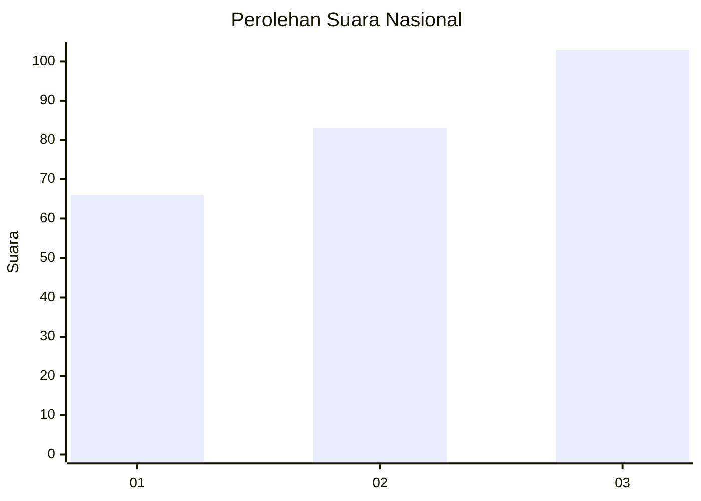
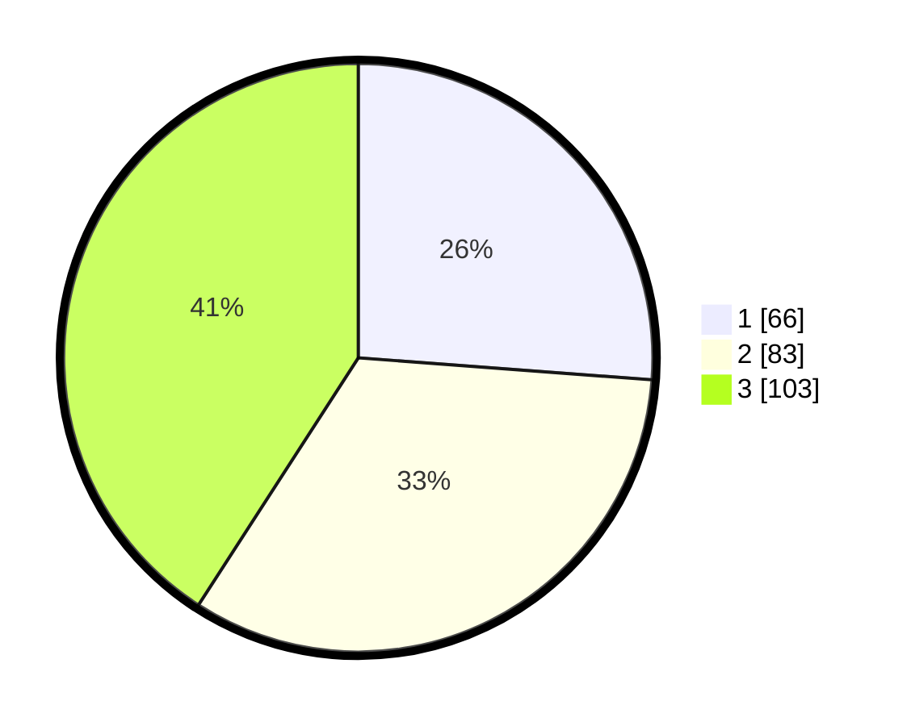

# Hasil

## Grafik

## Tabel

| No.    | Nama Paslon    | Suara | Suara (raw) | Persentase |
|:------ |:-------------- | -----:| -----------:| ----------:|
| 100025 | ANIES MUHAIMIN | 66    | [66][p-1]   | 26,19      |
| 100026 | PRABOWO GIBRAN | 83    | [83][p-2]   | 32,94      |
| 100027 | GANJAR MAHFUD  | 103   | [103][p-3]  | 40,87      |

[p-1]: https://github.com/gigit-pemilu/pemilu-2024/blob/main/pilpres/hitung-suara/sub/31-dki-jakarta/sub/73-jakarta-barat/sub/05-kebon-jeruk/sub/1004-kelapa-dua/sub/071-tps/sub/paslon-1.txt
[p-2]: https://github.com/gigit-pemilu/pemilu-2024/blob/main/pilpres/hitung-suara/sub/31-dki-jakarta/sub/73-jakarta-barat/sub/05-kebon-jeruk/sub/1004-kelapa-dua/sub/071-tps/sub/paslon-2.txt
[p-3]: https://github.com/gigit-pemilu/pemilu-2024/blob/main/pilpres/hitung-suara/sub/31-dki-jakarta/sub/73-jakarta-barat/sub/05-kebon-jeruk/sub/1004-kelapa-dua/sub/071-tps/sub/paslon-3.txt

## Foto C Plano

https://sirekap-obj-formc.kpu.go.id/49b6/pemilu/ppwp/31/73/05/10/04/3173051004071-20240215-010257--9c8c5eeb-2c93-47bd-9879-1be3a71aecfc.jpg

https://sirekap-obj-formc.kpu.go.id/49b6/pemilu/ppwp/31/73/05/10/04/3173051004071-20240215-010352--40f832da-7424-4d32-9cb4-fb0b4b3c6119.jpg

https://sirekap-obj-formc.kpu.go.id/49b6/pemilu/ppwp/31/73/05/10/04/3173051004071-20240215-010440--b96a375a-e016-4333-ab56-f918a5e5d569.jpg

## Metadata

| Key        | Value               |
| ---------- | ------------------- |
| Time Stamp | 2024-02-16 21:01:00 |

