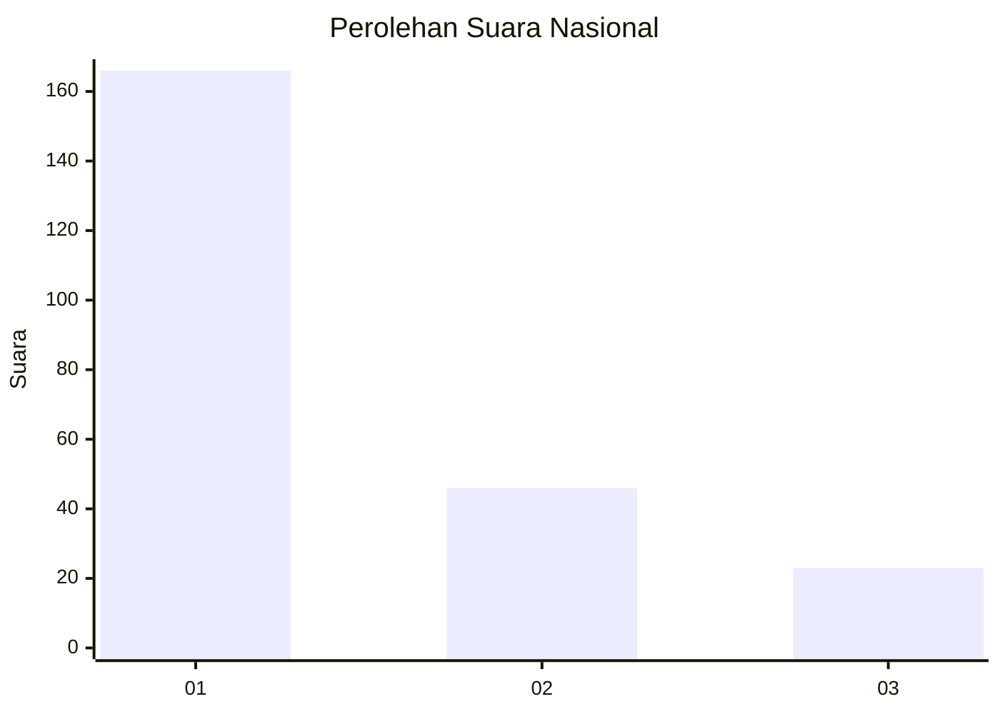
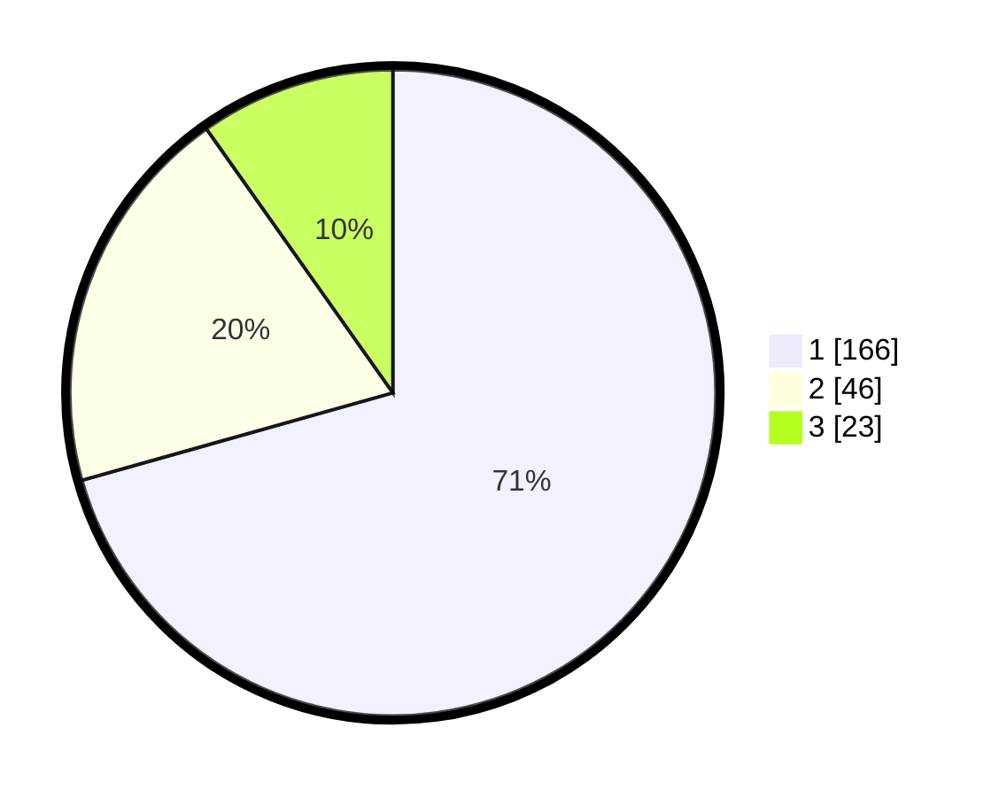

# Hasil

## Grafik

## Tabel

| No.    | Nama Paslon    | Suara | Suara (raw) | Persentase |
|:------ |:-------------- | -----:| -----------:| ----------:|
| 100025 | ANIES MUHAIMIN | 166   | [166][p-1]  | 70,64      |
| 100026 | PRABOWO GIBRAN | 46    | [46][p-2]   | 19,57      |
| 100027 | GANJAR MAHFUD  | 23    | [23][p-3]   | 9,79       |

[p-1]: https://github.com/gigit-pemilu/pemilu-2024/blob/main/pilpres/hitung-suara/sub/31-dki-jakarta/sub/73-jakarta-barat/sub/05-kebon-jeruk/sub/1004-kelapa-dua/sub/078-tps/sub/paslon-1.txt
[p-2]: https://github.com/gigit-pemilu/pemilu-2024/blob/main/pilpres/hitung-suara/sub/31-dki-jakarta/sub/73-jakarta-barat/sub/05-kebon-jeruk/sub/1004-kelapa-dua/sub/078-tps/sub/paslon-2.txt
[p-3]: https://github.com/gigit-pemilu/pemilu-2024/blob/main/pilpres/hitung-suara/sub/31-dki-jakarta/sub/73-jakarta-barat/sub/05-kebon-jeruk/sub/1004-kelapa-dua/sub/078-tps/sub/paslon-3.txt

## Foto C Plano

https://sirekap-obj-formc.kpu.go.id/283b/pemilu/ppwp/31/73/05/10/04/3173051004078-20240215-000457--6fe92a28-8338-42c3-a34f-f966ea49a178.jpg

https://sirekap-obj-formc.kpu.go.id/283b/pemilu/ppwp/31/73/05/10/04/3173051004078-20240215-000720--f36cf36a-616a-44f5-ae5b-f8845c869db6.jpg

https://sirekap-obj-formc.kpu.go.id/283b/pemilu/ppwp/31/73/05/10/04/3173051004078-20240215-000810--989b95d9-a3f2-4dda-a579-4d018f41b383.jpg

## Metadata

| Key        | Value               |
| ---------- | ------------------- |
| Time Stamp | 2024-02-19 14:00:00 |

