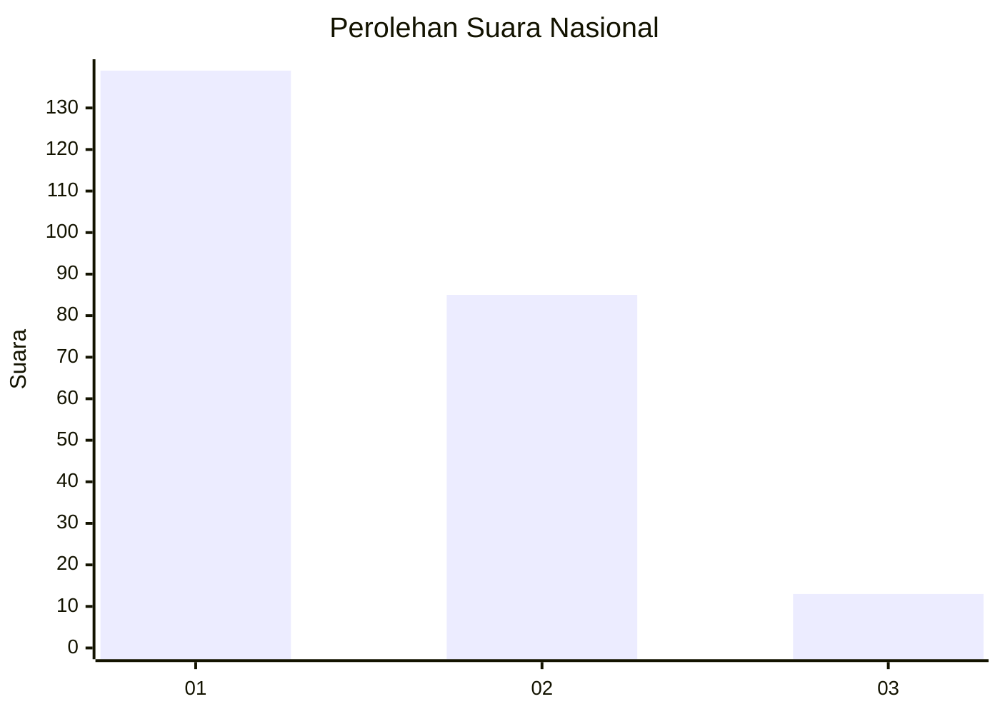
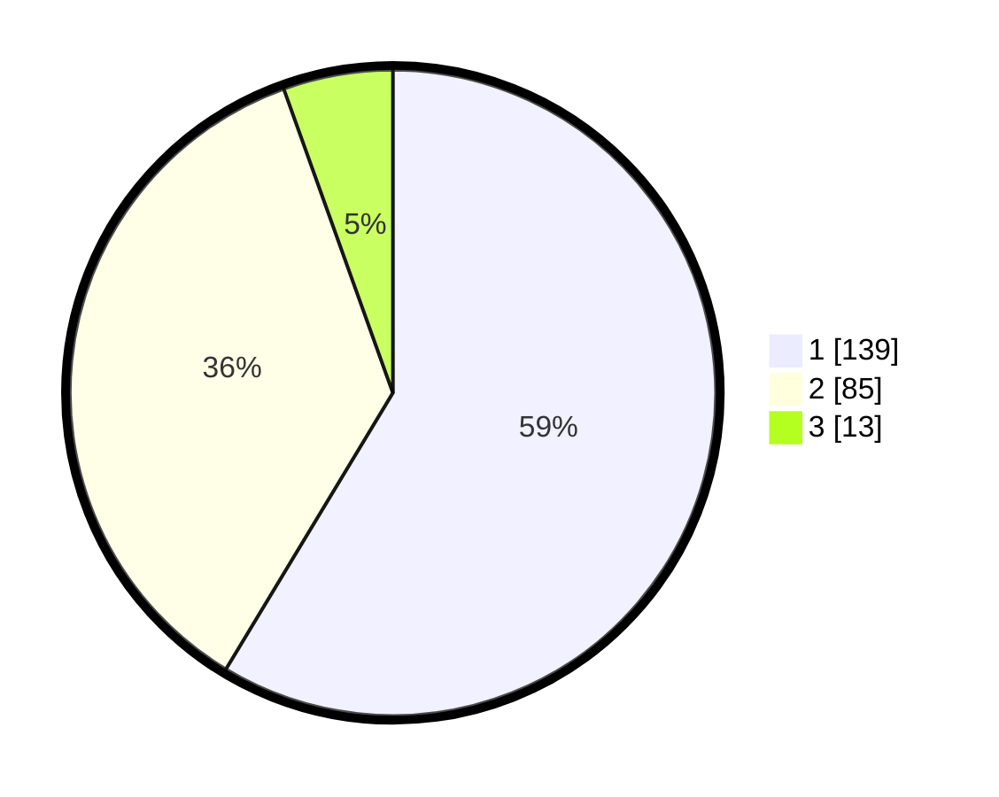

# Hasil

## Grafik

## Tabel

| No.    | Nama Paslon    | Suara | Suara (raw) | Persentase |
|:------ |:-------------- | -----:| -----------:| ----------:|
| 100025 | ANIES MUHAIMIN | 139   | [139][p-1]  | 58,65      |
| 100026 | PRABOWO GIBRAN | 85    | [85][p-2]   | 35,86      |
| 100027 | GANJAR MAHFUD  | 13    | [13][p-3]   | 5,49       |

[p-1]: https://github.com/gigit-pemilu/pemilu-2024/blob/main/pilpres/hitung-suara/sub/31-dki-jakarta/sub/73-jakarta-barat/sub/05-kebon-jeruk/sub/1004-kelapa-dua/sub/081-tps/sub/paslon-1.txt
[p-2]: https://github.com/gigit-pemilu/pemilu-2024/blob/main/pilpres/hitung-suara/sub/31-dki-jakarta/sub/73-jakarta-barat/sub/05-kebon-jeruk/sub/1004-kelapa-dua/sub/081-tps/sub/paslon-2.txt
[p-3]: https://github.com/gigit-pemilu/pemilu-2024/blob/main/pilpres/hitung-suara/sub/31-dki-jakarta/sub/73-jakarta-barat/sub/05-kebon-jeruk/sub/1004-kelapa-dua/sub/081-tps/sub/paslon-3.txt

## Foto C Plano

https://sirekap-obj-formc.kpu.go.id/f10c/pemilu/ppwp/31/73/05/10/04/3173051004081-20240215-013613--6dd80691-5622-4d8c-89e9-f9bf4f1cbb9d.jpg

https://sirekap-obj-formc.kpu.go.id/f10c/pemilu/ppwp/31/73/05/10/04/3173051004081-20240215-014045--b1dbd218-7b9e-48d8-bf53-cd5a13ce31ce.jpg

https://sirekap-obj-formc.kpu.go.id/f10c/pemilu/ppwp/31/73/05/10/04/3173051004081-20240215-014306--842ff507-5ffb-4483-b10e-8c10543a8b3c.jpg

## Metadata

| Key        | Value               |
| ---------- | ------------------- |
| Time Stamp | 2024-02-16 21:01:00 |

