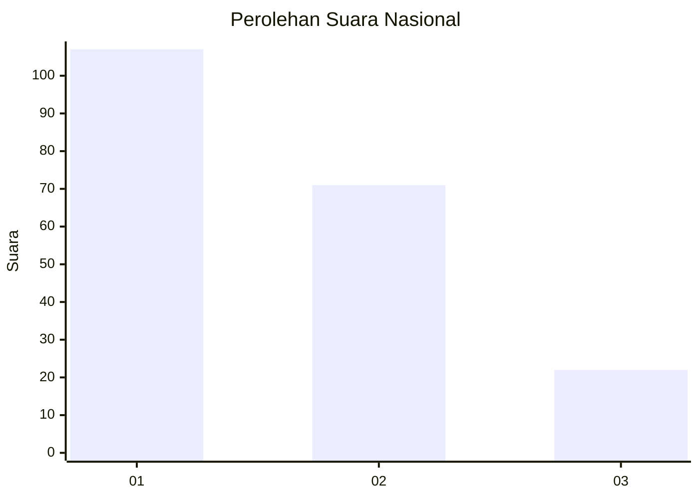
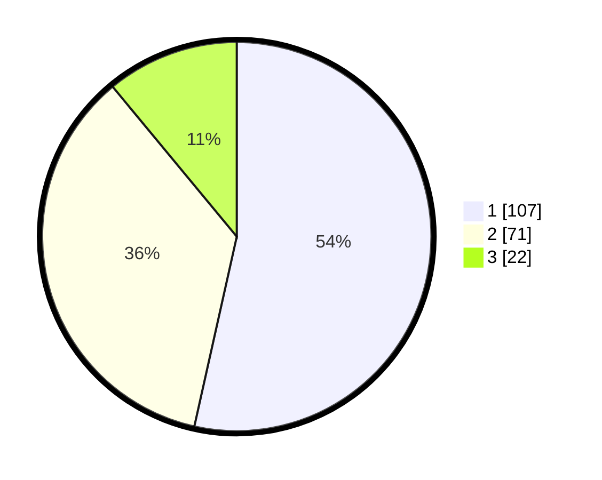

# Hasil

## Grafik

## Tabel

| No.    | Nama Paslon    | Suara | Suara (raw) | Persentase |
|:------ |:-------------- | -----:| -----------:| ----------:|
| 100025 | ANIES MUHAIMIN | 107   | [107][p-1]  | 53,50      |
| 100026 | PRABOWO GIBRAN | 71    | [71][p-2]   | 35,50      |
| 100027 | GANJAR MAHFUD  | 22    | [22][p-3]   | 11,00      |

[p-1]: https://github.com/gigit-pemilu/pemilu-2024/blob/main/pilpres/hitung-suara/sub/31-dki-jakarta/sub/73-jakarta-barat/sub/05-kebon-jeruk/sub/1005-duri-kepa/sub/007-tps/sub/paslon-1.txt
[p-2]: https://github.com/gigit-pemilu/pemilu-2024/blob/main/pilpres/hitung-suara/sub/31-dki-jakarta/sub/73-jakarta-barat/sub/05-kebon-jeruk/sub/1005-duri-kepa/sub/007-tps/sub/paslon-2.txt
[p-3]: https://github.com/gigit-pemilu/pemilu-2024/blob/main/pilpres/hitung-suara/sub/31-dki-jakarta/sub/73-jakarta-barat/sub/05-kebon-jeruk/sub/1005-duri-kepa/sub/007-tps/sub/paslon-3.txt

## Foto C Plano

https://sirekap-obj-formc.kpu.go.id/7729/pemilu/ppwp/31/73/05/10/05/3173051005007-20240214-220659--3ed1cc85-ea86-4070-ab1f-62f536077e61.jpg

https://sirekap-obj-formc.kpu.go.id/7729/pemilu/ppwp/31/73/05/10/05/3173051005007-20240214-221003--71fd7a75-3031-4819-b9e2-517151dbd2ea.jpg

https://sirekap-obj-formc.kpu.go.id/7729/pemilu/ppwp/31/73/05/10/05/3173051005007-20240214-221328--a4c827d9-6ce2-4f86-bd66-b8f322e7ea32.jpg

## Metadata

| Key        | Value               |
| ---------- | ------------------- |
| Time Stamp | 2024-02-19 14:00:00 |

