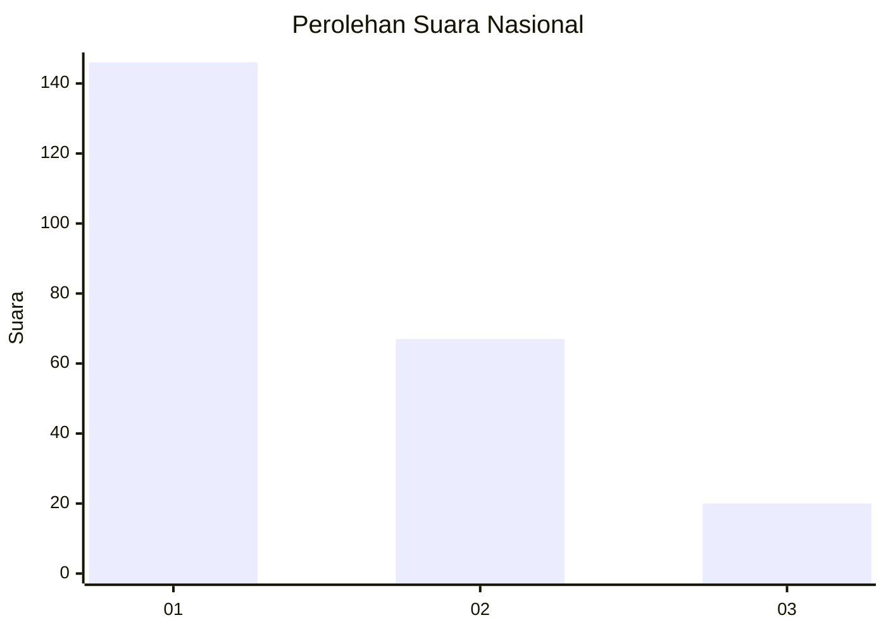
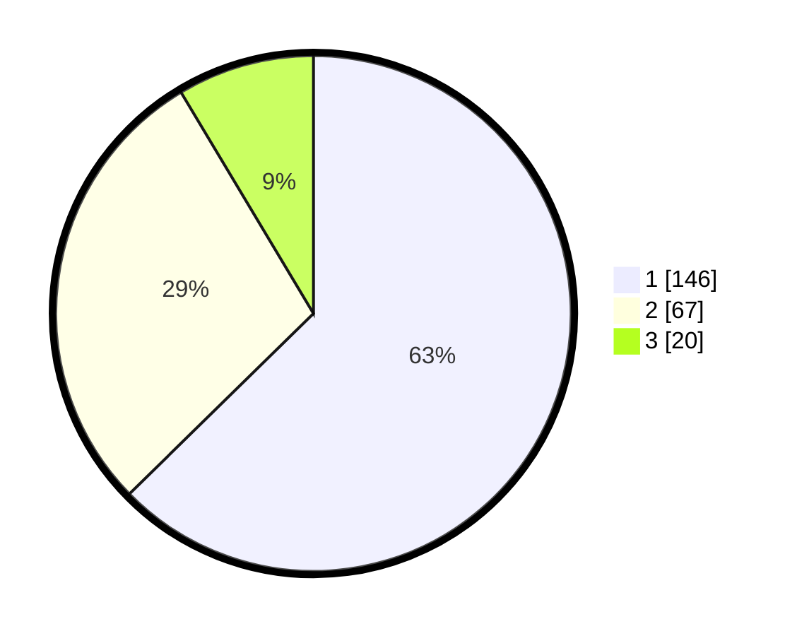

# Hasil

## Grafik

## Tabel

| No. | Nama Paslon    | Suara | Suara (raw) | Persentase |
|:--- |:-------------- | -----:| -----------:| ----------:|
| 1   | ANIES MUHAIMIN | 146   | [146][p-1]  | 62,66      |
| 2   | PRABOWO GIBRAN | 67    | [67][p-2]   | 28,76      |
| 3   | GANJAR MAHFUD  | 20    | [20][p-3]   | 8,58       |

[p-1]: https://github.com/gigit-pemilu/pemilu-2024/blob/main/pilpres/hitung-suara/sub/31-dki-jakarta/sub/73-jakarta-barat/sub/05-kebon-jeruk/sub/1005-duri-kepa/sub/010-tps/sub/paslon-1.txt
[p-2]: https://github.com/gigit-pemilu/pemilu-2024/blob/main/pilpres/hitung-suara/sub/31-dki-jakarta/sub/73-jakarta-barat/sub/05-kebon-jeruk/sub/1005-duri-kepa/sub/010-tps/sub/paslon-2.txt
[p-3]: https://github.com/gigit-pemilu/pemilu-2024/blob/main/pilpres/hitung-suara/sub/31-dki-jakarta/sub/73-jakarta-barat/sub/05-kebon-jeruk/sub/1005-duri-kepa/sub/010-tps/sub/paslon-3.txt

## Foto C Plano

https://sirekap-obj-formc.kpu.go.id/08f7/pemilu/ppwp/31/73/05/10/05/3173051005010-20240215-001708--8d4ca2ce-1b06-471c-b596-f344e07bd6cb.jpg

https://sirekap-obj-formc.kpu.go.id/08f7/pemilu/ppwp/31/73/05/10/05/3173051005010-20240215-001915--0b2fc62c-1bba-4ad0-b142-a2fda46df168.jpg

https://sirekap-obj-formc.kpu.go.id/08f7/pemilu/ppwp/31/73/05/10/05/3173051005010-20240215-001521--d4d305c0-f69f-468a-9681-6327f695c3e2.jpg

## Metadata

| Key        | Value               |
| ---------- | ------------------- |
| Time Stamp | 2024-02-19 14:00:00 |

