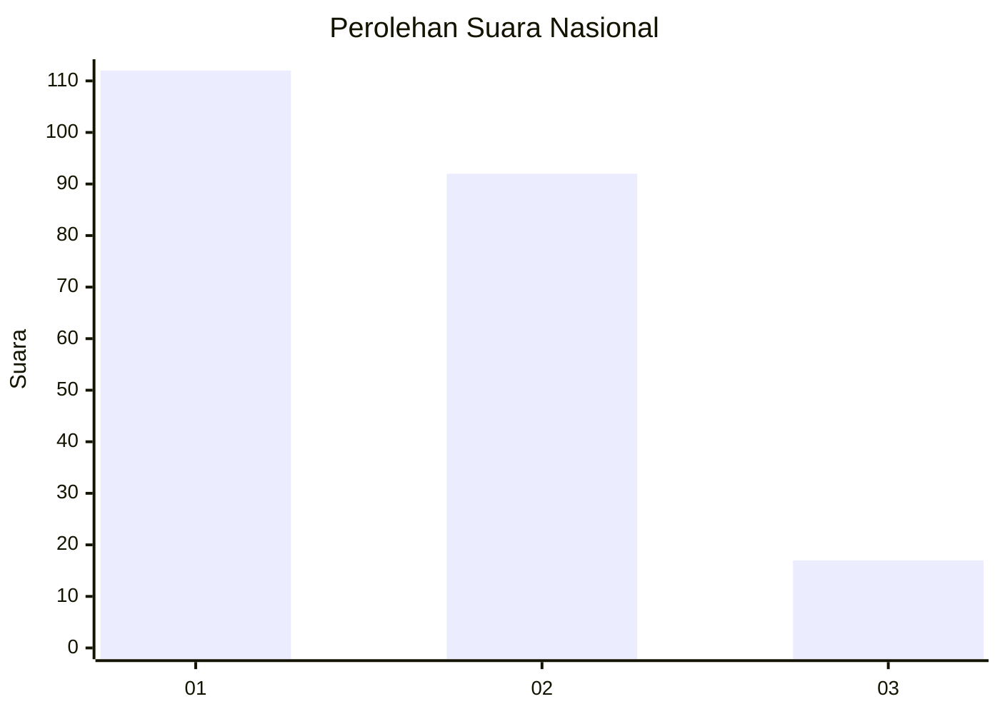
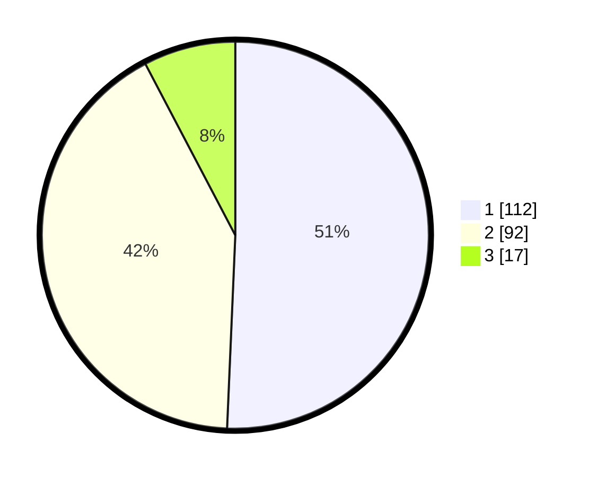

# Hasil

## Grafik

## Tabel

| No.    | Nama Paslon    | Suara | Suara (raw) | Persentase |
|:------ |:-------------- | -----:| -----------:| ----------:|
| 100025 | ANIES MUHAIMIN | 112   | [112][p-1]  | 50,68      |
| 100026 | PRABOWO GIBRAN | 92    | [92][p-2]   | 41,63      |
| 100027 | GANJAR MAHFUD  | 17    | [17][p-3]   | 7,69       |

[p-1]: https://github.com/gigit-pemilu/pemilu-2024/blob/main/pilpres/hitung-suara/sub/31-dki-jakarta/sub/73-jakarta-barat/sub/05-kebon-jeruk/sub/1005-duri-kepa/sub/021-tps/sub/paslon-1.txt
[p-2]: https://github.com/gigit-pemilu/pemilu-2024/blob/main/pilpres/hitung-suara/sub/31-dki-jakarta/sub/73-jakarta-barat/sub/05-kebon-jeruk/sub/1005-duri-kepa/sub/021-tps/sub/paslon-2.txt
[p-3]: https://github.com/gigit-pemilu/pemilu-2024/blob/main/pilpres/hitung-suara/sub/31-dki-jakarta/sub/73-jakarta-barat/sub/05-kebon-jeruk/sub/1005-duri-kepa/sub/021-tps/sub/paslon-3.txt

## Foto C Plano

https://sirekap-obj-formc.kpu.go.id/039d/pemilu/ppwp/31/73/05/10/05/3173051005021-20240214-225021--e15f7251-81bb-4ff9-af74-9e2251dd6361.jpg

https://sirekap-obj-formc.kpu.go.id/039d/pemilu/ppwp/31/73/05/10/05/3173051005021-20240214-230018--497c3e0d-1204-4e3c-9ab8-557fe29308f7.jpg

https://sirekap-obj-formc.kpu.go.id/039d/pemilu/ppwp/31/73/05/10/05/3173051005021-20240214-230125--23a6131f-d106-4ed3-9c70-0adf27cdacc7.jpg

## Metadata

| Key        | Value               |
| ---------- | ------------------- |
| Time Stamp | 2024-02-16 21:01:00 |

