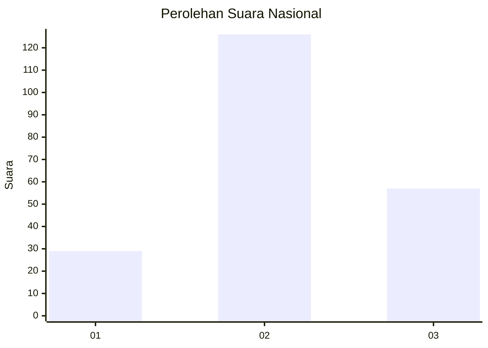
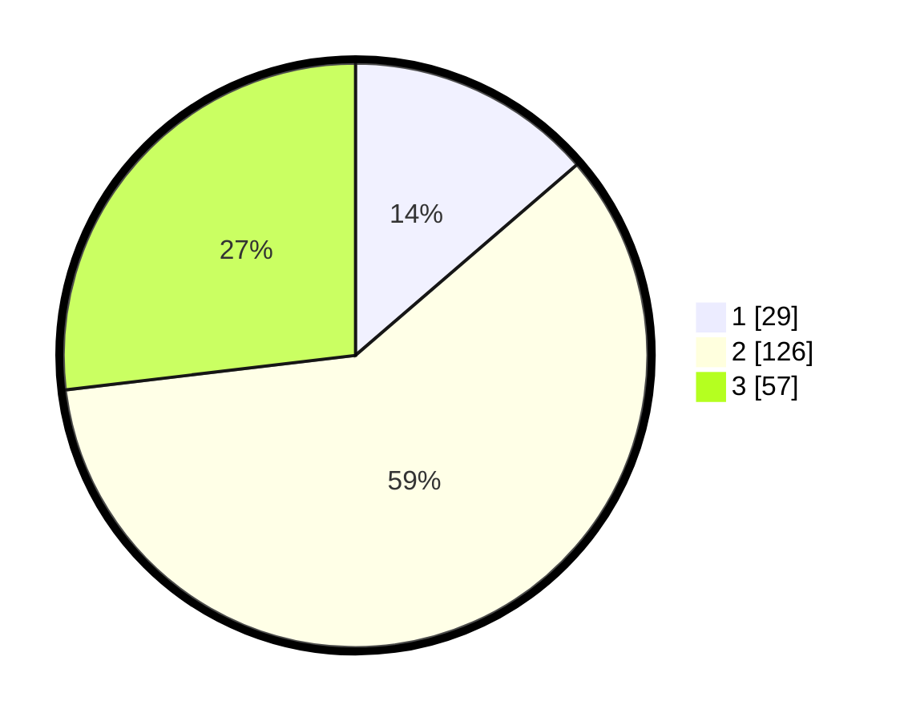

# Hasil

## Grafik

## Tabel

| No.    | Nama Paslon    | Suara | Suara (raw) | Persentase |
|:------ |:-------------- | -----:| -----------:| ----------:|
| 100025 | ANIES MUHAIMIN | 29    | [29][p-1]   | 13,68      |
| 100026 | PRABOWO GIBRAN | 126   | [126][p-2]  | 59,43      |
| 100027 | GANJAR MAHFUD  | 57    | [57][p-3]   | 26,89      |

[p-1]: https://github.com/gigit-pemilu/pemilu-2024/blob/main/pilpres/hitung-suara/sub/31-dki-jakarta/sub/73-jakarta-barat/sub/05-kebon-jeruk/sub/1005-duri-kepa/sub/028-tps/sub/paslon-1.txt
[p-2]: https://github.com/gigit-pemilu/pemilu-2024/blob/main/pilpres/hitung-suara/sub/31-dki-jakarta/sub/73-jakarta-barat/sub/05-kebon-jeruk/sub/1005-duri-kepa/sub/028-tps/sub/paslon-2.txt
[p-3]: https://github.com/gigit-pemilu/pemilu-2024/blob/main/pilpres/hitung-suara/sub/31-dki-jakarta/sub/73-jakarta-barat/sub/05-kebon-jeruk/sub/1005-duri-kepa/sub/028-tps/sub/paslon-3.txt

## Foto C Plano

https://sirekap-obj-formc.kpu.go.id/2576/pemilu/ppwp/31/73/05/10/05/3173051005028-20240214-231442--bb565c64-f54a-48f5-995d-28d2f0a2960a.jpg

https://sirekap-obj-formc.kpu.go.id/2576/pemilu/ppwp/31/73/05/10/05/3173051005028-20240214-231838--9ac4a6e3-69ef-47bf-af90-81e5997e93b9.jpg

https://sirekap-obj-formc.kpu.go.id/2576/pemilu/ppwp/31/73/05/10/05/3173051005028-20240214-232119--eb92bd76-1438-4db0-802c-47e7ddb35000.jpg

## Metadata

| Key        | Value               |
| ---------- | ------------------- |
| Time Stamp | 2024-02-19 14:00:00 |

