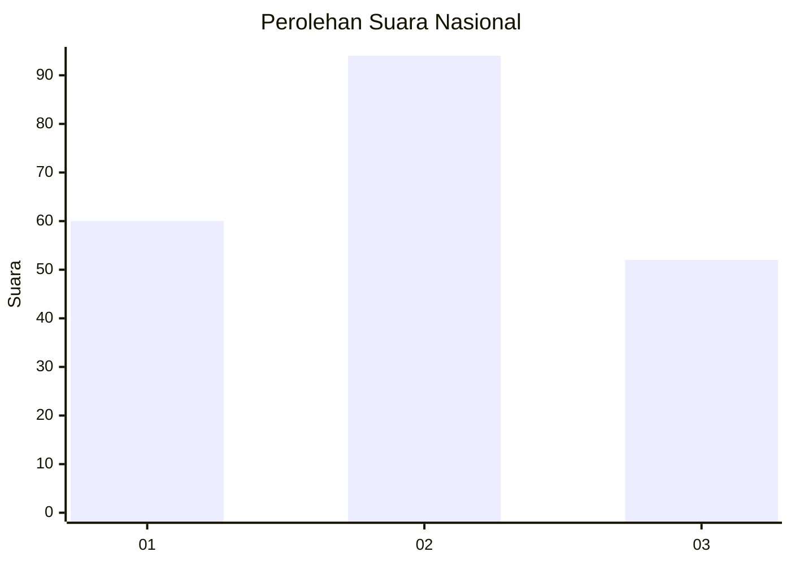
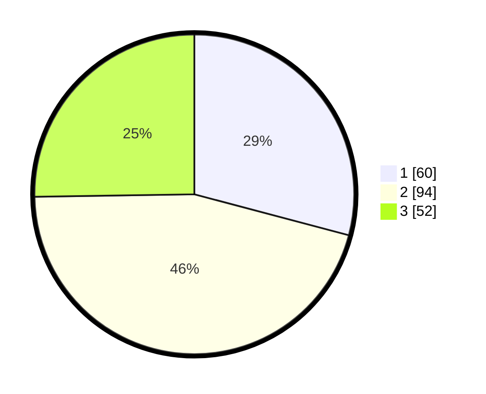

# Hasil

## Grafik

## Tabel

| No.    | Nama Paslon    | Suara | Suara (raw) | Persentase |
|:------ |:-------------- | -----:| -----------:| ----------:|
| 100025 | ANIES MUHAIMIN | 60    | [60][p-1]   | 29,13      |
| 100026 | PRABOWO GIBRAN | 94    | [94][p-2]   | 45,63      |
| 100027 | GANJAR MAHFUD  | 52    | [52][p-3]   | 25,24      |

[p-1]: https://github.com/gigit-pemilu/pemilu-2024/blob/main/pilpres/hitung-suara/sub/31-dki-jakarta/sub/73-jakarta-barat/sub/05-kebon-jeruk/sub/1005-duri-kepa/sub/031-tps/sub/paslon-1.txt
[p-2]: https://github.com/gigit-pemilu/pemilu-2024/blob/main/pilpres/hitung-suara/sub/31-dki-jakarta/sub/73-jakarta-barat/sub/05-kebon-jeruk/sub/1005-duri-kepa/sub/031-tps/sub/paslon-2.txt
[p-3]: https://github.com/gigit-pemilu/pemilu-2024/blob/main/pilpres/hitung-suara/sub/31-dki-jakarta/sub/73-jakarta-barat/sub/05-kebon-jeruk/sub/1005-duri-kepa/sub/031-tps/sub/paslon-3.txt

## Foto C Plano

https://sirekap-obj-formc.kpu.go.id/bdb7/pemilu/ppwp/31/73/05/10/05/3173051005031-20240215-024618--0d748215-f30b-48b9-8558-fac059347fd4.jpg

https://sirekap-obj-formc.kpu.go.id/bdb7/pemilu/ppwp/31/73/05/10/05/3173051005031-20240215-024750--74bba644-cefe-4f84-ae17-6c110d37539f.jpg

https://sirekap-obj-formc.kpu.go.id/bdb7/pemilu/ppwp/31/73/05/10/05/3173051005031-20240215-024844--ba5f6b4d-efb4-4567-b6d7-83ce13c87a2f.jpg

## Metadata

| Key        | Value               |
| ---------- | ------------------- |
| Time Stamp | 2024-02-16 21:01:00 |

