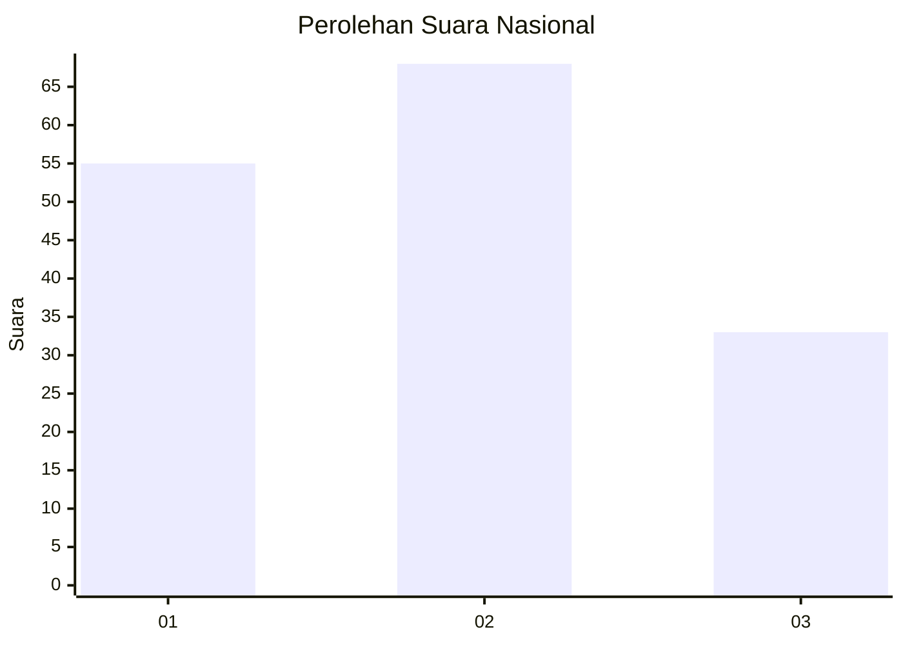
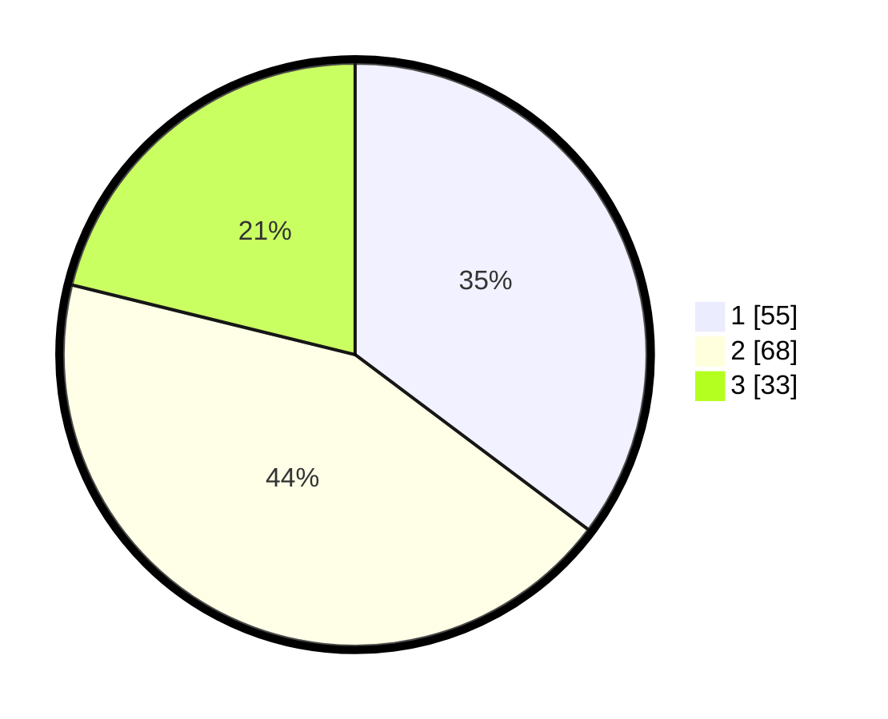

# Hasil

## Grafik

## Tabel

| No.    | Nama Paslon    | Suara | Suara (raw) | Persentase |
|:------ |:-------------- | -----:| -----------:| ----------:|
| 100025 | ANIES MUHAIMIN | 55    | [55][p-1]   | 35,26      |
| 100026 | PRABOWO GIBRAN | 68    | [68][p-2]   | 43,59      |
| 100027 | GANJAR MAHFUD  | 33    | [33][p-3]   | 21,15      |

[p-1]: https://github.com/gigit-pemilu/pemilu-2024/blob/main/pilpres/hitung-suara/sub/31-dki-jakarta/sub/73-jakarta-barat/sub/05-kebon-jeruk/sub/1005-duri-kepa/sub/039-tps/sub/paslon-1.txt
[p-2]: https://github.com/gigit-pemilu/pemilu-2024/blob/main/pilpres/hitung-suara/sub/31-dki-jakarta/sub/73-jakarta-barat/sub/05-kebon-jeruk/sub/1005-duri-kepa/sub/039-tps/sub/paslon-2.txt
[p-3]: https://github.com/gigit-pemilu/pemilu-2024/blob/main/pilpres/hitung-suara/sub/31-dki-jakarta/sub/73-jakarta-barat/sub/05-kebon-jeruk/sub/1005-duri-kepa/sub/039-tps/sub/paslon-3.txt

## Foto C Plano

https://sirekap-obj-formc.kpu.go.id/c196/pemilu/ppwp/31/73/05/10/05/3173051005039-20240214-215521--055acc70-e35e-4612-af02-a589dc60d000.jpg

https://sirekap-obj-formc.kpu.go.id/c196/pemilu/ppwp/31/73/05/10/05/3173051005039-20240214-215526--4ff370fb-ba46-4ad1-a308-35467f07105a.jpg

https://sirekap-obj-formc.kpu.go.id/c196/pemilu/ppwp/31/73/05/10/05/3173051005039-20240214-215529--6844f5bb-cda8-4367-99c3-200a9f2bc8a3.jpg

## Metadata

| Key        | Value               |
| ---------- | ------------------- |
| Time Stamp | 2024-02-16 21:01:00 |

