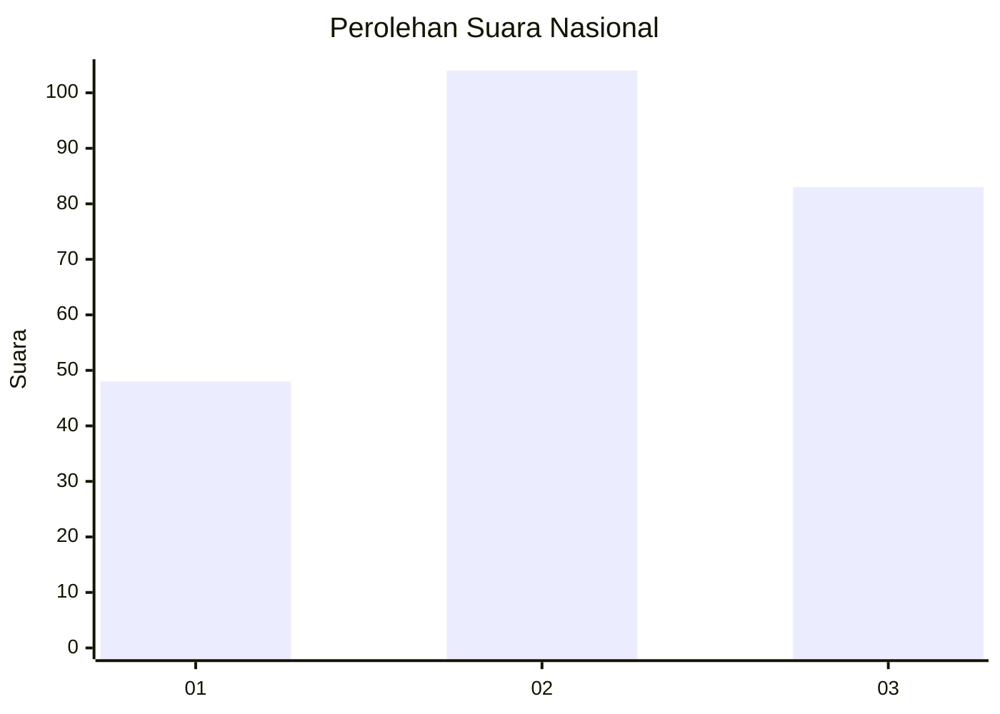
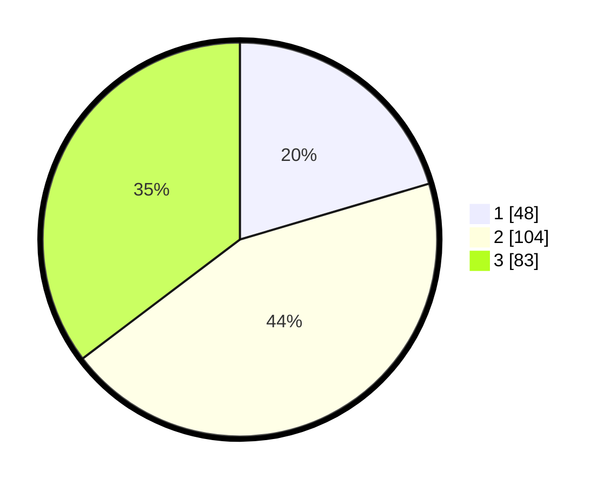

# Hasil

## Grafik

## Tabel

| No.    | Nama Paslon    | Suara | Suara (raw) | Persentase |
|:------ |:-------------- | -----:| -----------:| ----------:|
| 100025 | ANIES MUHAIMIN | 48    | [48][p-1]   | 20,43      |
| 100026 | PRABOWO GIBRAN | 104   | [104][p-2]  | 44,26      |
| 100027 | GANJAR MAHFUD  | 83    | [83][p-3]   | 35,32      |

[p-1]: https://github.com/gigit-pemilu/pemilu-2024/blob/main/pilpres/hitung-suara/sub/31-dki-jakarta/sub/73-jakarta-barat/sub/05-kebon-jeruk/sub/1005-duri-kepa/sub/054-tps/sub/paslon-1.txt
[p-2]: https://github.com/gigit-pemilu/pemilu-2024/blob/main/pilpres/hitung-suara/sub/31-dki-jakarta/sub/73-jakarta-barat/sub/05-kebon-jeruk/sub/1005-duri-kepa/sub/054-tps/sub/paslon-2.txt
[p-3]: https://github.com/gigit-pemilu/pemilu-2024/blob/main/pilpres/hitung-suara/sub/31-dki-jakarta/sub/73-jakarta-barat/sub/05-kebon-jeruk/sub/1005-duri-kepa/sub/054-tps/sub/paslon-3.txt

## Foto C Plano

https://sirekap-obj-formc.kpu.go.id/0e90/pemilu/ppwp/31/73/05/10/05/3173051005054-20240215-021418--5c4b07a6-281a-42bf-ac2e-86ea8b025a2e.jpg

https://sirekap-obj-formc.kpu.go.id/0e90/pemilu/ppwp/31/73/05/10/05/3173051005054-20240215-021628--b0bdbed0-ddae-4f70-b367-c7a016cf8215.jpg

https://sirekap-obj-formc.kpu.go.id/0e90/pemilu/ppwp/31/73/05/10/05/3173051005054-20240215-024802--9c63a1ae-e3c7-4dd2-8084-654111044742.jpg

## Metadata

| Key        | Value               |
| ---------- | ------------------- |
| Time Stamp | 2024-02-16 21:01:00 |

