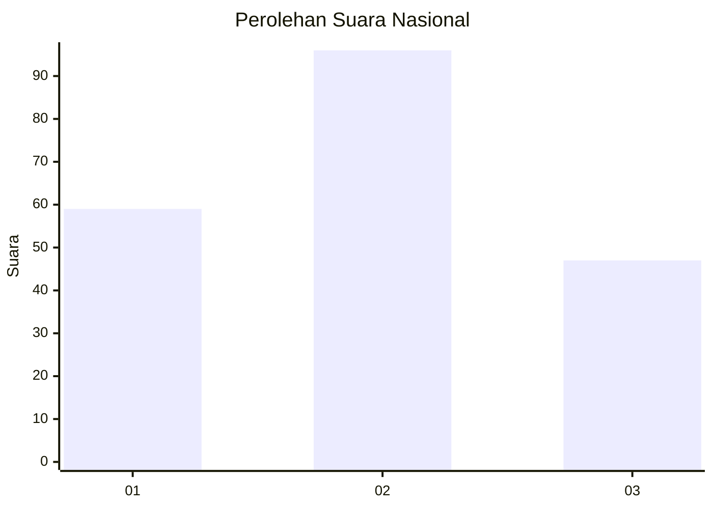
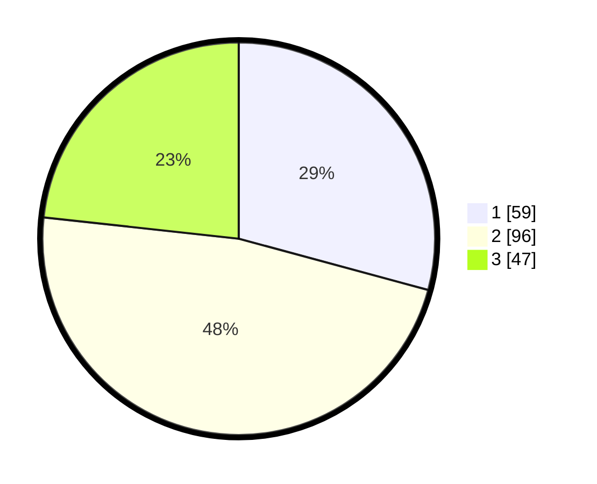

# Hasil

## Grafik

## Tabel

| No.    | Nama Paslon    | Suara | Suara (raw) | Persentase |
|:------ |:-------------- | -----:| -----------:| ----------:|
| 100025 | ANIES MUHAIMIN | 59    | [59][p-1]   | 29,21      |
| 100026 | PRABOWO GIBRAN | 96    | [96][p-2]   | 47,52      |
| 100027 | GANJAR MAHFUD  | 47    | [47][p-3]   | 23,27      |

[p-1]: https://github.com/gigit-pemilu/pemilu-2024/blob/main/pilpres/hitung-suara/sub/31-dki-jakarta/sub/73-jakarta-barat/sub/05-kebon-jeruk/sub/1005-duri-kepa/sub/056-tps/sub/paslon-1.txt
[p-2]: https://github.com/gigit-pemilu/pemilu-2024/blob/main/pilpres/hitung-suara/sub/31-dki-jakarta/sub/73-jakarta-barat/sub/05-kebon-jeruk/sub/1005-duri-kepa/sub/056-tps/sub/paslon-2.txt
[p-3]: https://github.com/gigit-pemilu/pemilu-2024/blob/main/pilpres/hitung-suara/sub/31-dki-jakarta/sub/73-jakarta-barat/sub/05-kebon-jeruk/sub/1005-duri-kepa/sub/056-tps/sub/paslon-3.txt

## Foto C Plano

https://sirekap-obj-formc.kpu.go.id/eea2/pemilu/ppwp/31/73/05/10/05/3173051005056-20240214-220050--f99812a4-df64-44c3-8b1c-1d4043b575f2.jpg

https://sirekap-obj-formc.kpu.go.id/eea2/pemilu/ppwp/31/73/05/10/05/3173051005056-20240214-220508--eea71537-11fa-43bc-9f2a-30149fc40508.jpg

https://sirekap-obj-formc.kpu.go.id/eea2/pemilu/ppwp/31/73/05/10/05/3173051005056-20240214-220248--9e8c63fb-e8f6-4cc9-807d-9c752ed001c8.jpg

## Metadata

| Key        | Value               |
| ---------- | ------------------- |
| Time Stamp | 2024-02-21 17:00:00 |

