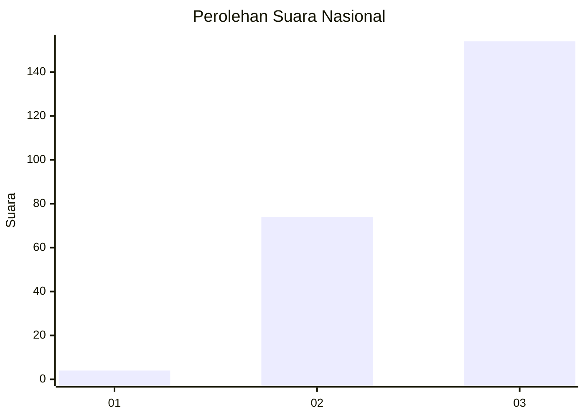
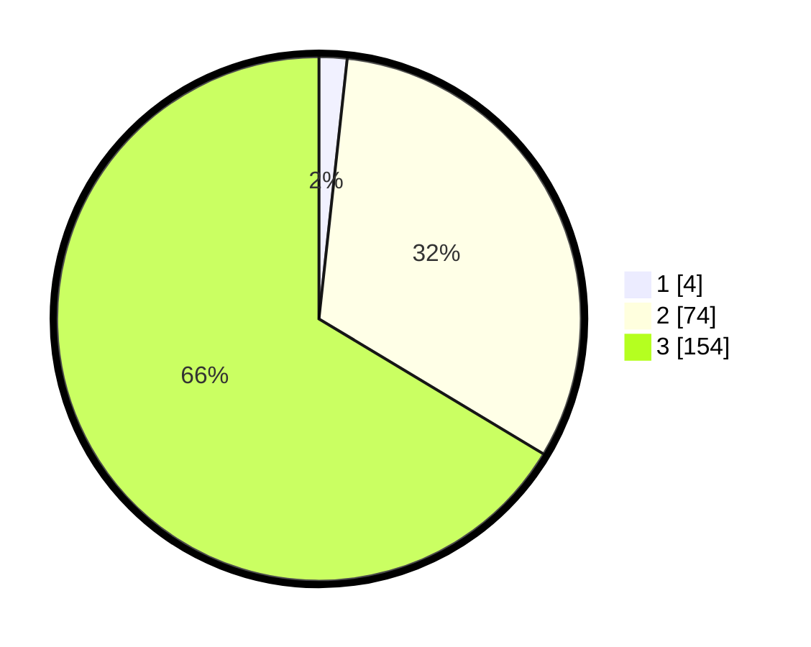

# Hasil

## Grafik

## Tabel

| No.    | Nama Paslon    | Suara | Suara (raw) | Persentase |
|:------ |:-------------- | -----:| -----------:| ----------:|
| 100025 | ANIES MUHAIMIN | 4     | [4][p-1]    | 1,72       |
| 100026 | PRABOWO GIBRAN | 74    | [74][p-2]   | 31,90      |
| 100027 | GANJAR MAHFUD  | 154   | [154][p-3]  | 66,38      |

[p-1]: https://github.com/gigit-pemilu/pemilu-2024/blob/main/pilpres/hitung-suara/sub/31-dki-jakarta/sub/73-jakarta-barat/sub/05-kebon-jeruk/sub/1005-duri-kepa/sub/094-tps/sub/paslon-1.txt
[p-2]: https://github.com/gigit-pemilu/pemilu-2024/blob/main/pilpres/hitung-suara/sub/31-dki-jakarta/sub/73-jakarta-barat/sub/05-kebon-jeruk/sub/1005-duri-kepa/sub/094-tps/sub/paslon-2.txt
[p-3]: https://github.com/gigit-pemilu/pemilu-2024/blob/main/pilpres/hitung-suara/sub/31-dki-jakarta/sub/73-jakarta-barat/sub/05-kebon-jeruk/sub/1005-duri-kepa/sub/094-tps/sub/paslon-3.txt

## Foto C Plano

https://sirekap-obj-formc.kpu.go.id/04fe/pemilu/ppwp/31/73/05/10/05/3173051005094-20240214-224858--41383319-44a5-4a90-90be-90623fa758e6.jpg

https://sirekap-obj-formc.kpu.go.id/04fe/pemilu/ppwp/31/73/05/10/05/3173051005094-20240214-191435--1d27c8a1-4875-4cd3-bccd-7247b90d614a.jpg

https://sirekap-obj-formc.kpu.go.id/04fe/pemilu/ppwp/31/73/05/10/05/3173051005094-20240214-191441--ab4fd01f-a2d7-41fd-9c40-20e8ab18ab89.jpg

## Metadata

| Key        | Value               |
| ---------- | ------------------- |
| Time Stamp | 2024-02-15 09:00:24 |

