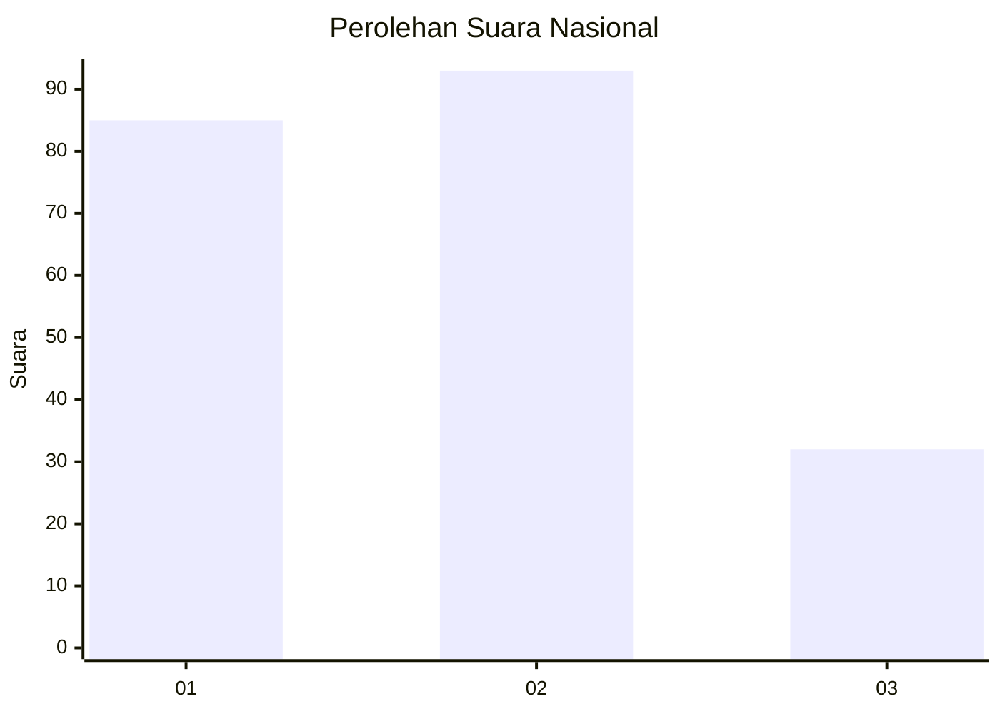
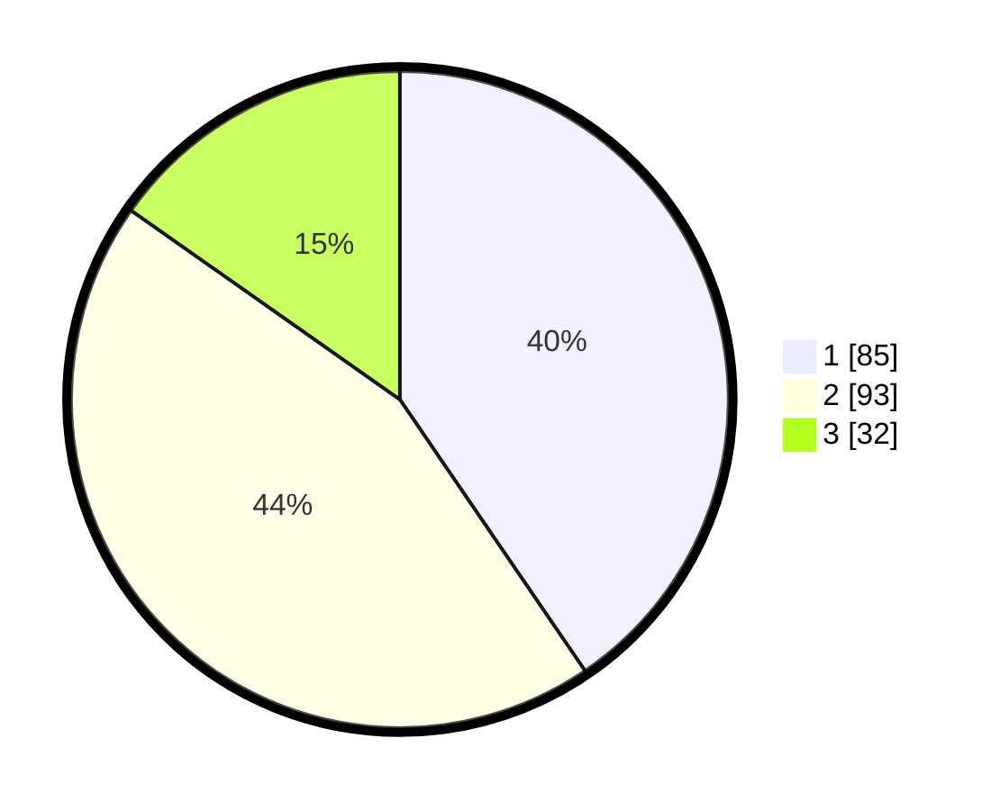

# Hasil

## Grafik

## Tabel

| No.    | Nama Paslon    | Suara | Suara (raw) | Persentase |
|:------ |:-------------- | -----:| -----------:| ----------:|
| 100025 | ANIES MUHAIMIN | 85    | [85][p-1]   | 40,48      |
| 100026 | PRABOWO GIBRAN | 93    | [93][p-2]   | 44,29      |
| 100027 | GANJAR MAHFUD  | 32    | [32][p-3]   | 15,24      |

[p-1]: https://github.com/gigit-pemilu/pemilu-2024/blob/main/pilpres/hitung-suara/sub/31-dki-jakarta/sub/73-jakarta-barat/sub/05-kebon-jeruk/sub/1005-duri-kepa/sub/100-tps/sub/paslon-1.txt
[p-2]: https://github.com/gigit-pemilu/pemilu-2024/blob/main/pilpres/hitung-suara/sub/31-dki-jakarta/sub/73-jakarta-barat/sub/05-kebon-jeruk/sub/1005-duri-kepa/sub/100-tps/sub/paslon-2.txt
[p-3]: https://github.com/gigit-pemilu/pemilu-2024/blob/main/pilpres/hitung-suara/sub/31-dki-jakarta/sub/73-jakarta-barat/sub/05-kebon-jeruk/sub/1005-duri-kepa/sub/100-tps/sub/paslon-3.txt

## Foto C Plano

https://sirekap-obj-formc.kpu.go.id/8de7/pemilu/ppwp/31/73/05/10/05/3173051005100-20240214-220956--d4529cdd-2f1f-4f55-9741-e56679a63716.jpg

https://sirekap-obj-formc.kpu.go.id/8de7/pemilu/ppwp/31/73/05/10/05/3173051005100-20240214-221050--6f69eef8-fef0-4d40-8e7a-faa24564143b.jpg

https://sirekap-obj-formc.kpu.go.id/8de7/pemilu/ppwp/31/73/05/10/05/3173051005100-20240214-221213--a6c62493-0079-4d89-b0e2-f808a3583e02.jpg

## Metadata

| Key        | Value               |
| ---------- | ------------------- |
| Time Stamp | 2024-02-16 21:01:00 |

