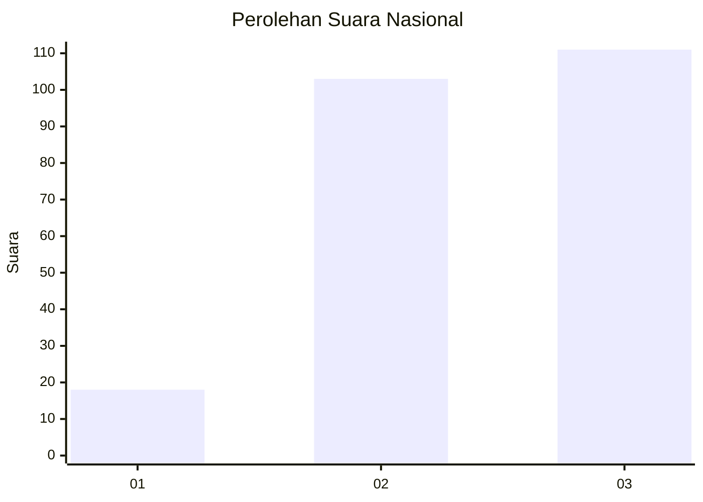
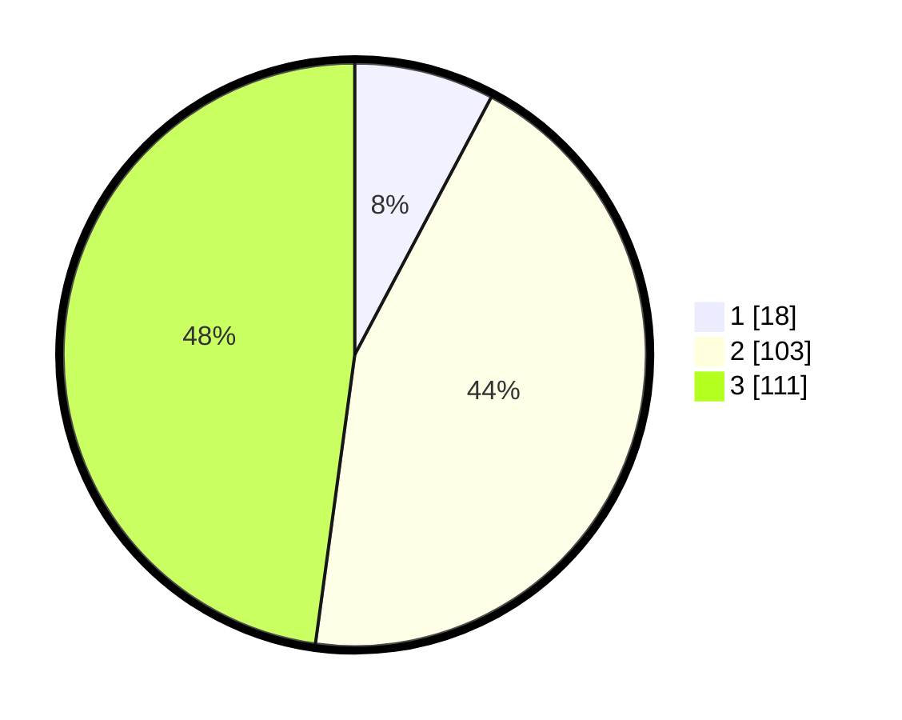

# Hasil

## Grafik

## Tabel

| No.    | Nama Paslon    | Suara | Suara (raw) | Persentase |
|:------ |:-------------- | -----:| -----------:| ----------:|
| 100025 | ANIES MUHAIMIN | 18    | [18][p-1]   | 7,76       |
| 100026 | PRABOWO GIBRAN | 103   | [103][p-2]  | 44,40      |
| 100027 | GANJAR MAHFUD  | 111   | [111][p-3]  | 47,84      |

[p-1]: https://github.com/gigit-pemilu/pemilu-2024/blob/main/pilpres/hitung-suara/sub/31-dki-jakarta/sub/73-jakarta-barat/sub/05-kebon-jeruk/sub/1005-duri-kepa/sub/110-tps/sub/paslon-1.txt
[p-2]: https://github.com/gigit-pemilu/pemilu-2024/blob/main/pilpres/hitung-suara/sub/31-dki-jakarta/sub/73-jakarta-barat/sub/05-kebon-jeruk/sub/1005-duri-kepa/sub/110-tps/sub/paslon-2.txt
[p-3]: https://github.com/gigit-pemilu/pemilu-2024/blob/main/pilpres/hitung-suara/sub/31-dki-jakarta/sub/73-jakarta-barat/sub/05-kebon-jeruk/sub/1005-duri-kepa/sub/110-tps/sub/paslon-3.txt

## Foto C Plano

https://sirekap-obj-formc.kpu.go.id/4dd7/pemilu/ppwp/31/73/05/10/05/3173051005110-20240214-222512--08f9e8b6-f7d8-44de-8f9e-7fe1ba2dfa97.jpg

https://sirekap-obj-formc.kpu.go.id/4dd7/pemilu/ppwp/31/73/05/10/05/3173051005110-20240214-222527--cd0b7e46-a76c-4d5d-9785-d9b78a058a77.jpg

https://sirekap-obj-formc.kpu.go.id/4dd7/pemilu/ppwp/31/73/05/10/05/3173051005110-20240214-222550--b725e7c2-074e-462c-86bc-f1c8c966019a.jpg

## Metadata

| Key        | Value               |
| ---------- | ------------------- |
| Time Stamp | 2024-02-15 15:00:29 |

