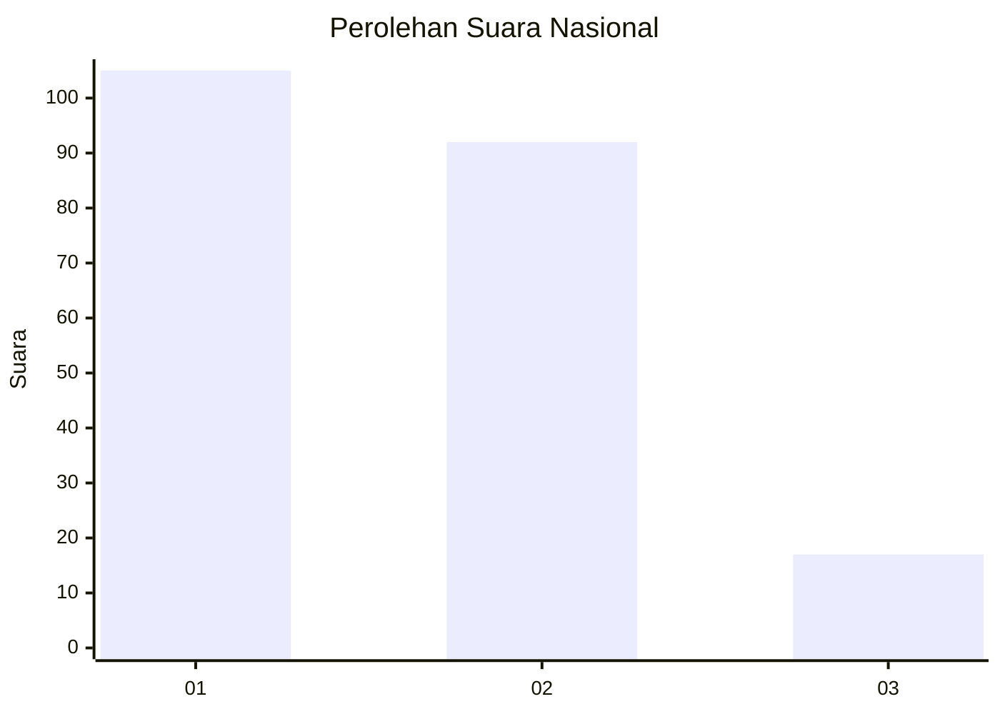
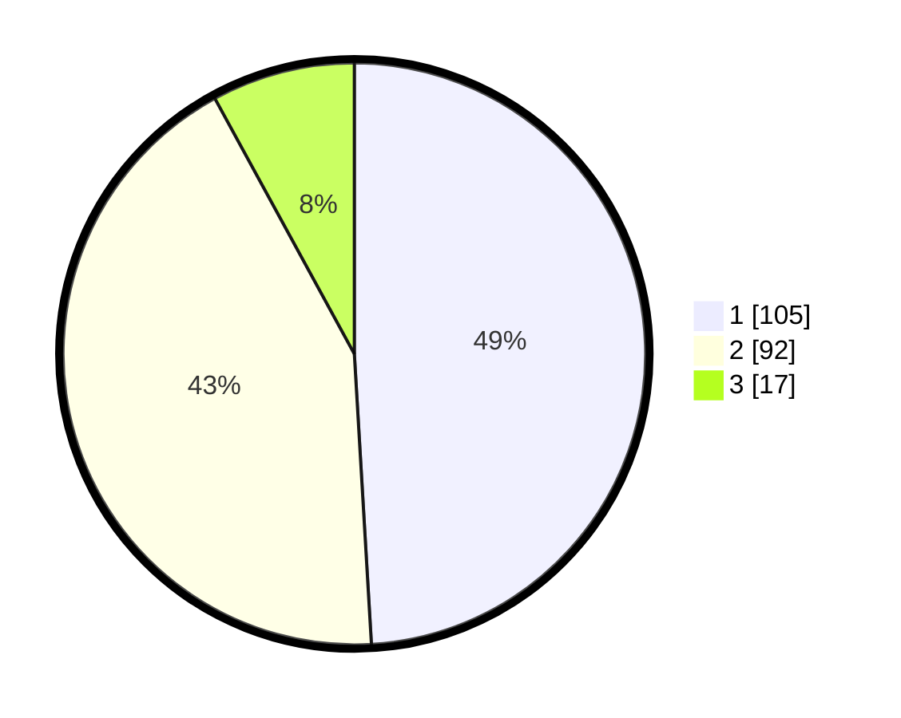

# Hasil

## Grafik

## Tabel

| No.    | Nama Paslon    | Suara | Suara (raw) | Persentase |
|:------ |:-------------- | -----:| -----------:| ----------:|
| 100025 | ANIES MUHAIMIN | 105   | [105][p-1]  | 49,07      |
| 100026 | PRABOWO GIBRAN | 92    | [92][p-2]   | 42,99      |
| 100027 | GANJAR MAHFUD  | 17    | [17][p-3]   | 7,94       |

[p-1]: https://github.com/gigit-pemilu/pemilu-2024/blob/main/pilpres/hitung-suara/sub/31-dki-jakarta/sub/73-jakarta-barat/sub/05-kebon-jeruk/sub/1005-duri-kepa/sub/135-tps/sub/paslon-1.txt
[p-2]: https://github.com/gigit-pemilu/pemilu-2024/blob/main/pilpres/hitung-suara/sub/31-dki-jakarta/sub/73-jakarta-barat/sub/05-kebon-jeruk/sub/1005-duri-kepa/sub/135-tps/sub/paslon-2.txt
[p-3]: https://github.com/gigit-pemilu/pemilu-2024/blob/main/pilpres/hitung-suara/sub/31-dki-jakarta/sub/73-jakarta-barat/sub/05-kebon-jeruk/sub/1005-duri-kepa/sub/135-tps/sub/paslon-3.txt

## Foto C Plano

https://sirekap-obj-formc.kpu.go.id/b3c5/pemilu/ppwp/31/73/05/10/05/3173051005135-20240214-230440--4ae3e66a-35dc-4357-b53f-cf2b0607c449.jpg

https://sirekap-obj-formc.kpu.go.id/b3c5/pemilu/ppwp/31/73/05/10/05/3173051005135-20240214-230651--6b067df7-1d62-4341-9456-63f51bd2863f.jpg

https://sirekap-obj-formc.kpu.go.id/b3c5/pemilu/ppwp/31/73/05/10/05/3173051005135-20240214-231124--055eeff9-b3f6-4b91-af9d-79a1020bed32.jpg

## Metadata

| Key        | Value               |
| ---------- | ------------------- |
| Time Stamp | 2024-02-16 21:01:00 |

