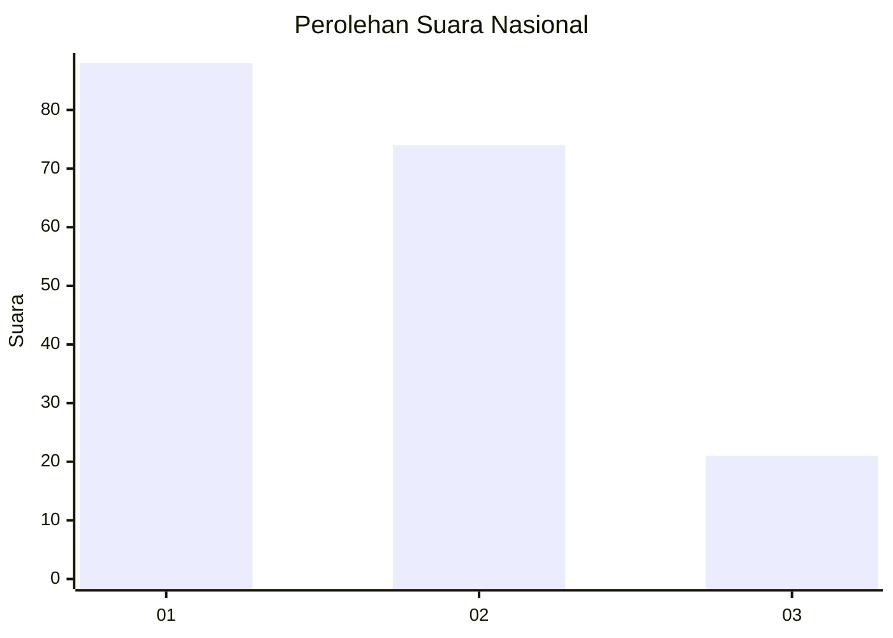
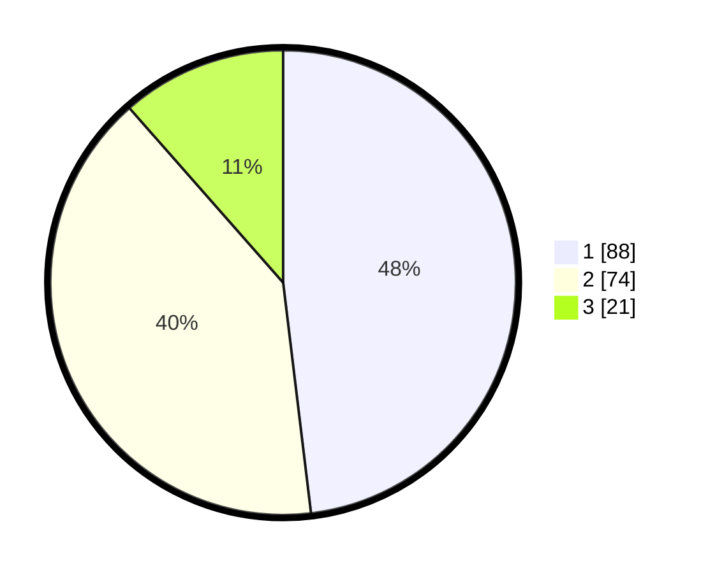

# Hasil

## Grafik

## Tabel

| No.    | Nama Paslon    | Suara | Suara (raw) | Persentase |
|:------ |:-------------- | -----:| -----------:| ----------:|
| 100025 | ANIES MUHAIMIN | 88    | [88][p-1]   | 48,09      |
| 100026 | PRABOWO GIBRAN | 74    | [74][p-2]   | 40,44      |
| 100027 | GANJAR MAHFUD  | 21    | [21][p-3]   | 11,48      |

[p-1]: https://github.com/gigit-pemilu/pemilu-2024/blob/main/pilpres/hitung-suara/sub/31-dki-jakarta/sub/73-jakarta-barat/sub/05-kebon-jeruk/sub/1005-duri-kepa/sub/141-tps/sub/paslon-1.txt
[p-2]: https://github.com/gigit-pemilu/pemilu-2024/blob/main/pilpres/hitung-suara/sub/31-dki-jakarta/sub/73-jakarta-barat/sub/05-kebon-jeruk/sub/1005-duri-kepa/sub/141-tps/sub/paslon-2.txt
[p-3]: https://github.com/gigit-pemilu/pemilu-2024/blob/main/pilpres/hitung-suara/sub/31-dki-jakarta/sub/73-jakarta-barat/sub/05-kebon-jeruk/sub/1005-duri-kepa/sub/141-tps/sub/paslon-3.txt

## Foto C Plano

https://sirekap-obj-formc.kpu.go.id/604e/pemilu/ppwp/31/73/05/10/05/3173051005141-20240215-001609--9b9f0368-a548-417a-9ad5-af95fa62b13a.jpg

https://sirekap-obj-formc.kpu.go.id/604e/pemilu/ppwp/31/73/05/10/05/3173051005141-20240215-001632--35575769-9738-4e24-98e2-2446eb57e597.jpg

https://sirekap-obj-formc.kpu.go.id/604e/pemilu/ppwp/31/73/05/10/05/3173051005141-20240215-001708--39989819-43b9-49bc-a1d8-772321076a7f.jpg

## Metadata

| Key        | Value               |
| ---------- | ------------------- |
| Time Stamp | 2024-02-16 21:01:00 |

