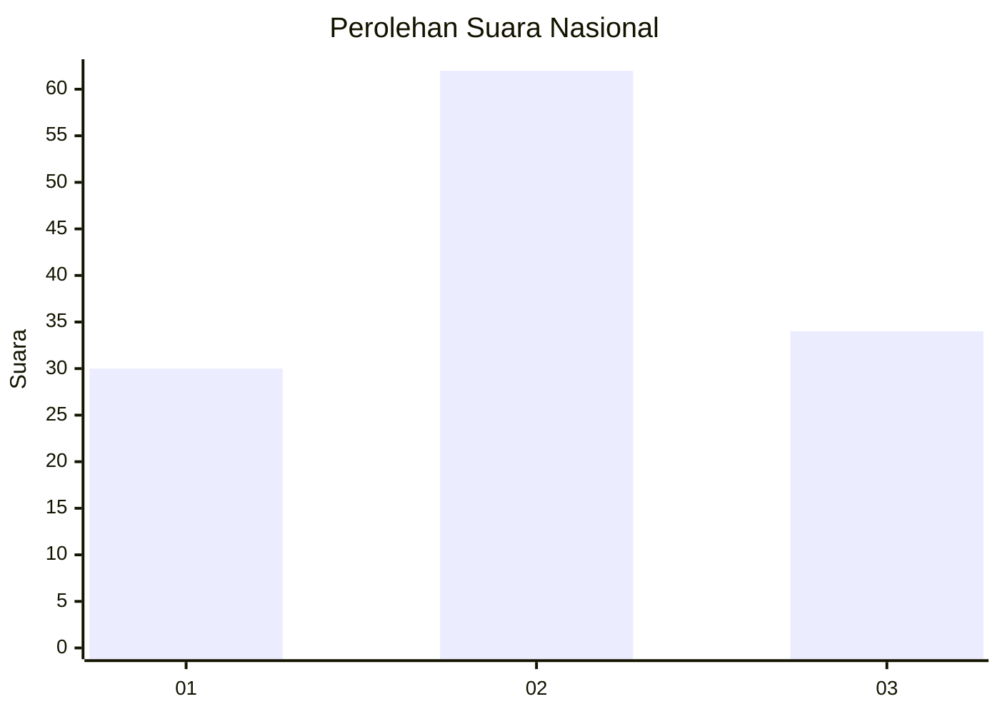
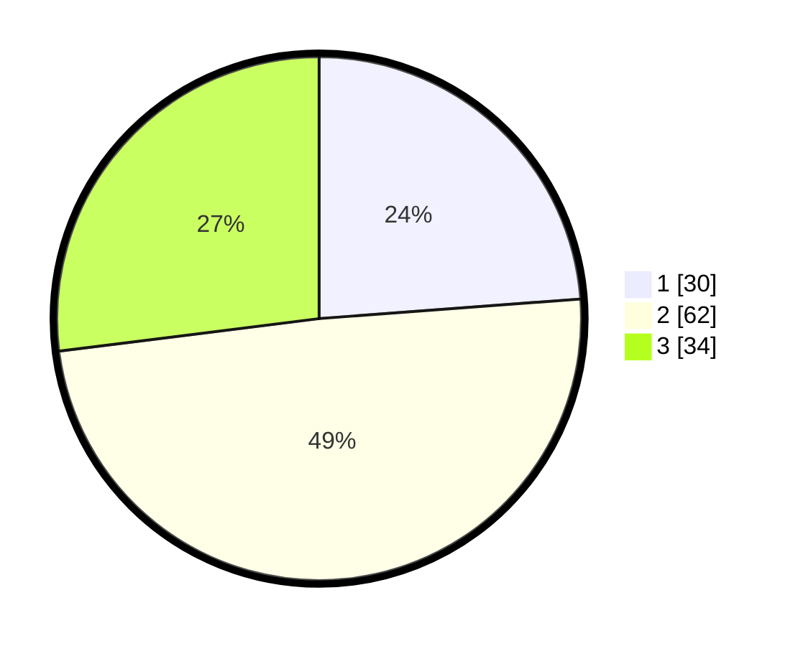

# Hasil

## Grafik

## Tabel

| No.    | Nama Paslon    | Suara | Suara (raw) | Persentase |
|:------ |:-------------- | -----:| -----------:| ----------:|
| 100025 | ANIES MUHAIMIN | 30    | [30][p-1]   | 23,81      |
| 100026 | PRABOWO GIBRAN | 62    | [62][p-2]   | 49,21      |
| 100027 | GANJAR MAHFUD  | 34    | [34][p-3]   | 26,98      |

[p-1]: https://github.com/gigit-pemilu/pemilu-2024/blob/main/pilpres/hitung-suara/sub/31-dki-jakarta/sub/73-jakarta-barat/sub/05-kebon-jeruk/sub/1005-duri-kepa/sub/146-tps/sub/paslon-1.txt
[p-2]: https://github.com/gigit-pemilu/pemilu-2024/blob/main/pilpres/hitung-suara/sub/31-dki-jakarta/sub/73-jakarta-barat/sub/05-kebon-jeruk/sub/1005-duri-kepa/sub/146-tps/sub/paslon-2.txt
[p-3]: https://github.com/gigit-pemilu/pemilu-2024/blob/main/pilpres/hitung-suara/sub/31-dki-jakarta/sub/73-jakarta-barat/sub/05-kebon-jeruk/sub/1005-duri-kepa/sub/146-tps/sub/paslon-3.txt

## Foto C Plano

https://sirekap-obj-formc.kpu.go.id/cfc1/pemilu/ppwp/31/73/05/10/05/3173051005146-20240214-155752--fc0005f2-b47d-486c-babe-be9509746237.jpg

https://sirekap-obj-formc.kpu.go.id/cfc1/pemilu/ppwp/31/73/05/10/05/3173051005146-20240214-155909--9adf5767-a00f-4fd7-b4e2-0af11b33d0f0.jpg

https://sirekap-obj-formc.kpu.go.id/cfc1/pemilu/ppwp/31/73/05/10/05/3173051005146-20240214-221411--dc38474f-37b8-4264-a77f-998f33c36705.jpg

## Metadata

| Key        | Value               |
| ---------- | ------------------- |
| Time Stamp | 2024-02-15 00:41:44 |

