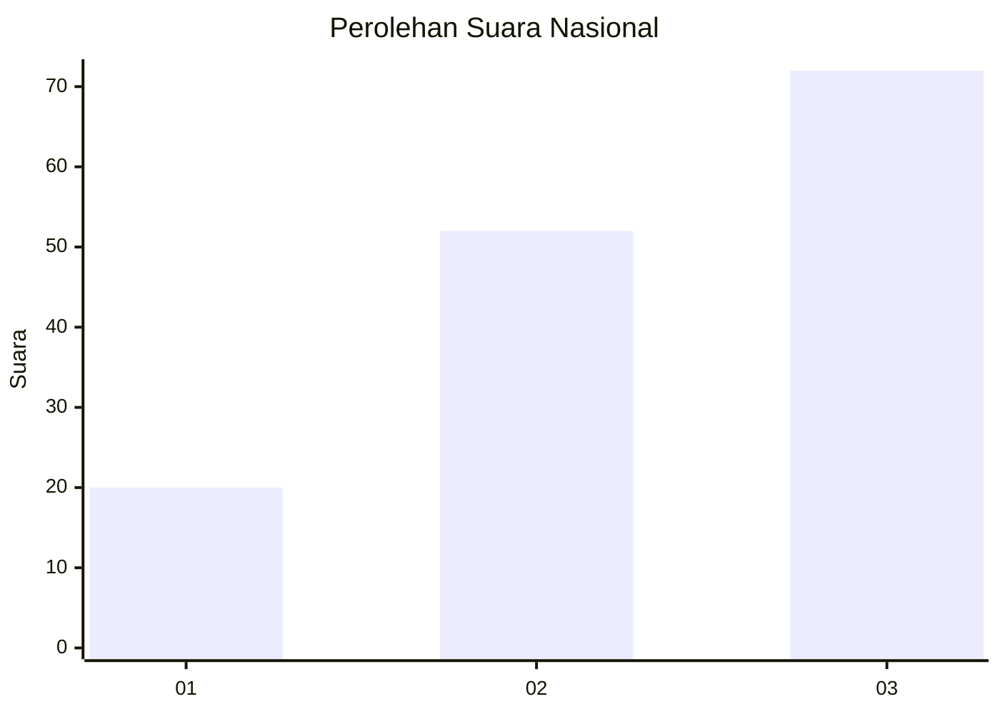
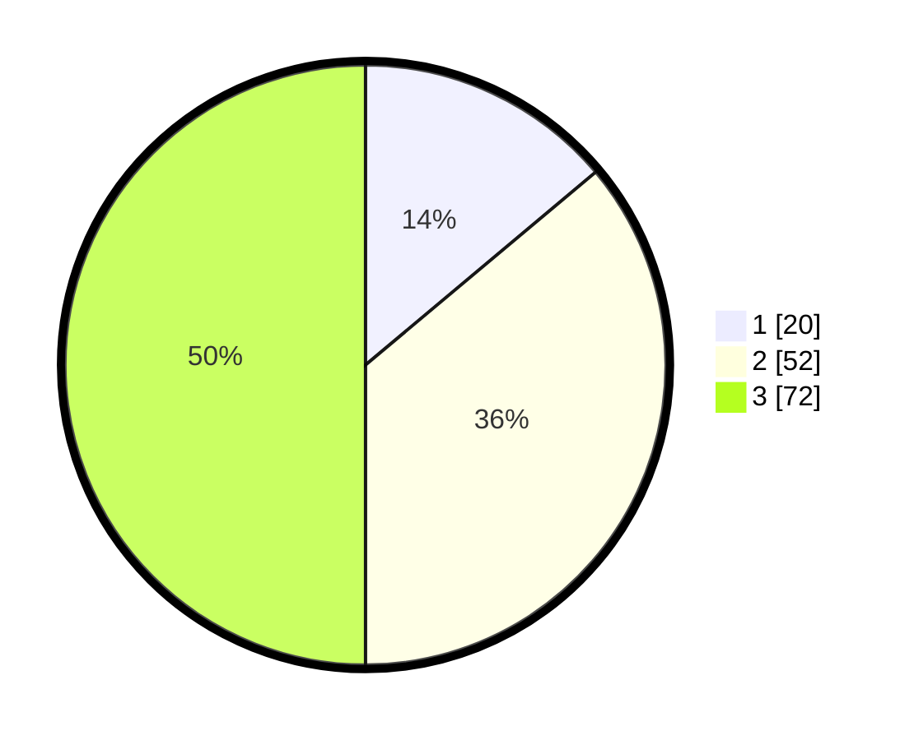

# Hasil

## Grafik

## Tabel

| No.    | Nama Paslon    | Suara | Suara (raw) | Persentase |
|:------ |:-------------- | -----:| -----------:| ----------:|
| 100025 | ANIES MUHAIMIN | 20    | [20][p-1]   | 13,89      |
| 100026 | PRABOWO GIBRAN | 52    | [52][p-2]   | 36,11      |
| 100027 | GANJAR MAHFUD  | 72    | [72][p-3]   | 50,00      |

[p-1]: https://github.com/gigit-pemilu/pemilu-2024/blob/main/pilpres/hitung-suara/sub/31-dki-jakarta/sub/73-jakarta-barat/sub/05-kebon-jeruk/sub/1005-duri-kepa/sub/149-tps/sub/paslon-1.txt
[p-2]: https://github.com/gigit-pemilu/pemilu-2024/blob/main/pilpres/hitung-suara/sub/31-dki-jakarta/sub/73-jakarta-barat/sub/05-kebon-jeruk/sub/1005-duri-kepa/sub/149-tps/sub/paslon-2.txt
[p-3]: https://github.com/gigit-pemilu/pemilu-2024/blob/main/pilpres/hitung-suara/sub/31-dki-jakarta/sub/73-jakarta-barat/sub/05-kebon-jeruk/sub/1005-duri-kepa/sub/149-tps/sub/paslon-3.txt

## Foto C Plano

https://sirekap-obj-formc.kpu.go.id/6dcc/pemilu/ppwp/31/73/05/10/05/3173051005149-20240215-020913--2eed3405-22bc-40db-9fba-8d5ee8b68fa7.jpg

https://sirekap-obj-formc.kpu.go.id/6dcc/pemilu/ppwp/31/73/05/10/05/3173051005149-20240215-020935--b9d0e362-ba00-4b25-bbb9-5fde39f65010.jpg

https://sirekap-obj-formc.kpu.go.id/6dcc/pemilu/ppwp/31/73/05/10/05/3173051005149-20240214-211743--ab7943bb-be10-45c6-ab8e-e9b66fbb1ffd.jpg

## Metadata

| Key        | Value               |
| ---------- | ------------------- |
| Time Stamp | 2024-02-19 14:00:00 |

