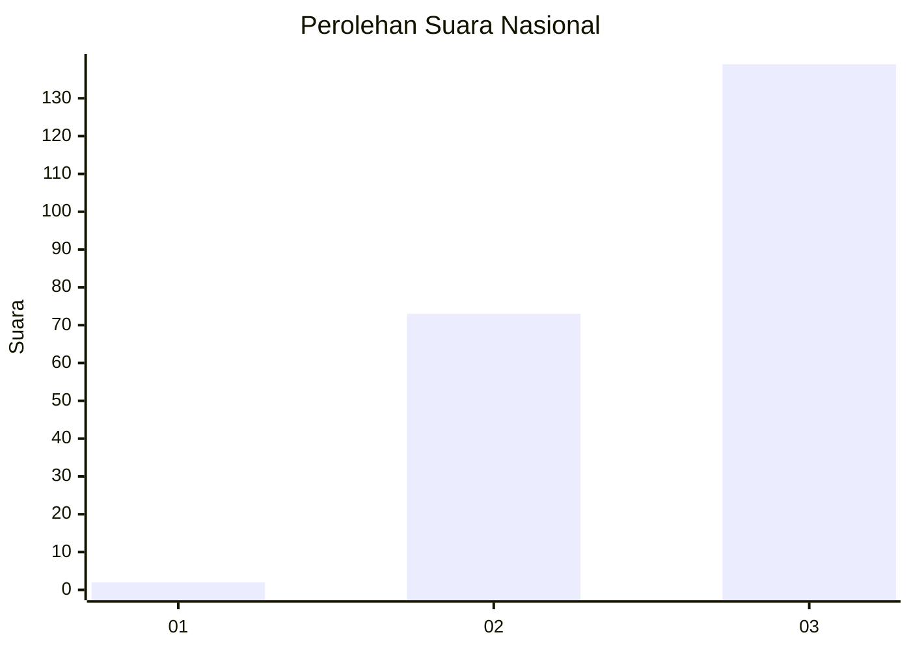
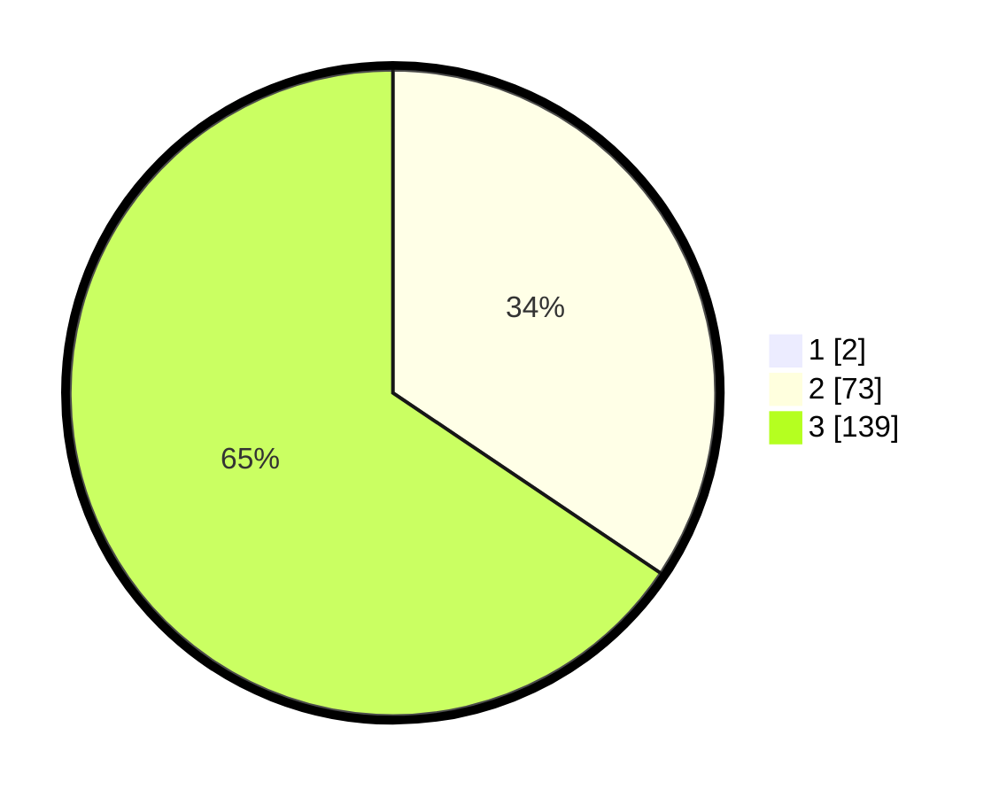

# Hasil

## Grafik

## Tabel

| No.    | Nama Paslon    | Suara | Suara (raw) | Persentase |
|:------ |:-------------- | -----:| -----------:| ----------:|
| 100025 | ANIES MUHAIMIN | 2     | [2][p-1]    | 0,93       |
| 100026 | PRABOWO GIBRAN | 73    | [73][p-2]   | 34,11      |
| 100027 | GANJAR MAHFUD  | 139   | [139][p-3]  | 64,95      |

[p-1]: https://github.com/gigit-pemilu/pemilu-2024/blob/main/pilpres/hitung-suara/sub/31-dki-jakarta/sub/73-jakarta-barat/sub/05-kebon-jeruk/sub/1005-duri-kepa/sub/198-tps/sub/paslon-1.txt
[p-2]: https://github.com/gigit-pemilu/pemilu-2024/blob/main/pilpres/hitung-suara/sub/31-dki-jakarta/sub/73-jakarta-barat/sub/05-kebon-jeruk/sub/1005-duri-kepa/sub/198-tps/sub/paslon-2.txt
[p-3]: https://github.com/gigit-pemilu/pemilu-2024/blob/main/pilpres/hitung-suara/sub/31-dki-jakarta/sub/73-jakarta-barat/sub/05-kebon-jeruk/sub/1005-duri-kepa/sub/198-tps/sub/paslon-3.txt

## Foto C Plano

https://sirekap-obj-formc.kpu.go.id/7ee2/pemilu/ppwp/31/73/05/10/05/3173051005198-20240214-230654--aeeeccd3-48db-45ef-9487-01867cbe371c.jpg

https://sirekap-obj-formc.kpu.go.id/7ee2/pemilu/ppwp/31/73/05/10/05/3173051005198-20240214-230724--e09821b1-5aab-4322-a41d-f980fe9b5acf.jpg

https://sirekap-obj-formc.kpu.go.id/7ee2/pemilu/ppwp/31/73/05/10/05/3173051005198-20240214-230745--63ce72a2-d7d6-4f80-8d2e-09e004cdb6ab.jpg

## Metadata

| Key        | Value               |
| ---------- | ------------------- |
| Time Stamp | 2024-02-19 14:00:00 |

