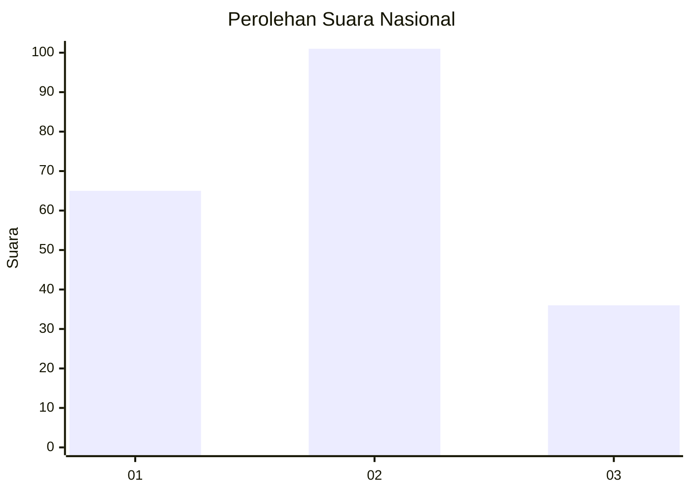
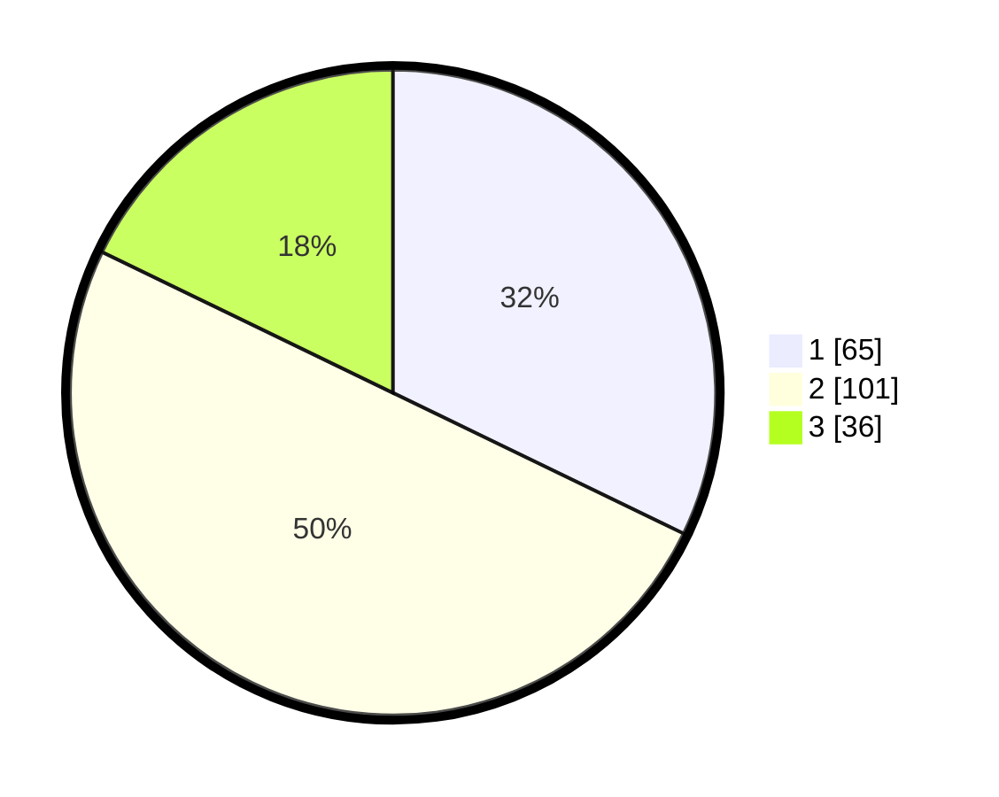

# Hasil

## Grafik

## Tabel

| No.    | Nama Paslon    | Suara | Suara (raw) | Persentase |
|:------ |:-------------- | -----:| -----------:| ----------:|
| 100025 | ANIES MUHAIMIN | 65    | [65][p-1]   | 32,18      |
| 100026 | PRABOWO GIBRAN | 101   | [101][p-2]  | 50,00      |
| 100027 | GANJAR MAHFUD  | 36    | [36][p-3]   | 17,82      |

[p-1]: https://github.com/gigit-pemilu/pemilu-2024/blob/main/pilpres/hitung-suara/sub/31-dki-jakarta/sub/73-jakarta-barat/sub/05-kebon-jeruk/sub/1006-kedoya-utara/sub/005-tps/sub/paslon-1.txt
[p-2]: https://github.com/gigit-pemilu/pemilu-2024/blob/main/pilpres/hitung-suara/sub/31-dki-jakarta/sub/73-jakarta-barat/sub/05-kebon-jeruk/sub/1006-kedoya-utara/sub/005-tps/sub/paslon-2.txt
[p-3]: https://github.com/gigit-pemilu/pemilu-2024/blob/main/pilpres/hitung-suara/sub/31-dki-jakarta/sub/73-jakarta-barat/sub/05-kebon-jeruk/sub/1006-kedoya-utara/sub/005-tps/sub/paslon-3.txt

## Foto C Plano

https://sirekap-obj-formc.kpu.go.id/fe7c/pemilu/ppwp/31/73/05/10/06/3173051006005-20240215-013545--b22778b6-3ae9-449d-a6ba-23be6a9679b1.jpg

https://sirekap-obj-formc.kpu.go.id/fe7c/pemilu/ppwp/31/73/05/10/06/3173051006005-20240215-013648--b87560ec-020e-4d55-9824-dec227433d94.jpg

https://sirekap-obj-formc.kpu.go.id/fe7c/pemilu/ppwp/31/73/05/10/06/3173051006005-20240215-013745--e45e207a-f3e0-4fc9-8b0f-ad0ae3fb2332.jpg

## Metadata

| Key        | Value               |
| ---------- | ------------------- |
| Time Stamp | 2024-02-15 22:30:27 |

