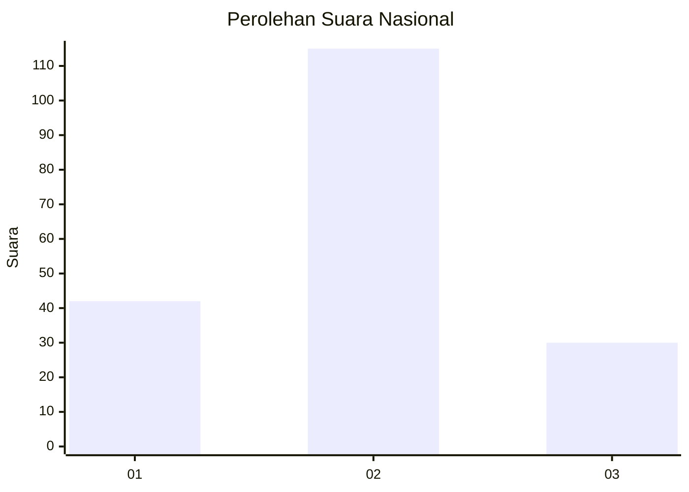
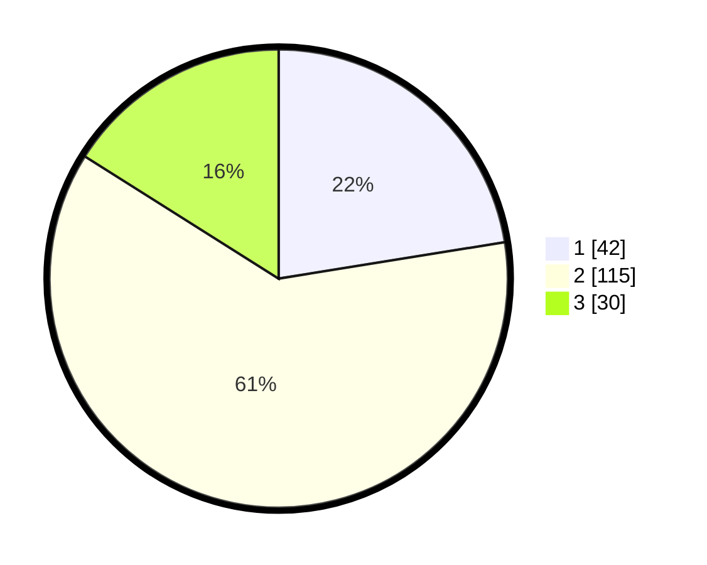

# Hasil

## Grafik

## Tabel

| No.    | Nama Paslon    | Suara | Suara (raw) | Persentase |
|:------ |:-------------- | -----:| -----------:| ----------:|
| 100025 | ANIES MUHAIMIN | 42    | [42][p-1]   | 22,46      |
| 100026 | PRABOWO GIBRAN | 115   | [115][p-2]  | 61,50      |
| 100027 | GANJAR MAHFUD  | 30    | [30][p-3]   | 16,04      |

[p-1]: https://github.com/gigit-pemilu/pemilu-2024/blob/main/pilpres/hitung-suara/sub/31-dki-jakarta/sub/73-jakarta-barat/sub/05-kebon-jeruk/sub/1006-kedoya-utara/sub/006-tps/sub/paslon-1.txt
[p-2]: https://github.com/gigit-pemilu/pemilu-2024/blob/main/pilpres/hitung-suara/sub/31-dki-jakarta/sub/73-jakarta-barat/sub/05-kebon-jeruk/sub/1006-kedoya-utara/sub/006-tps/sub/paslon-2.txt
[p-3]: https://github.com/gigit-pemilu/pemilu-2024/blob/main/pilpres/hitung-suara/sub/31-dki-jakarta/sub/73-jakarta-barat/sub/05-kebon-jeruk/sub/1006-kedoya-utara/sub/006-tps/sub/paslon-3.txt

## Foto C Plano

https://sirekap-obj-formc.kpu.go.id/6622/pemilu/ppwp/31/73/05/10/06/3173051006006-20240214-222924--72f3ac3a-b71a-4a4d-81cf-02812988a000.jpg

https://sirekap-obj-formc.kpu.go.id/6622/pemilu/ppwp/31/73/05/10/06/3173051006006-20240214-220325--46561c81-4340-4f89-bbca-89c733d77656.jpg

https://sirekap-obj-formc.kpu.go.id/6622/pemilu/ppwp/31/73/05/10/06/3173051006006-20240214-220428--34c9ed75-a06e-4803-8712-e5795203d57a.jpg

## Metadata

| Key        | Value               |
| ---------- | ------------------- |
| Time Stamp | 2024-02-16 21:01:00 |

