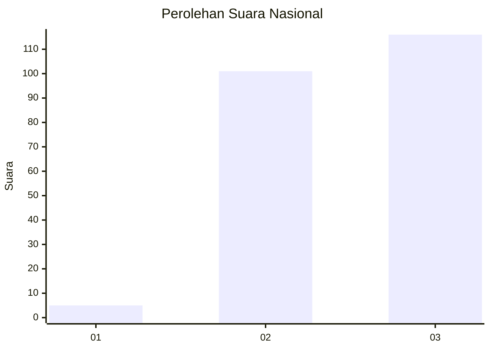
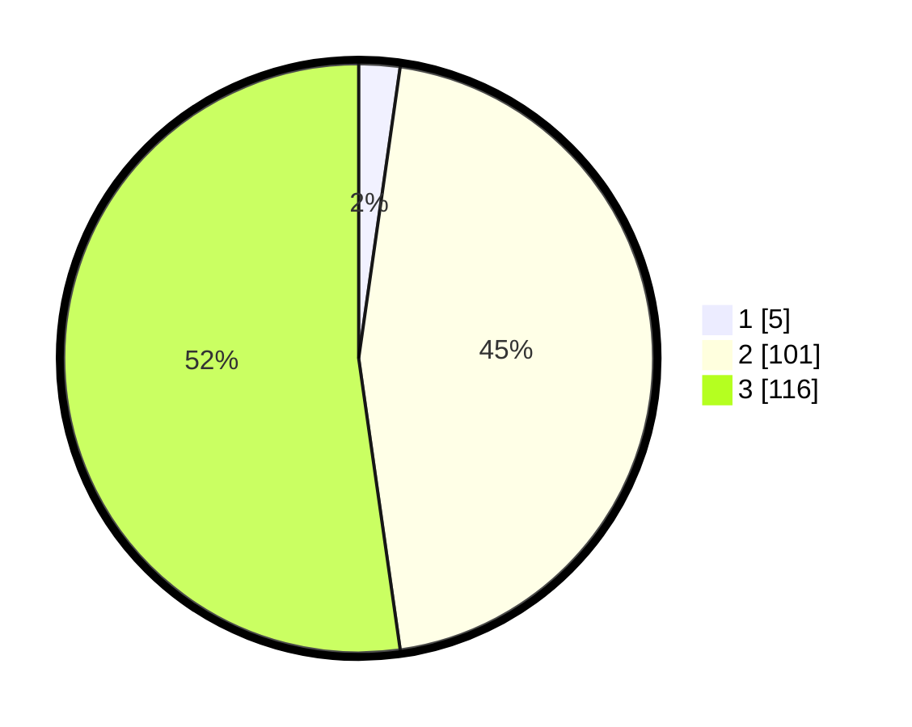

# Hasil

## Grafik

## Tabel

| No.    | Nama Paslon    | Suara | Suara (raw) | Persentase |
|:------ |:-------------- | -----:| -----------:| ----------:|
| 100025 | ANIES MUHAIMIN | 5     | [5][p-1]    | 2,25       |
| 100026 | PRABOWO GIBRAN | 101   | [101][p-2]  | 45,50      |
| 100027 | GANJAR MAHFUD  | 116   | [116][p-3]  | 52,25      |

[p-1]: https://github.com/gigit-pemilu/pemilu-2024/blob/main/pilpres/hitung-suara/sub/31-dki-jakarta/sub/73-jakarta-barat/sub/05-kebon-jeruk/sub/1006-kedoya-utara/sub/047-tps/sub/paslon-1.txt
[p-2]: https://github.com/gigit-pemilu/pemilu-2024/blob/main/pilpres/hitung-suara/sub/31-dki-jakarta/sub/73-jakarta-barat/sub/05-kebon-jeruk/sub/1006-kedoya-utara/sub/047-tps/sub/paslon-2.txt
[p-3]: https://github.com/gigit-pemilu/pemilu-2024/blob/main/pilpres/hitung-suara/sub/31-dki-jakarta/sub/73-jakarta-barat/sub/05-kebon-jeruk/sub/1006-kedoya-utara/sub/047-tps/sub/paslon-3.txt

## Foto C Plano

https://sirekap-obj-formc.kpu.go.id/6f82/pemilu/ppwp/31/73/05/10/06/3173051006047-20240214-214244--671edf1e-642e-4b7f-9d2f-10b2012a5db4.jpg

https://sirekap-obj-formc.kpu.go.id/6f82/pemilu/ppwp/31/73/05/10/06/3173051006047-20240214-214332--5d000dfe-572d-41d5-8d2e-8b03be658554.jpg

https://sirekap-obj-formc.kpu.go.id/6f82/pemilu/ppwp/31/73/05/10/06/3173051006047-20240214-214417--338c0ce5-0ce7-4128-92bb-2100228029c3.jpg

## Metadata

| Key        | Value               |
| ---------- | ------------------- |
| Time Stamp | 2024-02-19 14:00:00 |

