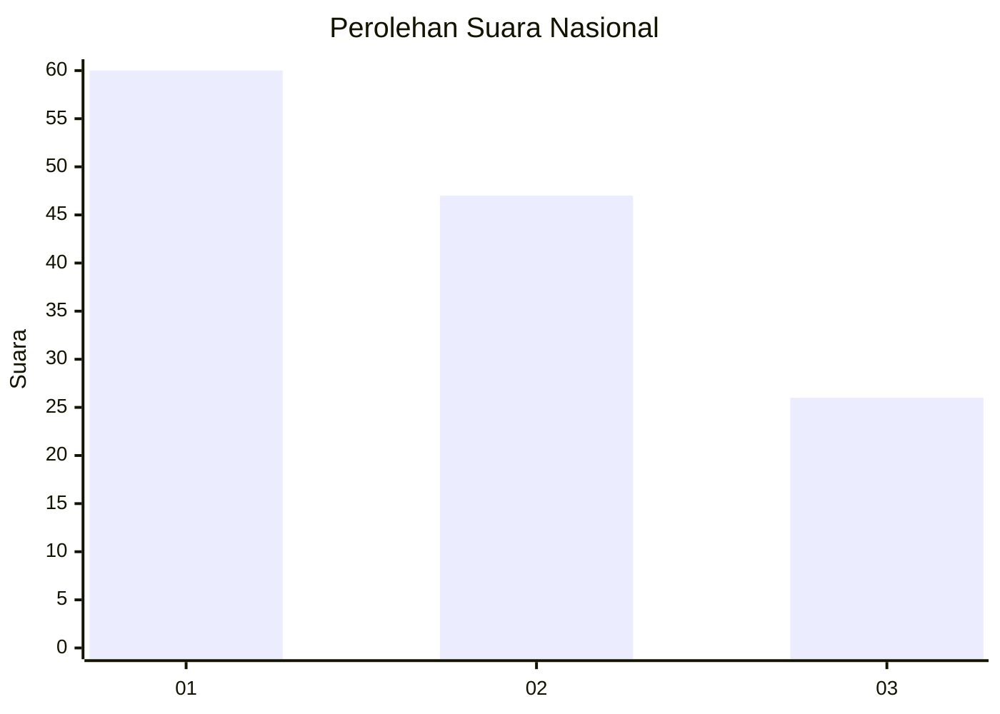
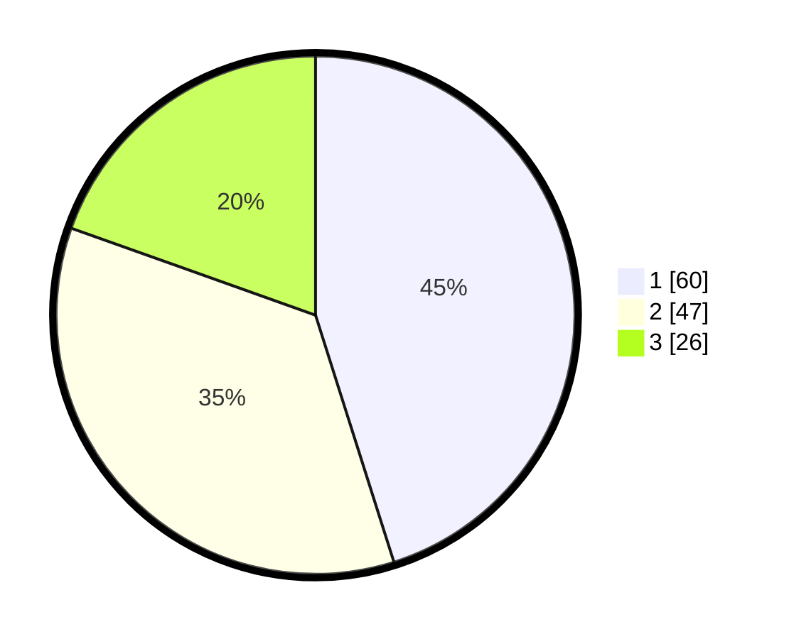

# Hasil

## Grafik

## Tabel

| No.    | Nama Paslon    | Suara | Suara (raw) | Persentase |
|:------ |:-------------- | -----:| -----------:| ----------:|
| 100025 | ANIES MUHAIMIN | 60    | [60][p-1]   | 45,11      |
| 100026 | PRABOWO GIBRAN | 47    | [47][p-2]   | 35,34      |
| 100027 | GANJAR MAHFUD  | 26    | [26][p-3]   | 19,55      |

[p-1]: https://github.com/gigit-pemilu/pemilu-2024/blob/main/pilpres/hitung-suara/sub/31-dki-jakarta/sub/73-jakarta-barat/sub/05-kebon-jeruk/sub/1006-kedoya-utara/sub/074-tps/sub/paslon-1.txt
[p-2]: https://github.com/gigit-pemilu/pemilu-2024/blob/main/pilpres/hitung-suara/sub/31-dki-jakarta/sub/73-jakarta-barat/sub/05-kebon-jeruk/sub/1006-kedoya-utara/sub/074-tps/sub/paslon-2.txt
[p-3]: https://github.com/gigit-pemilu/pemilu-2024/blob/main/pilpres/hitung-suara/sub/31-dki-jakarta/sub/73-jakarta-barat/sub/05-kebon-jeruk/sub/1006-kedoya-utara/sub/074-tps/sub/paslon-3.txt

## Foto C Plano

https://sirekap-obj-formc.kpu.go.id/4732/pemilu/ppwp/31/73/05/10/06/3173051006074-20240215-011325--9f1a6dc1-84fb-4ab4-b6f5-733cc890bb9f.jpg

https://sirekap-obj-formc.kpu.go.id/4732/pemilu/ppwp/31/73/05/10/06/3173051006074-20240215-011427--80da953f-cc19-45f7-b207-8d89034e2e3a.jpg

https://sirekap-obj-formc.kpu.go.id/4732/pemilu/ppwp/31/73/05/10/06/3173051006074-20240215-011536--3f1955f9-161e-47fe-b6c7-058a8a7cdfe2.jpg

## Metadata

| Key        | Value               |
| ---------- | ------------------- |
| Time Stamp | 2024-02-19 14:00:00 |

